# Leadzilla Interview Source of Truth

> Definitive repository-grounded Q&A for discussing the Zbooni-sponsored Lead Flood platform and its Leadzilla demo continuation. Generated 2026-07-31. This is an engineering audit, not a production attestation or a substitute for client/university records.

### Q0. What exactly was verified, at what revision, and under what safety boundary?

**Interview-ready answer**

I audited the complete current worktree at commit `0dd697f1937f10b00c6fb17605065aeb494d00ec` on `main`, including uncommitted demo work, while preserving every pre-existing change. I inspected the web, Edge, Fastify API, worker, provider, schema, migrations, queue, outbox, tests, CI, deployment material, documents, and Git history. Type checking, linting, production builds, and isolated unit suites passed. Database-backed tests and Docker builds could not run because the local Docker daemon was unavailable. I made no provider calls, touched no production data, sent no outreach, and exposed no secrets or prospect data.

**Deep technical answer**

The audit has two time axes. `HEAD` is the committed baseline, while the dirty worktree is the code actually inspected and built. The worktree began with 55 modified/deleted and 18 untracked paths; this document is the only audit-created path. Some current-demo facts—especially the `/leadzilla` base path, Edge-function work, and demo documentation—are uncommitted and therefore must not be described as deployed. The current safety invariant is stronger than historical full-platform behavior: email and WhatsApp delivery are disabled in API, outbox, recovery, and worker paths.

**Repository evidence**

- Branch/SHA: `main`, `0dd697f1937f10b00c6fb17605065aeb494d00ec` (`git branch --show-current`; `git rev-parse HEAD`).
- Generation time: 2026-07-31 16:42 CDT (America/Chicago).
- Runtime: Node `v22.22.0`; pnpm `10.14.0`; repository pins Node 22 and `pnpm@10.14.0` in `.nvmrc` and `package.json`.
- Docker client: 28.5.1, Compose 2.40.3, Buildx 0.29.1. Docker daemon connection failed at `/Users/zacksikkink/.docker/run/docker.sock`.
- Initial worktree: 55 tracked modifications and 18 untracked paths, including changes under `apps/web`, `apps/api`, `packages/db`, `supabase/functions/api`, and an untracked SQL migration. See the contemporaneous `git status --short --branch` record in this audit session.
- `pnpm typecheck`: PASS, 16/16 tasks.
- `pnpm lint`: PASS, 11/11 tasks.
- `pnpm build`: PASS, 11/11 tasks; Next.js produced 27 static pages plus dynamic routes. One non-fatal warning said the Next.js ESLint plugin was not detected.
- `pnpm --filter @lead-flood/api test:unit`: PASS, 33 files/184 tests.
- `pnpm --filter @lead-flood/worker test:unit`: PASS, 37 files/315 tests.
- `pnpm --filter @lead-flood/discovery test:unit`: PASS, 11 files/77 tests.
- `deno test supabase/functions/api/*.test.ts`: PASS, 15 tests covering dirty-worktree Edge discovery limits/progress, public error redaction/settings exposure, and REST count preferences.
- `deno check supabase/functions/api/index.ts`: PASS for the dirty-worktree Edge API.
- Other suites completed within the root fan-out: providers 18 files/134 tests, web 12 files/88 tests, contracts 5 files/26 tests, plus observability/testkit/UI single-file suites.
- `pnpm test:unit`: FAIL overall because 8 tests in 7 `packages/db` files attempted `localhost:5434` and received `ECONNREFUSED`; the DB package result was 6 files/24 tests passed and 7 files/8 tests failed. This is an unavailable dependency, not a proved application assertion failure.
- `docker compose ... up -d postgres`: BLOCKED because the Docker daemon was not running. SQL bootstrap and database integration/E2E therefore did not run.
- `docker build -f infra/docker/Dockerfile.{api,worker,web} ...`: all three were attempted and BLOCKED before build because the same Docker daemon socket was unavailable.
- Safety invariant: `AGENTS.md`; `apps/api/src/modules/messaging/messaging.service.ts`; `apps/worker/src/outbox-dispatcher.ts`; `apps/worker/src/jobs/message.send.job.ts`; `apps/worker/src/index.ts`; `supabase/functions/api/index.ts`.

**Tradeoffs and alternatives**

A dirty-worktree audit reflects what was actually present but weakens reproducibility. A clean tagged release plus cloud receipts would support stronger deployment claims. Running only mocked tests protects against paid side effects, while a disposable local Postgres would provide higher integration confidence if Docker were available.

**Failure modes and limitations**

No cloud console, production database, CI run, billing export, award record, client acceptance record, or external provider was accessed. Git records implementation and authorship, not meetings, titles, acceptance, or live state. Generated build output is ignored and is not deployment evidence.

**Safe interview claim**

“I performed a repository-level audit at a named revision and verified the code with type checks, lint, builds, and 576 targeted API/worker/discovery unit tests; database integration and Docker image verification were blocked by an unavailable local Docker daemon, and production facts remain separately qualified.”

### Q0a. How should evidence labels be read?

**Answer**

Every material claim uses one of the required labels below. A label applies to the exact sentence or table row, not automatically to adjacent claims.

| Label | Meaning in this audit |
|---|---|
| **Production-deployed and repository-supported** | Repository evidence plus an independently inspectable deployment artifact establish production use. No major résumé claim reached this bar in this offline audit. |
| **Deployment externally asserted but not independently established** | Repository docs assert a deployment or operational result, but no cloud receipt/live check/raw production artifact was independently verified. |
| **Implemented and tested** | Current code plus relevant passing tests establish behavior; production use is not implied. |
| **Implemented but deployment not established** | Current code establishes behavior, but direct test coverage or deployment proof is incomplete. |
| **Partially implemented** | A meaningful subset exists, with named gaps. |
| **Demonstration-only or outbound-disabled** | The behavior is preview/demo state or delivery is deliberately blocked. |
| **Historical or superseded implementation** | Git/docs retain a former design that is not the current runtime path. |
| **Designed or documented only** | A plan, runbook, or interface exists without a proved current implementation. |
| **External operational fact not independently verifiable from repository** | The fact needs a client, billing, university, cloud, or production record outside Git. |
| **Not found in repository** | Exhaustive scoped search found no supporting artifact. |
| **Contradicted by repository evidence** | Current code or current-state documentation conflicts with the claim. |

---

# I. Highest-value interview questions

### Q1. What business problem was Zbooni trying to solve?

**Interview-ready answer**

Zbooni’s sponsored project was a sales-operations funnel: turn a configurable ideal-customer profile into candidate businesses, collect public web and social evidence, enrich contactability, score fit, and draft individualized outreach for a representative to review. The repository supports that product shape, especially for businesses with conversational, WhatsApp, social, or payment-related sales motion. It does not contain a reliable before-state study, so I would not invent a spreadsheet workflow, hours-saved figure, or client conversion baseline. The honest value proposition is decision support and workflow consolidation, not proved revenue lift.

**Deep technical answer**

The full platform models ICP definitions and rules, expands them into search tasks, discovers `Business` records, retains `BusinessEvidence` and discovery provenance, converts qualified businesses into `Lead` records, creates feature snapshots and score predictions, and produces `MessageDraft` variants. The current Leadzilla demo preserves bounded discovery, enrichment-like updates, scoring visibility, and draft generation, but outbound delivery is disabled.

**Repository evidence**

- Product flow: `lead-flood-system-walkthrough.md:30-77,425-627`; `docs/pipeline-workflow.md`.
- Entities: `packages/db/prisma/schema.prisma:243-1100`.
- ICP seed derived from client-specific criteria: `scripts/icp/seed-zbooni-icps.ts:23-382`.
- Current demo boundary: `README.md:105-137`; `docs/CURRENT_STATE.md:46-68`; `supabase/functions/api/index.ts:5339-5377,5602-5634`.
- Prior manual process and quantitative pain baseline: **Not found in repository**.

**Tradeoffs and alternatives**

A custom funnel makes criteria, provenance, review state, and workflow integration controllable. Buying a sales-intelligence product would reduce maintenance and compliance burden but may offer less control over Zbooni-specific scoring and workflow. A spreadsheet would be cheaper for tiny volume but weak at provenance, concurrency, retries, and auditability.

**Failure modes and limitations**

Public data can be stale or blocked; broad discovery creates duplicates; enrichment can be partial; model explanations may be plausible but unsupported; and workflow usefulness is not equivalent to conversion impact. No repository artifact proves client ROI.

**Safe interview claim**

**Implemented and tested** — “We built a configurable prospect-discovery, evidence, qualification, and human-review workflow for Zbooni’s sales use case; the repository does not establish a quantified pre-project baseline or revenue impact.”

### Q7. What did I personally design and implement, and what does “led development” mean?

**Interview-ready answer**

I can defend leading the architecture, reliability, deployment, and handoff work—not sole authorship. My Git history includes the API/web/worker skeletons, the three Docker build paths, transactional-outbox producer and dispatcher work, dead-letter and recovery hardening, SQL-first migration workflows, Supabase JWT/admin boundaries, deployment automation, and handoff documentation. A teammate made major contributions across the frontend, messaging, providers, and pipeline. Git proves substantial technical ownership and cross-cutting integration; it cannot prove a formal title, meeting leadership, client communication, or authority to assign work.

**Deep technical answer**

The strongest ownership evidence is commit topology and subsystem history. Zack-authored commits include `729e339` (service skeletons), `9645c15` (Dockerfiles/deploy workflow), `ed64404` (outbox producer), `a2f3425` (dispatcher/retry), `57c409f`/`9fc502f` (DLQ/recovery), `50c9a95` (SQL-first migrations), `507f6fe` (admin proxy), `a86cd22` (Supabase JWT auth), production/handoff sequences, and `06261ad` (current Edge demo workflows). Peem-authored history is substantial in UI, providers, messaging, learning, and pipeline implementation. Merged PRs in both directions show integration, not necessarily formal review quality.

**Repository evidence**

- `git shortlog -sne --all`: Peem identities 340 commits combined; Zack 247. Counts are directional, not effort or leadership measures.
- Zack concentration: `.github`, `infra`, deployment/reliability docs, outbox/auth/migration commits listed above.
- Peem examples: `00b1a86`, `9c911f5`, `be0aeec`–`49507a7`, `df2f83b`, `f9fc0d5`, `4eb917a`, `ad32b83`, and extensive UI work.
- Coordination artifact: `docs/plans/2026-03-09-developer-setup-and-peem-push.md:10-14,114-239`.
- Formal leadership title/client-meeting authority: **External operational fact not independently verifiable from repository**.

**Tradeoffs and alternatives**

Commit volume is easy to count but poor evidence of architecture, coordination, and review. Subsystem-specific history plus design sequences is stronger, while client emails, project plans, meeting notes, or sponsor testimony would establish operational leadership.

**Failure modes and limitations**

Authorship can be distorted by squashes, co-author trailers, generated diffs, pair programming, and account identity. Large commit counts must never become a percentage-of-project claim.

**Safe interview claim**

**External operational fact not independently verifiable from repository** for the formal role; repository-supported wording: “I led architecture, deployment/reliability, and handoff work in a two-contributor history, while my teammate made major UI, messaging, provider, and pipeline contributions.”

### Q17. Was the platform deployed into Zbooni’s production environment?

**Interview-ready answer**

The repository contains detailed historical records asserting a Zbooni-owned live/acceptance environment and a durable production discovery run, so deployment is more than an architectural aspiration. But I cannot independently prove it from this checkout: there is no cloud deployment receipt, client acceptance signature, raw production snapshot, or live-console verification. Later current-state notes say the old Railway API and worker were failed or stopped after readiness and billing issues. The current recruiter demo is a separate Vercel/Supabase Edge path. I therefore describe the Zbooni deployment as historically documented but externally unverified, never as a currently live full-platform service.

**Deep technical answer**

The historical target was Vercel web plus Railway Fastify API and long-running worker backed by a Zbooni Supabase project. The operations guide names exact project/platform resources, and current-state notes record discovery run `7373d5ba-...` with aligned `JobExecution`, `OutboxEvent`, ten tasks, and completed root state. Those are documentary assertions. The same current-state material later reports failed/stopped Railway services and a 404 health path. Current `supabase/config.toml` identifies a separate demo project, and current docs say the public demo uses the Supabase Edge API rather than the Fastify/worker path.

**Repository evidence**

- Historical assertion: `docs/ZBOONI_OPERATIONS_DEPLOYMENT_GUIDE.md:15-25,403-479,550-568,674-688`.
- Recorded production run: `docs/CURRENT_STATE.md:70-79`; `docs/DEPLOYMENT.md:197-206`.
- Later failed/stopped state: `docs/CURRENT_STATE.md:56-68`; `docs/DEPLOYMENT.md:85-98`.
- Current demo: `README.md:105-137`; `docs/CURRENT_STATE.md:46-54`; `supabase/config.toml:1-12`; `supabase/functions/api/index.ts`.
- Historical Zbooni resource ref vs demo ref: `apps/*/.env.example`, `docs/PROD_REMOTE_DB_STRATEGY.md:45-49`, and `supabase/config.toml:1-4`.
- Deployment/handoff commits: `ff41b7c`, `465f231`, `09b5a86`, `c9a8665`.

**Tradeoffs and alternatives**

Documentation is valuable operational evidence but weaker than immutable release IDs, cloud audit logs, client acceptance, and a retained sanitized metrics export. A public health check would prove availability only at one moment, not ownership or full workflow health.

**Failure modes and limitations**

Config can be committed without deployment; named resources can later be deleted; a completed discovery run does not prove all components; and an old production release says nothing about current uptime.

**Safe interview claim**

**Deployment externally asserted but not independently established** — “Repository handoff records document a Zbooni-owned deployment and production discovery run; the old Railway services are now historical, and this audit did not independently verify the client cloud environment.”

### Q20. Was outbound outreach enabled or disabled?

**Interview-ready answer**

In the current Leadzilla demo it is disabled in depth, not merely hidden in the UI. Approval saves an `APPROVED` draft for review; it does not create a send record or publish `message.send`. Direct API send requests fail, the outbox dispatcher treats historical send events as intentionally skipped, recovery jobs do not requeue sends, and the worker registers the send handler with outbound disabled. Historical provider and send code remains as reference, but describing the current product as sending approved outreach would be false.

**Deep technical answer**

The API approval transaction selects a variant and changes draft state without inserting `MessageSend`. The explicit send service throws `MessagingOutboundDisabledError`. API immediate-publish code marks blocked queued sends failed and consumes/skips the outbox event. Worker bootstrap passes `outboundSendsEnabled: false`; the send handler guards before any provider call. Approval/send recovery jobs preserve the disabled boundary. The Edge API similarly restricts mutations and returns demo-disabled behavior. This is defense in depth across presentation, command, event, recovery, consumer, and provider-adjacent layers.

**Repository evidence**

- `apps/api/src/modules/messaging/messaging.repository.ts:527-653`.
- `apps/api/src/modules/messaging/messaging.service.ts`; `apps/api/src/index.ts:657-703`.
- `apps/worker/src/outbox-dispatcher.ts`; `apps/worker/src/jobs/message.send.job.ts:101-110`; `apps/worker/src/index.ts`.
- `apps/worker/src/jobs/message.approval.recovery.job.test.ts`; `message.send.recovery.job.test.ts`; `message.send.job.test.ts`.
- `supabase/functions/api/index.ts:5339-5377,5602-5634`.
- `AGENTS.md` demo invariant.

**Tradeoffs and alternatives**

Keeping historical delivery adapters aids demonstration and future restoration, but dormant code expands audit surface. Removing it entirely would be safer but would erase useful system-design reference. A feature flag alone would be too weak for a public demo; multiple hard blocks reduce accidental activation.

**Failure modes and limitations**

Historical docs can contradict current behavior. Future maintainers could weaken one guard, so tests should continue asserting that no provider call or `message.send` publication occurs. Existing database send rows may reflect historical activity and must not be interpreted as current capability.

**Safe interview claim**

**Demonstration-only or outbound-disabled** — “The current demo generates and approves drafts but cannot deliver them; the former full-platform send implementation is historical.”

### Q25. What is the complete architecture?

**Interview-ready answer**

There are two related architectures. The historical full platform used a Next.js operator UI, a Fastify control-plane API, a separate Node worker, Supabase Postgres/Auth, pg-boss queues, a transactional outbox, discovery/enrichment providers, and OpenAI. Durable database writes and outbox intents happened together; a dispatcher published pg-boss jobs; idempotent handlers advanced business state. The current recruiter demo keeps the Next.js UI and Supabase Auth/Postgres but routes demo-safe calls through a Supabase Edge Function, with bounded SerpAPI/OpenAI actions and no outbound delivery. Keeping those paths distinct is essential when discussing what is current, historical, durable, or deployed.

**Deep technical answer**

The web stores a Supabase session and calls authenticated APIs. In the full path, Fastify verifies Supabase JWTs through JWKS, applies app-admin checks to sensitive routes, uses Prisma for domain operations and raw `pg` where atomic SQL/notifications are needed, and creates `JobExecution` plus `OutboxEvent` in transactions. Both API and worker instantiate pg-boss; the API is a producer, while the worker creates queues, registers schedules/handlers, polls the outbox, and runs recovery. External adapters live in `packages/providers`; discovery task creation/normalization lives in `packages/discovery`. In the current demo, the Edge function authenticates bearer tokens and admin membership itself, uses a service-role Supabase client for server-side data access, and deliberately exposes a smaller mutation set.

**Repository evidence**

- Web: `apps/web/app`, `apps/web/src/lib/api-client.ts`, `auth-context.tsx`, `supabase-client.ts`.
- Full API: `apps/api/src/server.ts:298-390`; `apps/api/src/index.ts`; modules under `apps/api/src/modules`.
- Worker: `apps/worker/src/index.ts`; `queues.ts`; `schedules.ts`; `jobs/**`; `outbox-dispatcher.ts`.
- Shared boundaries: `packages/contracts`, `packages/db`, `packages/discovery`, `packages/providers`.
- Current Edge path: `supabase/functions/api/index.ts:31-47,128-175,1826-1861,5602-5634,5710-5722`.
- Deployment descriptions: `README.md:105-137`; `docs/CURRENT_STATE.md:46-68`.

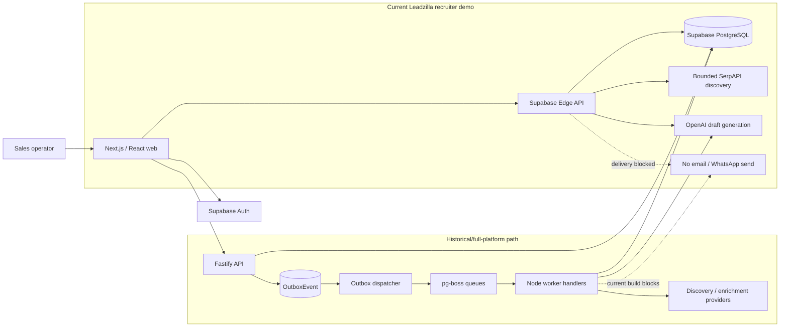

**Tradeoffs and alternatives**

Separate API/worker services keep HTTP latency and failure domains apart but add deployment and observability overhead. Postgres-backed queues reduce infrastructure count but compete with transactional workload. The Edge demo is simpler to host and safer to expose, but it does not demonstrate the full worker/outbox runtime live.

**Failure modes and limitations**

Provider rate limits, DB connection pressure, queue backlog, stale in-process schedule payloads, multi-instance progress aggregation, and document/runtime drift are major risks. At 10× load, provider/DB concurrency is likely the first constraint; at 100×, partitioning work, separating queue storage, stronger telemetry, and tenant boundaries become necessary.

**Safe interview claim**

**Implemented and tested** for the full repository architecture; **Deployment externally asserted but not independently established** for historical client deployment; **Demonstration-only or outbound-disabled** for current public delivery behavior.

### Q47. Trace the representative target-to-approved-draft workflow.

**Interview-ready answer**

An operator defines an ICP—industries, countries, business size and positive or hard-filter rules. The system validates it, expands it into stable search tasks, queries configured discovery providers, normalizes business identity, preserves source evidence, and records attribution across runs. Promising businesses can be converted to leads and enriched. Feature snapshots feed deterministic rules and, when available, an LLM or trained logistic model; structured output is validated and persisted with its source. Qualified leads can receive several grounded message variants. A representative sees the evidence, score explanation, and draft, can edit a variant, and approves or rejects it. In the current demo, approval ends at durable review state—nothing is sent.

**Deep technical answer**

ICP inputs are Zod-validated at the API boundary and stored in `IcpProfile`/`QualificationRule`. Discovery creates a root `JobExecution`, child job records, and outbox events; task generation uses normalized query hashes and run numbers. Provider results normalize phone/domain/name/location, upsert or match `Business`, write `BusinessEvidence`, and create `DiscoveryAttributionAssignment` so rediscovery is not lost. Conversion creates a `Lead`; new-lead conversion writes downstream features intent durably, while one existing-business path still directly enqueues and is a reliability gap. Scoring creates immutable-ish feature snapshots and upserts a prediction for the snapshot/model tuple. Message generation writes draft/variants; approval locks/updates draft state but creates no send.

**Repository evidence**

- ICP/rules: `apps/api/src/modules/icp`; `scoring`; `packages/contracts/src`; `scripts/icp/seed-zbooni-icps.ts`.
- Task creation: `packages/discovery/src/queries`; `dedupe/task_key.ts`; `apps/api/src/modules/discovery`.
- Discovery: `apps/worker/src/jobs/discovery.seed.job.ts`; `discovery.run_search_task.*`; `business.prequalify.job.ts`; `business.convert.*`.
- Data: `SearchTask`, `Source`, `Business`, `BusinessEvidence`, `DiscoveryAttributionAssignment`, `LeadDiscoveryRecord`, `LeadFeatureSnapshot`, `LeadScorePrediction`, `MessageDraft`, `MessageVariant` in `packages/db/prisma/schema.prisma`.
- Scoring: `apps/worker/src/jobs/features.compute.*`; `scoring.compute.*`; `scoring/deterministic.ts`; `scoring/logistic.ts`.
- Draft review: `apps/worker/src/jobs/message.generate.job.ts`; `apps/api/src/modules/messaging`; `apps/web/src/components/message-draft-card.tsx`.

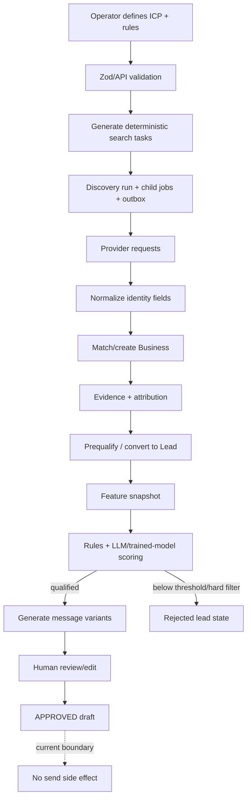

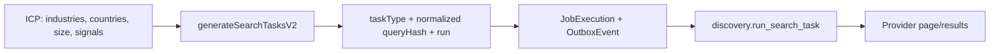

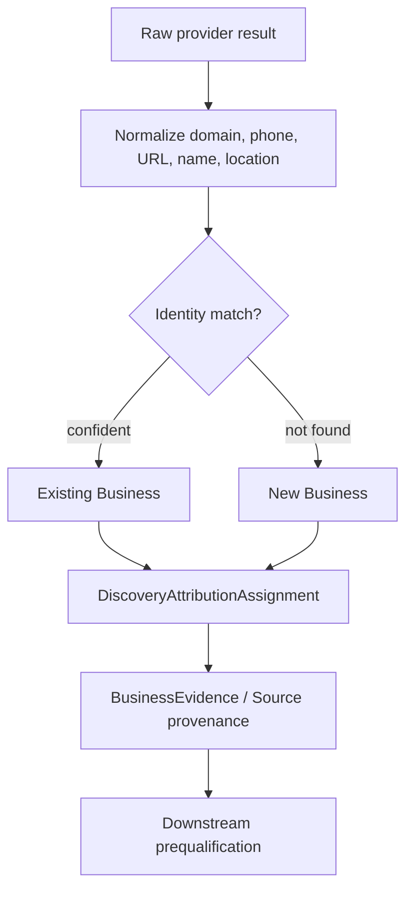

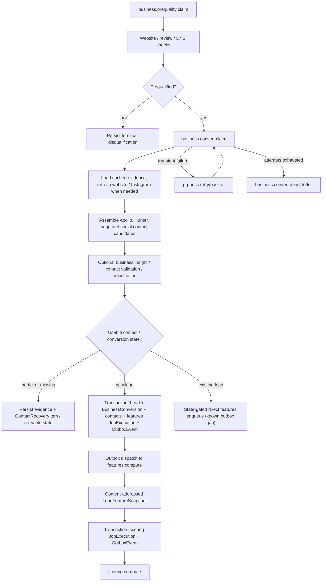

**Tradeoffs and alternatives**

Broad discovery then qualification maximizes recall and retains evidence, at higher provider/storage cost. Early strict filtering is cheaper but may discard unusual good fits. Stable task hashes and attribution allow reproducibility, while fuzzy entity resolution would improve recall at the cost of false merges.

**Failure modes and limitations**

Two rows can still represent one real business because `Business` lacks global unique domain/phone/name constraints. Incomplete identity is retained rather than force-merged. Web/social extraction can be blocked. Most stages are retryable and stateful, but not every direct queue publication is protected by an outbox, and approval/rejection authorization is global rather than tenant-scoped.

**Safe interview claim**

**Implemented and tested** — “The repository implements the target-to-draft workflow with provenance, durable job paths, structured scoring, and human review; current approval intentionally stops before delivery.”

### Q70. What are the major data entities and invariants?

**Interview-ready answer**

The data model separates four concerns: prospect identity and evidence, workflow state, model artifacts, and delivery/review artifacts. `Business` is the discovery-level organization, while `Lead` is a converted sales prospect. Search tasks, attribution, source, and evidence preserve how a business was found. Feature snapshots, model versions, evaluations, and predictions preserve scoring inputs and outputs. Drafts, variants, approvals, sends, feedback, jobs, and outbox records represent workflow. The key invariant is not “one row per real-world company”—the schema cannot guarantee that. The stronger invariants are stable task keys, unique snapshot/model prediction tuples, request/idempotency keys, and atomic business-state/outbox writes on named paths.

**Deep technical answer**

UUID/string primary keys dominate. `Lead.email` is globally unique; `LeadDiscoveryRecord` is unique by lead/ICP/provider/provider-record ID; `LeadEnrichmentRecord.requestKey`, `ModelVersion.versionTag`, `MessageSend.idempotencyKey`, and `FeedbackEvent.dedupeKey` are unique. Feature snapshots are unique per lead/ICP/version/source version/hash; predictions per lead/ICP/snapshot/model. A partial unique SQL index permits one active model per type. Search tasks are unique on task type/query hash/run; attribution is unique on run/ICP/business. `Business` itself has no uniqueness on domain, phone, or normalized name, so entity resolution remains application-level and duplicates are possible. Most tables use UTC `timestamptz`/Prisma `DateTime` conventions.

**Repository evidence**

- Canonical production SQL: `supabase/migrations/**`; ORM mirror: `packages/db/prisma/schema.prisma:243-1100`.
- Schema health: `packages/db/src/schema-health.ts`; SQL bootstrap/verification scripts under `scripts/db`.
- Single-active model: `supabase/migrations/20260329120000_enforce_single_active_model_version_per_model_type.sql`.
- Browser privilege revocation: `supabase/migrations/20260403193000_reassert_browser_access_revokes.sql:1-36`.

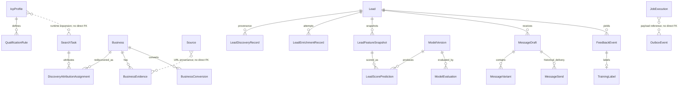

**Tradeoffs and alternatives**

Separate append-oriented snapshots and predictions improve traceability but increase storage and query complexity. Stronger database identity constraints would prevent duplicates but can create false collisions for shared domains/phones. A normalized organization/contact graph would improve entity resolution but was beyond the demonstrated scope.

**Failure modes and limitations**

Prediction upsert can overwrite output/predicted time for the same snapshot/model tuple, so it is not a fully immutable audit log. Criteria are mutable and do not have a dedicated immutable version entity. Rejected drafts can change state; approver/time are stored, but rejection actor is not stored on `MessageDraft`. Legacy `User`/`Session` and current Supabase Auth seams require care.

**Safe interview claim**

**Implemented and tested** — “The schema preserves workflow provenance and versioned scoring artifacts, but real-world business uniqueness and immutable criteria/prompt history remain application-level limitations.”

### Q98. Why separate the API from workers?

**Interview-ready answer**

The API handles authentication, validation, small transactions, queries, and job submission; the worker owns slow, retryable, rate-limited work such as discovery, scraping, enrichment, scoring, draft generation, analytics, recovery, and maintenance. That keeps HTTP latency bounded and lets worker throughput scale independently. PostgreSQL and pg-boss provide durable coordination. The cost is another service, more connection budgeting, eventual-consistency states, and harder local/deployment operations. The current public demo bypasses this split through a bounded Edge path, so I describe it as the full-platform architecture, not the current demo topology.

**Deep technical answer**

Fastify registers protected domain routes and performs transactional creation. The API has a small pg-boss producer pool. The worker calls `ensureWorkerQueues`, registers 30 queue definitions and schedules, installs job handlers through common wrappers, and gracefully stops pg-boss with a 30-second timeout. pg-boss owns durable claims/retries; process memory holds adapters, rate-limit state, polling flags, and a discovery-progress `Map`. Business/job state remains in Postgres. Several worker instances can safely claim pg-boss jobs/outbox rows, but the process-local discovery slot/counter aggregation is weaker across instances.

**Repository evidence**

- API entrypoints: `apps/api/src/index.ts`, `server.ts`.
- Worker entrypoint: `apps/worker/src/index.ts:947-964`; `queues.ts`; `schedules.ts`.
- Queue count: `WORKER_QUEUE_DEFINITIONS` in `apps/worker/src/queues.ts` contains 30 definitions.
- API shutdown: `apps/api/src/index.ts:1931-1950`.
- Worker shutdown: `apps/worker/src/index.ts:947-964`.

**Tradeoffs and alternatives**

A monolith is operationally simpler at small scale. Serverless functions suit short stateless work but are awkward for long polling, browser scraping, rate-limit state, and graceful job ownership. A managed workflow engine adds visibility and orchestration guarantees but adds cost and platform coupling.

**Failure modes and limitations**

Database pools can be exhausted by scaled API/worker replicas. Worker image startup through pnpm complicates PID 1 signaling. Shutdown timeout can expire during provider work, leading to redelivery. The legacy `job_requests` dispatcher appears superseded and lacks stale-`RUNNING` reclaim.

**Safe interview claim**

**Implemented and tested** — “I separated synchronous control-plane work from durable, retryable background processing; multi-instance queue claims are safe, while some progress aggregation and legacy recovery paths are not horizontally complete.”

### Q113. What does the transactional outbox actually guarantee?

**Interview-ready answer**

The outbox closes a specific dual-write gap: on selected paths, the business mutation, tracked job state, and publish intent commit in one PostgreSQL transaction. A dispatcher later atomically claims pending rows with `FOR UPDATE SKIP LOCKED` and publishes pg-boss jobs. If publication or status recording fails, the row is retried or eventually dead-lettered. That is at-least-once delivery, not exactly once. `OutboxEvent.status = sent` means queue publication—or an intentional outbound-disabled skip—not completion of enrichment or an external action. Duplicate publication remains possible after a crash, so singleton keys, state gates, unique constraints, and idempotent handlers are essential.

**Deep technical answer**

Proved producers include manual lead creation to `features.compute`, discovery root/shards, scoring run initiation, new-business conversion to features, and features to scoring. `OutboxEvent` contains type, JSON payload, status, attempts, next-attempt time, last error, processed time, and timestamps. The dispatcher claims eligible pending rows and stale `processing` rows after five minutes using one SQL update whose subquery uses `FOR UPDATE SKIP LOCKED`. It retries up to five dispatcher attempts with exponential delay from five seconds capped at sixty, then records `dead_letter`. pg-boss has its own per-queue retry/DLQ policy after publication. Therefore there are two retry layers with distinct meanings.

**Repository evidence**

- Model: `packages/db/prisma/schema.prisma:306-320`.
- API lead producer: `apps/api/src/index.ts:828-870`.
- Discovery producer: `apps/api/src/modules/discovery/discovery.repository.ts:228-265`.
- Scoring producer: `apps/api/src/modules/scoring/scoring.repository.ts:161-187`.
- Dispatcher: `apps/worker/src/outbox-dispatcher.ts:277+`.
- Tests: `apps/worker/src/outbox-dispatcher.unit.test.ts`; `outbox-dispatcher.test.ts`; API producer tests; `apps/worker/src/jobs/__tests__/pipeline-full-chain.test.ts`.

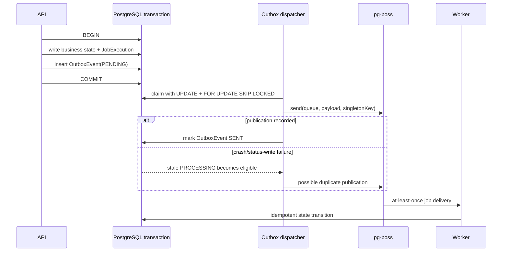

**Tradeoffs and alternatives**

Direct enqueue is simpler but can lose work after a committed business mutation. Kafka/SQS provide dedicated broker scale but still require an outbox or change-data-capture bridge for atomicity. A managed workflow engine improves visibility and step semantics but adds cost. Exactly-once external effects usually require provider idempotency keys or reconciliation, not queue branding.

**Failure modes and limitations**

A crash after `boss.send` and before marking the event sent can redeliver. Some direct `boss.send` paths are outside the outbox. Existing-business rediscovery has a direct feature enqueue. Post-transaction provenance writes in conversion can fail separately. A handler can repeat external work if it lacks a stable idempotency key. Outbox cleanup reduces forensic history.

**Safe interview claim**

**Implemented and tested** — “The outbox makes selected database-to-queue handoffs durable and at-least-once; it does not make providers exactly-once, and not every queue publication uses it.”

### Q141. Which job system is used, and how do claims, retries, and recovery work?

**Interview-ready answer**

The full platform uses pg-boss, so queue state lives in PostgreSQL. Thirty named worker queues define retry delay, backoff, and a dead-letter queue. The API publishes work; the worker registers handlers and recurring schedules. pg-boss performs durable claims and redelivery. Payloads are strongly typed in TypeScript, but many worker jobs do not independently Zod-parse their payload at runtime—a real limitation. Handlers use singleton keys, database target-state checks, unique keys, and upserts for idempotency. Permanent failures are surfaced through logs/job state/DLQ, although the common error-classification pattern can still allow nominally permanent errors to consume retries.

**Deep technical answer**

Queue definitions live in one registry and `ensureWorkerQueues` creates both primary and dead-letter queues. Retry limits differ by job, generally one to five retries with optional exponential backoff. Schedules use pg-boss cron plus singleton keys. The worker wrapper records lifecycle and correlation context. Provider adapters implement timeouts and map rate-limit/transient/terminal outcomes; discovery also has scoped fallback and budget checks. Recovery jobs scan stuck lead/send/approval/search states. A legacy `job_requests` claim table uses `SKIP LOCKED`, but no current producer was found and stale `RUNNING` reclaim is missing, so it should be described as superseded residue.

**Repository evidence**

- Registry: `apps/worker/src/queues.ts`.
- Schedules: `apps/worker/src/schedules.ts`; note the inline TODO that label time windows are baked at registration.
- Handlers: `apps/worker/src/jobs/**`; bootstrap: `apps/worker/src/index.ts`.
- Provider budget/rate helpers: `apps/worker/src/utils/provider-budget.ts`; `messaging/rate-limiter.ts`; provider adapters under `packages/providers/src`.
- Tests: `queues.test.ts`, `schedules.test.ts`, handler tests, `pipeline.health.job.test.ts`, recovery and DLQ tests.

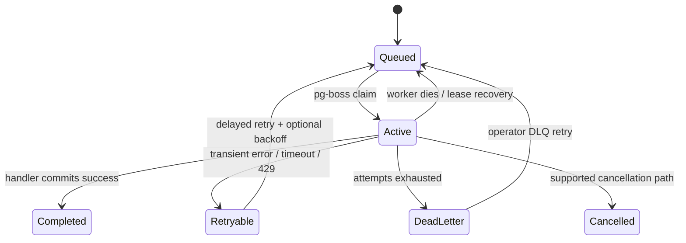

**Tradeoffs and alternatives**

pg-boss avoids Redis/SQS and aligns queue transactions with PostgreSQL, which is attractive at capstone/client scale. It increases DB load and couples queue availability to the primary data store. A broker or workflow engine becomes attractive when throughput, isolation, or cross-service orchestration dominates simplicity.

**Failure modes and limitations**

Payload type erasure at runtime, duplicated provider effects, cost amplification from retries, stale scheduled timestamps, process-local discovery counters, and missing queue-depth alerts are the largest gaps. Cancellation is implemented for discovery-specific flows, not uniformly for all jobs.

**Safe interview claim**

**Implemented and tested** — “pg-boss provides durable at-least-once claims and retries with DLQs; application idempotency and runtime payload validation still determine end-to-end correctness.”

### Q206. How does qualification scoring encode Zbooni’s criteria?

**Interview-ready answer**

The system represents criteria in two layers. Database-backed ICP profiles and rules encode countries, industries, size constraints, weighted positive signals, and hard filters. A Zbooni-specific seed script defines four named ICPs around chat-first sellers, high-touch services, ecommerce recovery, and multi-rep growth, with country and business-signal rules. Feature computation creates a stable snapshot. Scoring prefers an active trained logistic model; otherwise it can call OpenAI; if that is unavailable it falls back to deterministic rules unless configuration requires OpenAI. The final runtime score is a replacement choice, not a true weighted blend, despite some legacy naming and settings that imply blending.

**Deep technical answer**

`scoring.compute` evaluates deterministic rules first, including hard filters and category bonuses. It then selects an active logistic model if present, otherwise calls `evaluateLeadScore`; failure falls back to deterministic scoring. The current code assigns the trained/LLM result as final when produced and the deterministic result otherwise. `reasonsJson.scoreSource` records `trained`, `llm`, or `deterministic`. Default qualification threshold is 0.40; default display bands are low below 0.34, medium 0.34–0.669..., and high at 0.67+. The LLM prompt text separately describes “strong fit” as 0.75–0.89, so “strong fit” is ambiguous unless the exact report/query threshold is named.

The dirty current Edge demo does not execute that trained-model/LLM scoring hierarchy. Its bounded “enrichment” writes a `LeadEnrichmentRecord` whose provider enum is `HUNTER` while the payload identifies `EDGE_DEMO`; no Hunter request occurs. It computes a deterministic score, copies that same value into `deterministicScore`, `logisticScore`, and `blendedScore`, and attaches an active/latest logistic `ModelVersion` that it did not execute. It uses 0.50—not the full worker’s default 0.40—for the lead-status qualification transition. Those are **Demonstration-only or outbound-disabled** semantics with misleading model lineage, not proof that the demo ran Hunter, a logistic model, or LLM qualification.

**Repository evidence**

- Criteria: `scripts/icp/seed-zbooni-icps.ts:23-382`; `IcpProfile` and `QualificationRule` in schema.
- Deterministic engine: `apps/worker/src/scoring/deterministic.ts:288-463`.
- Orchestration: `apps/worker/src/jobs/scoring.compute.job.ts` and handler, especially final-score selection around line 320.
- Settings/thresholds: `apps/worker/src/utils/pipeline-settings.ts:228-323`.
- Dirty Edge demo enrichment/scoring: `supabase/functions/api/index.ts:1277-1485`.
- LLM: `packages/providers/src/ai/openai.adapter.ts:327-400,565-601`.
- Trained model: `apps/worker/src/scoring/logistic.ts`; `model.train.job.ts`; `model.evaluate.job.ts`.

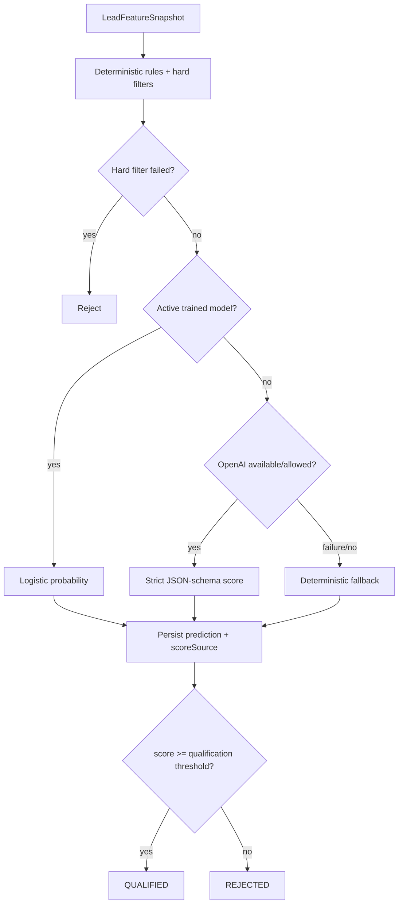

**Tradeoffs and alternatives**

Rules are reproducible and auditable; an LLM can interpret sparse qualitative evidence; logistic training can learn from outcomes once labels exist. A staged design is sensible, but the current fallback hierarchy and inconsistent “strong fit” thresholds must be made explicit. A calibrated classifier or embedding retrieval layer could reduce cost and variance.

**Failure modes and limitations**

The client source PDF is absent from current `main`; history says it was intentionally excluded from a sanitized branch. Client authorship/approval of exact rules is external. Scraped text is untrusted, and no strong prompt-injection instruction boundary was found. Temperature is 0.7, no seed is used, and scoring is not reproducible. Prediction records do not store a scoring prompt version.

**Safe interview claim**

**Implemented and tested** for criteria representation and scoring mechanics; **External operational fact not independently verifiable from repository** for client approval of every rule. “We encoded client-oriented ICP rules and hard filters, then used a trained model or structured LLM score with deterministic fallback.”

### Q240. How was AI quality evaluated?

**Interview-ready answer**

The honest answer is that the repository contains two different evidence levels. It implements an offline evaluation pipeline for a trained logistic classifier—deterministic train/validation/test splitting logic, class weighting, AUC, PR-AUC, precision, recall, F1, Brier score, and confusion counts. But I found no checked-in evaluation run or human-labeled benchmark proving those metrics were produced, and `calibrationJson` is explicitly persisted as null: Brier is a probabilistic error score, not a completed calibration analysis. That pipeline evaluates outcome-derived training labels, not whether the LLM correctly understood business fit. LLM tests verify prompt construction, schema parsing, and fallbacks with mocks. There is no golden qualification set, independent reviewer study, hallucination rate, grounding score, or prompt-regression benchmark. Therefore 42% strong-fit is an output distribution, never accuracy.

**Deep technical answer**

`model.train` selects labels/features and performs a run-ID-seeded 70/15/15 split before optimizing logistic weights. `model.evaluate` computes discrimination/classification metrics, Brier score, and confusion counts and can gate activation. It reloads all labels and each lead’s latest feature snapshot before re-splitting, so the holdout and features are not frozen; later labels/enrichment can change results and post-outcome snapshots can leak future information. `ModelEvaluation` persists metric fields while leaving `calibrationJson` null. LLM adapter tests mock Chat Completions and exercise strict JSON schemas, invalid responses, and failure mapping. They prove contract behavior, not semantic correctness. A rigorous LLM evaluation would freeze a time-bounded, deduplicated evidence set; obtain two or more independent sales-review labels with adjudication; lock prompts/models; measure precision/recall by decision threshold, calibration and abstention; separately score grounded explanations and draft factuality; and stratify by ICP/provider/evidence completeness.

**Repository evidence**

- `apps/worker/src/jobs/model.train.job.ts`; `model.evaluate.job.ts`.
- `apps/worker/src/scoring/logistic.ts`; `lift-analysis.ts`.
- `ModelEvaluation` schema: `packages/db/prisma/schema.prisma:507-529`.
- LLM contract tests: `packages/providers/src/ai/openai.adapter.integration.test.ts`; `openai-classify.test.ts`; worker scoring/message tests.
- Stored evaluation result/snapshot for the résumé run: **Not found in repository**.

**Tradeoffs and alternatives**

Behavioral outcomes are valuable but confounded by outreach, seller effort, and selection bias. Human fit labels are faster but subjective. Precision should usually dominate when representative attention and brand risk are costly; recall matters when missing a buyer is costlier. Thresholds should be chosen on a validation set, not from a desired percentage.

**Failure modes and limitations**

Prompt examples can leak into evaluation; reviewers can disagree; temporal drift invalidates old tests; and outcome labels can reinforce prior selection. Without stored runs, metric code is capability, not evidence of quality.

**Safe interview claim**

**Partially implemented** — “We implemented offline classifier metrics and robust structured-output tests, but did not preserve a repository-verifiable human benchmark for LLM qualification; 42% describes label prevalence, not correctness.”

### Q264. Where is the human in the loop?

**Interview-ready answer**

Humans define target profiles and rules, inspect leads and supporting business intelligence, review score explanations, edit draft variants, and approve or reject drafts. Full autonomy is intentionally not the current boundary because evidence can be sparse, model wording can be wrong, and outbound communication creates brand and compliance risk. Approval and approver/time are persisted, but any authenticated user can currently approve or reject a draft because there is no tenant ownership model; only some message editing/admin operations require app-admin. Rejection reason is stored, but rejection actor is not captured on the draft. Approval now records review state only and causes no external side effect.

**Deep technical answer**

`MessageApproval` has `PENDING`, `APPROVED`, `REJECTED`, and `AUTO_APPROVED`. Drafts have variants, selected variant, approval attribution/time, rejection reason, grounding context, prompt version, and model. Operators can edit variants through a more privileged route. The approval transaction locks current state, selects the desired variant, and updates the draft. There is no current score-edit endpoint; rejection/unrejection and rule changes are different forms of human override. Feedback tables could train future models, and label-generation/training jobs exist, but a closed-loop causal improvement process is not proved operationally.

**Repository evidence**

- Schema: `MessageDraft`, `MessageVariant`, `FeedbackEvent`, `TrainingLabel` in `packages/db/prisma/schema.prisma:629-758`.
- API: `apps/api/src/modules/messaging/messaging.routes.ts`, `service.ts`, `repository.ts:527-653`.
- UI: `apps/web/src/components/message-draft-card.tsx`; inbox/message/lead pages.
- Tests: messaging route/service/repository tests; worker message-generation/recovery tests.

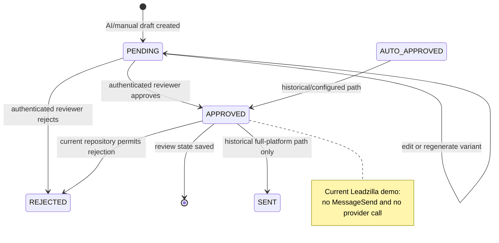

**Tradeoffs and alternatives**

Review every draft maximizes control but limits throughput. Confidence thresholds or sampling reduce labor but require calibrated scores and monitoring. Fully autonomous delivery should require tenant-scoped authorization, robust evaluation, suppression/compliance, idempotent provider calls, and operational approvals.

**Failure modes and limitations**

Any authenticated user’s global draft access is an IDOR/authorization concern in a multi-tenant deployment. Accidental approval is not a sending risk today, but it can misstate review history. Mutable states are not a full append-only audit log.

**Safe interview claim**

**Implemented and tested** for review/edit/approval state; **Demonstration-only or outbound-disabled** for side effects. “The representative remains the decision boundary; approval records review but cannot send in the current demo.”

### Q284. How is tailored outreach generated safely?

**Interview-ready answer**

There are two draft generators. The full worker requests several variants through OpenAI Chat Completions; the dirty current Edge demo requests one structured draft through the Responses API. Both use lead/company/score/ICP/business context, factual/context-only instructions, strict JSON shape checks, persisted model/prompt/grounding metadata, and human review. That is useful scaffolding, not a guarantee of truth: no semantic citation checker verifies every sentence, web content is untrusted, and model output is variable. Delivery is disabled. Full-worker generation is **Implemented and tested**; dirty Edge generation is **Implemented but deployment not established** and lacks a dedicated draft-generation test.

**Deep technical answer**

The full-platform worker adapter builds a system prompt from defaults plus database settings, ICP hooks, and operator feedback, then a user prompt from the lead and business context. It calls `/chat/completions` with `response_format.type = json_schema`, strict mode, a 30-second timeout, and default `gpt-4o-mini`; Zod validates the parsed response. The current dirty Edge demo has a separate implementation: the OpenAI Responses API, default `gpt-5.5` after environment/setting overrides, low reasoning effort, a strict JSON schema, 900 output-token limit, and a 30-second timeout (`supabase/functions/api/index.ts:38-40,901-908,2320-2640`). Neither local default proves which model served a historical or deployed run. The full adapter’s schema fix avoids strict-mode optional/nullable incompatibility that historically caused 400s. Message generation supports variants/regeneration, but prior versions are separate draft/variant records rather than a formal append-only prompt registry.

**Repository evidence**

- Prompts/config/call: `packages/providers/src/ai/openai.adapter.ts:136-139,151-325,446-563,701-725,793-802`.
- Current dirty Edge draft: `supabase/functions/api/index.ts:38-40,901-908,2320-2640`.
- Draft job: `apps/worker/src/jobs/message.generate.job.ts`.
- Defaults: `apps/web/src/lib/messaging-defaults.ts`.
- Schema: `MessageDraft`, `MessageVariant`.
- Tests: `openai.adapter.integration.test.ts`; `message.generate.job.test.ts`; `validate-message.test.ts`.

**Tradeoffs and alternatives**

Templates are predictable but less adaptive. Retrieval plus explicit evidence citations would improve grounding. A smaller model or deterministic template can reduce cost; a larger model may improve fluency without automatically improving factuality.

**Failure modes and limitations**

Prompt injection, sensitive inference, stale facts, repetitive messages, and plausible fabrication remain possible. No token/cost ledger is captured by the OpenAI adapter, and no formal outreach-quality evaluation is stored.

**Safe interview claim**

Full-worker structured generation is **Implemented and tested**; dirty Edge generation is **Implemented but deployment not established**; outreach delivery is **Demonstration-only or outbound-disabled**. “The system generates evidence-informed drafts under schema and human review; it does not prove every sentence or send them.”

### Q303. What is the evidence for the 200-search, 680-lead, $3.21 run?

**Interview-ready answer**

I could not reproduce that résumé figure from this repository. No script, billing export, experiment log, or claim-supporting snapshot ties 200 searches to 680 leads and $3.21. The schema can record search tasks and some discovery cost events, and Appendix D provides bounded queries if authorized source rows become available. A checked-in aggregate CSV contains one undated/unprovenanced table-count capture, but it does not contain the claimed run and cannot establish production. Seed data is synthetic. I repeat the résumé’s word “leads” without silently redefining it, avoid saying the 680 were unique, and do not imply $3.21 includes enrichment, OpenAI, infrastructure, retries, or failed requests unless the original ledger explicitly says so.

**Deep technical answer**

“Search” could mean a `SearchTask`, a provider request/page, or a top-level discovery run; the claim must identify which. `DiscoveryCostEvent` can store provider/cost data, but the OpenAI adapter does not persist token usage/cost. Unique businesses require `COUNT(DISTINCT business_id)` over attribution or another stated identity unit; raw provider result counts cannot establish uniqueness. Cost-per-derived metrics require joining the same run/cohort and handling zero denominators, retries, failures, and currency consistently.

**Repository evidence**

- `SearchTask`, `DiscoveryAttributionAssignment`, `DiscoveryCostEvent`, `BusinessConversion`, `LeadScorePrediction` in `packages/db/prisma/schema.prisma:760-1008`.
- Cost/budget helpers: `apps/worker/src/utils/provider-budget.ts`; discovery jobs.
- Exact strings `680`, `$3.21`, and the claimed 200-search experiment: **Not found in repository**.
- Production/billing data: **External operational fact not independently verifiable from repository**.

**Tradeoffs and alternatives**

Application cost events enable cohort analysis but require disciplined provider pricing/version and retry accounting. Billing exports are authoritative for spend but harder to attribute to leads. Both should be retained for a defensible experiment.

**Failure modes and limitations**

Raw results may duplicate businesses across queries/pages/providers. Currency micros vs dollars, free-tier credits, cached responses, failed requests, and retry costs can distort totals. Infrastructure and labor are usually omitted unless explicitly modeled.

**Safe interview claim**

**External operational fact not independently verifiable from repository** — “The résumé reports that one 200-search run found 680 leads for $3.21; this repository does not establish what ‘search’ or ‘lead’ meant, whether the leads were unique, or the cost components.”

### Q332. What do “21,000-plus leads” and “42% strong fit” mean?

**Interview-ready answer**

The repository does not contain a production snapshot or query result proving either number. “21,000 leads” could mean raw discovery results, attributed businesses, converted lead rows, enriched leads, or a cumulative provider count; those are not interchangeable. “42% strong fit” needs a denominator, date range, deduplication rule, successful-score filter, model/prompt version, and threshold. The code has at least three related thresholds—0.40 qualification, 0.67 high band, and prompt prose calling 0.75–0.89 strong—so the number is ambiguous without the original report. Even if correctly calculated, 42% is label prevalence, not accuracy.

**Deep technical answer**

Use `DiscoveryAttributionAssignment` for run-attributed unique businesses, `Lead`/`BusinessConversion` for converted leads, `LeadEnrichmentRecord` for attempts, and final `LeadScorePrediction` plus named threshold for scores. Exclude synthetic seed rows and define whether failures/unscored records remain in the denominator. For historical claims, preserve the exact SQL and a sanitized immutable result containing run IDs, timestamps, model and criteria versions.

**Repository evidence**

- No matching `21,000`, `680`, `$3.21`, `42%`, SIEDS, or Best Paper claim was found in current tracked text/code searches.
- Thresholds: `apps/worker/src/utils/pipeline-settings.ts:228-323`; `packages/providers/src/ai/openai.adapter.ts:394`; `apps/web/src/lib/messaging-defaults.ts:76`.
- Aggregate table-count artifact: `Supabase Snippet Public Schema Column List (1).csv` records 27,638 search tasks, 1,301 businesses, 638 sources, and zero leads/scores at an unprovenanced capture; it is not evidence for the résumé totals.
- Synthetic fixtures: `packages/db/prisma/seed.ts`—not production evidence.

**Tradeoffs and alternatives**

Raw counts are easy to report but misleading. Cohort-specific unique entity counts are slower and depend on identity quality. A metrics mart with immutable run definitions is the durable alternative.

**Failure modes and limitations**

Duplicate businesses, seed/test contamination, overwritten predictions, threshold changes, and denominator exclusion can move percentages materially. Model prevalence can look impressive while precision is poor.

**Safe interview claim**

Both are **External operational fact not independently verifiable from repository**. “The résumé reports more than 21,000 leads and 42% strong-fit prevalence; the repository does not preserve what ‘lead’ meant, uniqueness, cohort, denominator, or threshold, and the percentage is not accuracy.”

### Q349. How do authentication, authorization, and tenant isolation work?

**Interview-ready answer**

Users authenticate with Supabase Auth. In the Fastify path, bearer JWTs are verified against Supabase’s remote JWKS with issuer and audience checks, and protected routes receive the server-derived user identity. Sensitive operations query `app_admins`; discovery-admin routes additionally require a constant-time checked server admin key behind a Next.js proxy. The Edge demo also validates bearer users and app-admin membership before using a service-role client. Authentication is real and server-enforced, but authorization is not tenant isolation: the schema has no organization/tenant key, many reads are global to authenticated users, and any authenticated user can approve/reject a draft. That is acceptable only for a single-organization operator deployment, not multi-tenant SaaS.

**Deep technical answer**

Fastify auth uses JOSE `createRemoteJWKSet`/`jwtVerify`, issuer/audience validation, and optional active-user lookup against `auth.users`. `requireAppAdmin` queries `app_admins`. The Next admin proxy allowlists route roots, requires a bearer-shaped header, and injects `ADMIN_API_KEY`; the upstream API still verifies JWT/admin membership and key. Later SQL migrations revoke browser privileges on internal tables from `anon`/`authenticated`, leaving trusted server paths. Historical HS256 auth helpers remain but `/v1/auth/login` returns 410 and current Fastify registration uses Supabase JWT verification.

**Repository evidence**

- `apps/api/src/auth/supabase.ts:46-77`; `guard.ts:28-105`; `apps/api/src/index.ts:414+`.
- `apps/api/src/server.ts:298+`; `discovery-admin.auth.ts:9-94`.
- `apps/web/src/lib/supabase-client.ts:9-42`; `auth-context.tsx`; `app/api/admin/[...path]/route.ts`.
- Edge auth: `supabase/functions/api/index.ts:140-147,1826-1861`.
- Revokes: `supabase/migrations/20260403193000_reassert_browser_access_revokes.sql:1-36`.

**Tradeoffs and alternatives**

Supabase Auth reduces identity plumbing. App-admin membership is simple for one client. Multi-tenant SaaS would require organization membership on every domain row, server-side scope enforcement, RLS policies, tenant-aware unique keys, and authorization tests.

**Failure modes and limitations**

IDOR/global data exposure is the largest security limitation if more than one organization uses the deployment. Untrusted web content can influence LLM input. Secrets belong in server environments, but actual secret rotation/storage is external. CSRF risk is reduced by bearer tokens rather than ambient cookies; XSS remains relevant wherever HTML is rendered.

**Safe interview claim**

**Implemented and tested** for Supabase authentication and app-admin authorization; **Partially implemented** for least privilege; **Not found in repository** for tenant isolation. “The design is single-organization, not multi-tenant.”

### Q411. How are Docker, Railway, Vercel, CI, and deployment handled?

**Interview-ready answer**

The repository has three Node 22 slim Dockerfiles. The API uses a multi-stage build with a pruned production deployment and explicitly copies the generated Prisma runtime; it exposes port 5050 and has a `/health` check. Worker and web images are single-stage full-workspace builds, retain more build/development material, run as root, and lack image health checks. CI is strong on paper: Node 22/pnpm, disposable PostgreSQL, SQL-first migration bootstrap, lint, typecheck, unit/integration/E2E tests, builds, and runtime readiness lanes. Deployment is manually dispatched; current production workflow source-deploys API and worker to Railway and does not deploy Vercel. Configuration proves deployability, not a successful production release.

**Deep technical answer**

`Dockerfile.api` installs with frozen lockfile, generates Prisma, builds/deploys the API, copies `.prisma` directories, then creates a slim runtime. Worker/web perform frozen workspace installs and builds in their final images. No Dockerfile declares `USER`. `railway.toml` is service-neutral; exact service Dockerfile selection is out-of-repo. CI applies canonical Supabase SQL rather than Prisma migrations. The deploy workflow migrates before app deployment, source-deploys Railway API/worker, then requires readiness/smoke. Vercel is an external/manual platform path. Current demo deployment documentation refers to Vercel plus Supabase Edge; current live state was not externally checked.

**Repository evidence**

- `infra/docker/Dockerfile.api:1-47`; `Dockerfile.worker:1-23`; `Dockerfile.web:1-21`; `docker-compose.local.yml:1-27`.
- `.github/workflows/ci.yml:1-252`; `.github/workflows/deploy.yml`.
- `railway.toml:1-6`; `docs/DEPLOYMENT.md`; `docs/VERCEL_PROD_SETUP.md`.
- Prisma packaging fix history: `f3bab58`, `655c6b9`, `22edcda`, `593de54`, `a9e7bec`.
- Workflow/doc drift: current `.github/workflows/deploy.yml` is manual and source-deploys production API/worker, while `docs/DEPLOYMENT.md:47-83` still describes automatic staging and GHCR/GraphQL-era production behavior; the workflow also installs Railway CLI with npm despite the repository’s pnpm-only policy.

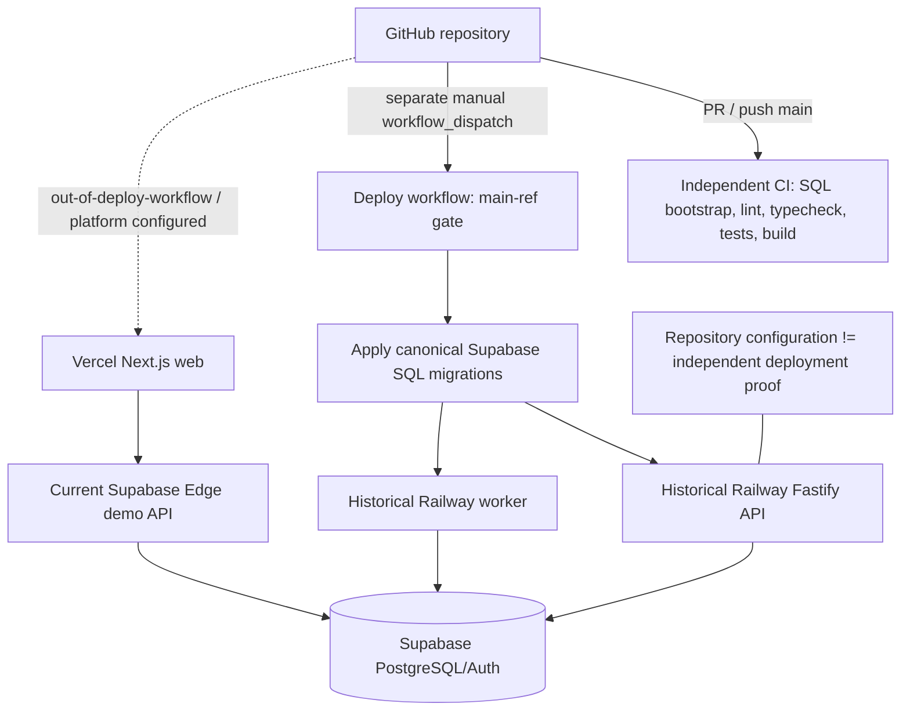

**Tradeoffs and alternatives**

Containers give runtime parity and long-running workers; serverless reduces operations for bounded APIs. One platform would simplify release coordination. Kubernetes is unjustified at demonstrated scale. Managed workers/workflows become valuable when queue operations exceed a small team’s capacity.

**Failure modes and limitations**

Docker daemon was unavailable, so image builds were not verified in this audit. Containers run as root; web/worker are not pruned. Migration-before-app can leave schema ahead after a failed deploy. Rollback docs describe image tags while current production uses source deployment. The smoke script targets the older Zbooni/Fastify root and is not valid for the dirty `/leadzilla` Edge demo without updates.

**Safe interview claim**

Repository TypeScript builds and CI design are **Implemented and tested**; container image assembly is **Implemented but deployment not established** because Docker builds were blocked in this audit; Railway/Vercel live state is **Deployment externally asserted but not independently established**. “I architected and hardened containerized API and worker build paths; this audit did not independently assemble the images or verify deployment receipts.”

### Q433. What do tests and CI prove—and not prove?

**Interview-ready answer**

Vitest is the actual test framework throughout. Unit tests cover rules, normalization, providers with mocks, prompt schema handling, scoring, rate limiting, message validation, routes, authorization, recovery, queue definitions, and disabled sending. Integration/E2E suites use real PostgreSQL, Fastify injection, and pg-boss. CI provisions Postgres 16 from canonical SQL, seeds it, runs lint/typecheck/tests/E2E/build, and performs built-runtime API/worker checks. The current audit passed typecheck, lint, build, and 576 targeted API/worker/discovery tests; additional provider/web/shared suites also passed during fan-out. DB-backed tests could not connect because Docker was off. Tests prove implemented contracts, not provider availability, production data quality, AI correctness, or deployment success.

**Deep technical answer**

There is no Jest suite. `playwright-core` is used by scraping runtime/tests, not as a browser E2E framework. API E2E means Vitest plus Fastify/Postgres. OpenAI/search/email/WhatsApp provider tests mock fetch/adapters and must not be treated as live integration. Concurrency is covered around outbox claiming and pipeline transitions but not a production-scale load profile. The web `test:unit` script runs `vitest run src`, so app-directory helper tests and Supabase Edge Deno tests are outside that target unless CI calls them separately.

**Repository evidence**

- Package scripts in root and package `package.json` files.
- `.github/workflows/ci.yml:1-252`.
- Co-located `*.test.ts`; API `test/integration` and `test/e2e`; worker `test/integration` and pipeline tests.
- Audit command record in Q0.

**Tradeoffs and alternatives**

Mocked providers make tests fast and safe but miss API drift. Contract recordings reduce drift risk without paid calls but can become stale. A small scheduled sandbox canary would complement CI. Browser E2E would catch navigation/auth/layout failures absent from component/helper tests.

**Failure modes and limitations**

All tests can pass while credentials expire, quotas change, pages block scraping, deployment config drifts, database pools saturate, prompts lose semantic quality, or tenant authorization exposes data. Docker and real-DB results remain unverified in this audit.

**Safe interview claim**

**Implemented and tested** — “The code has broad deterministic and database integration coverage, but no repository test establishes production availability or LLM decision accuracy.”

### Q459. What observability and operational controls exist?

**Interview-ready answer**

The services use structured Pino logging with request, job, run, lead, and correlation context where handlers provide it. Durable `JobExecution`, pg-boss rows, `OutboxEvent`, retry counters/errors, analytics rollups, provider cost events, pipeline-health checks, recovery jobs, and DLQs give several inspection surfaces. `/health` reports process liveness; `/ready` checks dependencies. What is missing is equally important: there is no repository-proven metrics backend, alert routing, dashboard for queue depth/oldest age, model token/cost capture, distributed tracing, or backup verification. Operations are diagnosable through SQL and logs, but not yet a mature SRE system.

**Deep technical answer**

Fastify creates request IDs and normalizes/logs errors. Worker wrappers attach job metadata and classify provider failures. The outbox records attempt count/last error/next attempt; pg-boss/DLQs capture queue retry state; pipeline health and recovery jobs scan durable stuck states. Analytics daily rollups provide product metrics, not infrastructure telemetry. The current Edge path has its own logs but no repository-proven aggregation. Runbooks describe smoke, migrations, and recovery but sometimes lag current topology.

**Repository evidence**

- `packages/observability/src`; `apps/api/src/server.ts`; `apps/worker/src/index.ts` and job wrappers.
- `JobExecution`, `OutboxEvent`, `AnalyticsDailyRollup`, `DiscoveryCostEvent` in schema.
- `pipeline.health.job.ts`, `lead.recovery.job.ts`, `search-task.recovery.job.ts`, `dlq.process.job.ts`, `outbox.cleanup.job.ts`.
- `docs/DEPLOYMENT.md`, `CURRENT_STATE.md`, `PROD_REMOTE_DB_STRATEGY.md`, operations guide.

**Tradeoffs and alternatives**

Database-backed operational truth is accessible and inexpensive at small scale. OpenTelemetry plus managed metrics/logs would improve correlation and alerting but add instrumentation and cost. Provider token/cost capture should be treated as business-critical before enabling high-volume AI.

**Failure modes and limitations**

Logs may omit a correlation ID on older/direct paths; queue backlog can grow without an alert; provider costs can spike without a hard global ceiling; and database-backed monitoring fails with the database. Backup/restore capability is documented as a provider assumption, not independently tested.

**Safe interview claim**

**Partially implemented** — “We built structured logs and durable job/outbox/recovery inspection, but not full metrics, tracing, alerting, or verified backup operations.”

### Q479. What can be said about the team, handoff, and SIEDS award?

**Interview-ready answer**

The repository supports a two-contributor engineering history with substantial work from both Zack and Peem. It supports my ownership of architecture, deployment/reliability, security/migration hardening, integration, and handoff, and it supports major teammate ownership in UI, messaging, providers, and pipeline features. It also contains extensive Zbooni handoff artifacts—env templates, operations and deployment guides, SQL-first migration procedures, smoke scripts, Dockerfiles, CI, and release commits. Git does not establish team titles, sponsor meetings, how disagreements were resolved, formal acceptance, or who wrote an academic paper. No paper, presentation, award certificate, proceedings link, or SIEDS/Best Paper string was found in current or searched Git history.

**Deep technical answer**

Commit and path histories support division of implementation, not organizational facts. Bidirectional PR merges show integration activity. `09b5a86` is a broad handoff release and `c9a8665` adds the operations guide. Historical commits say the proprietary ICP/offerings PDF informed seed work, but that file was excluded from sanitized current main. Technical-requirements docs include future-tense deliverables and unresolved client questions, so they are not acceptance evidence. The award and paper require university/external records.

**Repository evidence**

- Contribution/history evidence summarized in Q7.
- Handoff: `docs/SETUP_ONBOARDING.md`, `DEPLOYMENT.md`, `CURRENT_STATE.md`, `ZBOONI_*`, `scripts/db/**`, `scripts/release/smoke-production.sh`, Docker/CI files.
- Handoff commits: `98278c1`–`c4b9d00`, `09b5a86`, `c9a8665`.
- Paper/award artifact: **Not found in repository**.

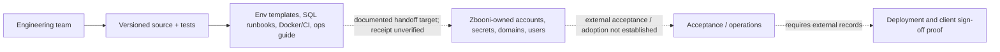

**Tradeoffs and alternatives**

Sanitizing proprietary client material protects confidentiality but removes provenance useful for interviews. A redacted requirements/acceptance packet and public award citation would preserve proof without exposing confidential data.

**Failure modes and limitations**

Git metadata cannot prove interpersonal leadership, sponsor feedback, academic authorship, or award outcome. AI co-author trailers also make raw volume a poor proxy for contribution.

**Safe interview claim**

Team leadership: **External operational fact not independently verifiable from repository**, with strong subsystem ownership evidence. Prepared code/runbook/handoff artifacts: **Implemented and tested**; actual transfer and acceptance: **External operational fact not independently verifiable from repository**. SIEDS Best Paper: **External operational fact not independently verifiable from repository**.

### Q501. What were the hardest decisions, genuine bugs, and redesign priorities?

**Interview-ready answer**

The hardest architecture decision was combining transactional durability with provider-heavy asynchronous work without adding another broker. The outbox plus pg-boss was pragmatic, but it creates at-least-once semantics and demands idempotent handlers. A genuine background-job risk is the crash window after queue publication and before marking the outbox event sent; the design mitigates but cannot eliminate duplicates. A genuine integration bug was SerpAPI local pagination offset handling, fixed in `b558d40`. A genuine AI issue was an OpenAI strict-schema definition whose nullable/optional shape caused 400s, now documented and tested in the adapter. A genuine container issue was omitted generated Prisma runtime in isolated deploy output, fixed by explicitly copying `.prisma`. Today I would first add tenant authorization, immutable prompt/criteria/run records, LLM evaluation fixtures, token/cost telemetry, and close the remaining direct-enqueue/recovery gaps.

**Deep technical answer**

The incidents are evidence-backed:

1. **Database/background delivery window** — symptom: a job can be observed twice after a dispatcher crash; hypothesis/root cause: `boss.send` and `OutboxEvent=SENT` cannot share one transaction; fix/prevention: singleton keys, target-state checks, idempotency keys, retry/dead-letter state, and tests. This is inherent, not fully “fixed.”
2. **External discovery pagination** — history `b558d40` records a correction to SerpAPI local offsets; adapter tests cover pagination. Exact production incident impact is not stored.
3. **AI structured output** — `openai.adapter.ts:793-802` records the strict-mode schema incompatibility that caused HTTP 400 generation/fallback failure; corrected schema and mocked adapter tests verify parsing paths.
4. **Deployment packaging** — commit chain `f3bab58`, `655c6b9`, `22edcda`, `593de54`, `a9e7bec`; current `Dockerfile.api:20-26` preserves explicit generated Prisma copy. Git proves the fix, not the first successful remote release.

At 10×, tune provider concurrency, DB pools/indexes, budget controls, and multi-instance progress. At 100×, separate operational telemetry, consider broker/workflow isolation, partition cohorts, introduce a true entity-resolution service, and add tenant partitioning. Do not speculatively adopt Kubernetes before measured pressure.

**Repository evidence**

- Commits/files named above.
- Outbox tests and dispatcher.
- `apps/worker/src/schedules.ts` stale-window TODO and legacy job-request recovery gap.
- Security/AI gaps in Q206/Q240/Q349.

**Tradeoffs and alternatives**

The capstone/client-scale design optimized one durable store and fast iteration. Hyperscale infrastructure would increase cost and cognitive load without evidence it was needed. The redesign trigger should be measured queue age, provider saturation, DB lock/pool pressure, tenant count, evaluation drift, and operational toil.

**Failure modes and limitations**

Do not turn commit messages into invented production incidents. Exact symptoms, dates, client impact, and post-deploy verification are often absent. The most serious current limitations are global authorization, incomplete LLM evaluation, missing token/cost telemetry, and incomplete outbox coverage.

**Safe interview claim**

**Implemented and tested** for the cited fixes; production incident impact is **External operational fact not independently verifiable from repository**. “I can explain the failure mechanism, code fix, tests, and remaining invariant without inventing a customer-impact story.”

---

# II. Complete numbered answer ledger

The following ledger answers every required numbered question. It is deliberately concise where the detailed answer above or an appendix supplies the mechanics. Status applies to the answer in that row. “NF” means **Not found in repository**; “External” means **External operational fact not independently verifiable from repository**.

## A. Product, scope, ownership, and handoff (Q1–Q24)

| Q | Answer | Evidence status and anchor |
|---:|---|---|
| 1 | Zbooni sought a configurable funnel from business discovery through evidence, fit scoring, and reviewed outreach drafts; the prior workflow baseline is absent. | Product: **Implemented and tested**; prior workflow: **Not found in repository**. Q1. |
| 2 | No repository artifact reliably describes the exact previous workflow, staffing, tools, cycle time, or pain metrics. | **Not found in repository**. |
| 3 | Authenticated sales/operator/admin users are inferred from UI/routes; no approved persona roster is stored. | **Implemented but deployment not established**; `apps/web/app/dashboard`, API auth/routes. |
| 4 | A rep defines/chooses ICPs, launches bounded discovery, inspects leads/evidence/scores, requests/edits drafts, and approves/rejects. | **Implemented and tested**; Q47/Q264. |
| 5 | Task expansion, provider querying, normalization, evidence capture, prequalification, conversion, feature extraction, scoring, draft generation, jobs/recovery/analytics are automated. | **Implemented and tested**. |
| 6 | Target/rule definition, review, draft editing, approval/rejection, provider/account operations, and current send boundary remain human-controlled. | **Implemented and tested**; outbound **Demonstration-only or outbound-disabled**. |
| 7 | Zack has repository-supported architecture, outbox, auth, migration, deployment/reliability, integration, and handoff ownership; Peem has major UI/provider/messaging/pipeline work. | Formal leadership: **External operational fact not independently verifiable from repository**; Q7. |
| 8 | Peem’s history supports major UI, provider, messaging, learning, and pipeline contributions; Git does not prove complete responsibility boundaries. | **Implemented and tested** for authored code; `git log`/`shortlog`. |
| 9 | Cross-cutting originating/hardening commits and handoff plans support leadership-sized work, but no title/meeting record exists. | **External operational fact not independently verifiable from repository**. |
| 10 | Safest meaning: architecture + implementation + deployment/reliability/handoff coordination, not sole implementation or proved people-management authority. | **External operational fact not independently verifiable from repository**. |
| 11 | Git cannot determine hours, pair work, client meetings, task authority, conflict resolution, acceptance, or organizational title. | **External operational fact not independently verifiable from repository**. |
| 12 | Docs assign Zbooni ownership of cloud/provider accounts, domains, secrets, users, acceptance, and operations; actual fulfillment is external. | Plan: **Designed or documented only**; fulfillment: **External operational fact not independently verifiable from repository**. |
| 13 | Commit history says a proprietary “ICP and Offerings” PDF informed seeds; current `main` excludes it, and exact interviews/approval are unknown. | Encoding **Implemented and tested**; provenance/approval **External operational fact not independently verifiable from repository**. |
| 14 | No signed acceptance criteria or client sign-off is present; an operations guide describes an acceptance/live environment. | **Deployment externally asserted but not independently established**. |
| 15 | Source, env templates, SQL migration/runbooks, Docker/CI/deploy configuration, setup/current-state/ops/handoff docs were prepared; receipt is unproved. | Artifacts **Implemented and tested**; delivery **External operational fact not independently verifiable from repository**. |
| 16 | See Q15 and Appendix F: onboarding, current state, deployment, operations, requirements, DB strategies, smoke, container and workflow material. | **Implemented and tested** as repository artifacts. |
| 17 | Historical docs assert Zbooni production/live acceptance and a completed discovery run; no independent receipt; later Railway services were stopped/failed. | **Deployment externally asserted but not independently established**; Q17. |
| 18 | Historically asserted: web, Fastify API, worker, Supabase DB/Auth and provider integrations. Exact live versions/components were not independently checked. | **Deployment externally asserted but not independently established**. |
| 19 | Current Leadzilla Vercel/Edge preview data and bounded workflows are recruiter-demo surfaces; old Fastify/worker is not the current public route. | **Demonstration-only or outbound-disabled**. |
| 20 | Current email/WhatsApp delivery is blocked across API, outbox, recovery, worker, and Edge paths. | **Demonstration-only or outbound-disabled**; Q20. |
| 21 | Config/adapters exist for SerpAPI/Google Places/Apollo/Hunter/OpenAI/Resend/Trengo/scrapers, but configured production accounts are external facts. | Code **Implemented and tested**; configuration **Deployment externally asserted but not independently established**. |
| 22 | Multi-tenant isolation, formal LLM benchmark, complete cost telemetry, uniform outbox coverage, complete runtime payload parsing, and mature alerts remain incomplete. | **Partially implemented**. |
| 23 | Strongest description: a client-sponsored, configurable AI-assisted prospecting and human-review platform with a tested full async architecture and a separate send-disabled public demo. | Full architecture **Implemented and tested**; public delivery **Demonstration-only or outbound-disabled**. |
| 24 | Overstatements: sole builder, presently live full Railway platform, exactly-once processing, 21k unique leads, 42% accuracy, fully autonomous outreach, or award/deployment proof from Git alone. | Several are **Contradicted by repository evidence**. |

## B. Complete architecture (Q25–Q46)

| Q | Answer | Evidence status and anchor |
|---:|---|---|
| 25 | Two topologies: historical full Next/Fastify/worker/pg-boss/outbox platform and current Next/Supabase Edge bounded demo. | **Implemented and tested**; Q25 diagram. |
| 26 | Web renders operator flows, manages Supabase session/preview mode, calls APIs, streams draft events in full path, and displays durable states/errors. | **Implemented and tested**; `apps/web`. |
| 27 | Fastify authenticates/authorizes, validates, queries, performs short transactions, creates job/outbox intent, serves health/readiness/SSE/webhooks. | **Implemented and tested**; `apps/api`. |
| 28 | Workers own 30 queue consumers, 18 schedules, providers, discovery, enrichment, scoring, generation, analytics, recovery, retention, and outbox dispatch. | **Implemented and tested**; `apps/worker`. |
| 29 | PostgreSQL is durable application, queue, outbox, model, provenance, approval, and analytics state. | **Implemented and tested**. |
| 30 | Supabase provides Postgres and Auth; current demo also uses Edge Functions. Storage is not materially used. “Realtime” is not the main update mechanism. | **Implemented and tested**. |
| 31 | Providers return discovery pages, enrichment/contact facts, web/social content, email/WhatsApp historical delivery, with adapters/timeouts/validation. | **Implemented and tested**; delivery historical/disabled. |
| 32 | OpenAI supplies structured fit scoring, draft variants, business insights, reply classification, and direct JSON contact extraction/validation/adjudication. | **Implemented and tested**; Appendix C. |
| 33 | Split keeps slow/retryable/provider work out of request lifecycles and scales it independently. | **Implemented and tested**; Q98. |
| 34 | Auth, reads, validation, short writes, approval-state changes, health/readiness and job submission are synchronous. | **Implemented and tested**. |
| 35 | Discovery, enrichment, features, scoring, training/evaluation, drafting, analytics, maintenance and recoveries are asynchronous in the full path. | **Implemented and tested**. |
| 36 | Boundaries: browser↔server, JWT/admin, server↔DB, queue producer↔consumer, worker↔providers, untrusted web content↔LLM, client accounts↔repo. | **Partially implemented**; tenant/prompt-injection gaps. |
| 37 | Major flows are in Q25/Q47 diagrams; write+intent, outbox→queue→handler, evidence→snapshot→score, draft→review. | **Implemented and tested**. |
| 38 | `Business` is discovered-organization truth; `Lead` is converted prospect truth; provenance/conversion links reconcile them. | **Implemented and tested**. |
| 39 | `JobExecution` is public workflow truth; pg-boss is delivery/claim truth; neither alone is complete. | **Implemented and tested**. |
| 40 | `IcpProfile`, `QualificationRule`, and pipeline settings are runtime criteria truth; seed scripts are defaults. | **Implemented and tested**. |
| 41 | `LeadScorePrediction` plus feature/model references and `reasonsJson.scoreSource` are persisted output truth, with lineage caveats. | **Implemented and tested**. |
| 42 | `MessageDraft.approvalStatus`, `approvedByUserId`, and `approvedAt` are approval truth; rejection actor is missing. | **Implemented and tested**. |
| 43 | Historical docs: Vercel+Railway+Supabase; current demo: Vercel-oriented web+Supabase Edge/Auth/Postgres. | **Deployment externally asserted but not independently established**. |
| 44 | Provider quotas/latency, shared Postgres pool/queue, scraping/browser work, OpenAI throughput, and UI polling are primary bottlenecks. | **Implemented but deployment not established**. |
| 45 | At 10×, provider limits and DB connection/concurrency budgets likely fail before CPU; process-local discovery progress also becomes visible. | Reasoned forecast: **Designed or documented only**. |
| 46 | At 100×, add tenant/partition boundaries, broker/workflow isolation if measured, entity-resolution service, autoscaling telemetry, budgets, and frozen evaluation lineage. | **Designed or documented only** recommendation. |

## C. Representative workflow (Q47–Q69)

| Q | Answer | Evidence status and anchor |
|---:|---|---|
| 47 | ICP→tasks→discovery→normalize/match→evidence/attribution→prequalify/convert→features→score→draft→human approval→no send. | **Implemented and tested**; Q47. |
| 48 | Industries, countries, company-size/volume, desired signals, hard filters, weights, descriptions, hooks/features, and discovery options. | **Implemented and tested**. |
| 49 | Zod request contracts, service rules, DB constraints, and provider-specific validation; worker payload validation is inconsistent. | **Partially implemented**. |
| 50 | Authenticated route validates limits/heartbeat then transactionally creates root/shard executions and outbox rows. | **Implemented and tested**; discovery routes/repository. |
| 51 | Outbox publishes `discovery.seed`; seed generates tasks and pg-boss search workers claim them; optional weekly schedule exists. | **Implemented and tested**. |
| 52 | Provider clients paginate; SerpAPI/Places paths return normalized pages. Retry/page semantics differ by provider. | **Implemented and tested**. |
| 53 | Discovery normalization standardizes domain/URL, phone, names, query hashes and locations before matching/persistence. | **Implemented and tested**; `packages/discovery/src/normalization`, `dedupe`. |
| 54 | Within/across searches, hostname first then phone plus DB partial unique indexes/upsert/skip-duplicates; shared identifiers risk false merges. | **Implemented and tested**, with limitation. |
| 55 | `Business`, source/evidence, attribution and cost rows are persisted; conversion may create `Lead` and lineage records. | **Implemented and tested**. |
| 56 | Prequalification/conversion enqueue features; selected new-lead paths use same-transaction outbox, while some paths directly enqueue. | **Partially implemented** durability. |
| 57 | Website scraper, Instagram scraper, search/review/DNS evidence and cached scrape JSON feed features/insights/contact extraction. | **Implemented and tested**. |
| 58 | Feature computation creates scoring `JobExecution`+outbox; scheduled/batch/manual scoring paths also exist. | **Implemented and tested**. |
| 59 | Baseline/ICP description and JSON features go to scoring; business text can be included indirectly; secrets are not intentional inputs. | **Implemented and tested**. |
| 60 | Strict JSON Schema plus Zod validate adapter outputs; malformed/refusal/timeouts map to failure/fallback. | **Implemented and tested**. |
| 61 | Qualified lead plus business intelligence/ICP/prompt settings enter `message.generate`; strict variants are saved. | **Implemented and tested**. |
| 62 | Rep reviews identity, evidence/intelligence, score/reasoning, subject/body variants, and approval status. | **Implemented and tested**. |
| 63 | Rep can edit/select variants, regenerate, approve/reject, reject/unreject leads; no direct persisted score-edit control was found. | **Partially implemented** override model. |
| 64 | `MessageDraft.approvalStatus=APPROVED` plus approver/time. | **Implemented and tested**. |
| 65 | Approval now only marks the draft; it does not create `MessageSend` or publish work. | **Demonstration-only or outbound-disabled**. |
| 66 | Pino logs request/job/run/correlation/lead/business identifiers where bound; durable job/outbox/errors/pipeline events also record state. | **Partially implemented** observability. |
| 67 | Transient work retries/backoffs; permanent/exhausted work enters failure/DLQ or terminal states; some jobs swallow errors and do not retry. | **Partially implemented**. |
| 68 | Many stages resume via pg-boss/outbox/recovery/target-state checks; legacy/direct paths and stale local counters weaken uniformity. | **Partially implemented**. |
| 69 | Upserts/unique keys/state gates make many repeats safe; external side effects and all direct enqueue paths are not universally exactly-once. | **Partially implemented**. |

## D. Data model and invariants (Q70–Q97)

| Q | Answer | Evidence status and anchor |
|---:|---|---|
| 70 | Major entities are summarized in Q70 and the ER diagram. | **Implemented and tested**. |
| 71 | See the Mermaid ER diagram in Q70. | **Implemented and tested**. |
| 72 | Accounts/users: Supabase Auth+`app_admins`; targets: ICP/rules; searches/results: tasks/attribution; prospect/evidence/score/draft/jobs/outbox: named tables in Q70. | **Implemented and tested**; no tenant/account entity. |
| 73 | Application entities mainly use string UUID/CUID IDs; some legacy/job request IDs differ. | **Implemented and tested**; schema/migrations. |
| 74 | Key uniques: lead email, enrichment request, feature tuple, prediction tuple, task key, attribution tuple, send/feedback idempotency, conversion pair. | **Implemented and tested**. |
| 75 | Prisma/SQL FKs connect leads, ICPs, businesses, evidence, scores, models, drafts, sends, feedback and jobs; delete behavior varies. | **Implemented and tested**. |
| 76 | Enums/checks/partial indexes exist in SQL; Prisma does not express every partial uniqueness/check detail. | **Implemented and tested**, schema-drift seam. |
| 77 | Leads/businesses/jobs/outbox/drafts/predictions/settings are mutable; evidence/events/evaluations are more append-oriented but not universally immutable. | **Implemented and tested**. |
| 78 | Evidence, discovery/enrichment attempts, feedback, labels and evaluations are append-oriented; prediction upsert and cleanup prevent a pure event log. | **Partially implemented** audit history. |
| 79 | Provider, provider record ID, source URL/raw payload, business evidence, run/task attribution and grounding IDs retain provenance. | **Implemented and tested**. |
| 80 | Prisma `DateTime`/SQL `timestamptz` and ISO strings are used; schedules are UTC. Label schedule freezes its window at registration. | **Implemented and tested**, known TODO. |
| 81 | Status/time indexes support outbox claims; task/run, lead status, model, attribution and analytics migrations add lookup indexes. | **Implemented and tested**. |
| 82 | Production schema is SQL-first under `supabase/migrations`; Prisma mirrors client expectations; scripts bootstrap/verify/sync. | **Implemented and tested**. |
| 83 | Critical: no send; one active model/type; stable task/prediction/snapshot keys; target state before side effects; same-tx outbox on covered handoffs. | **Implemented and tested**. |
| 84 | Unique/FK/check/partial indexes and transaction boundaries are DB-enforced. | **Implemented and tested**. |
| 85 | Status transition legality, identity matching, thresholds, provider budgets, prompt grounding, and some idempotency are application-enforced. | **Partially implemented**. |
| 86 | Yes. Real businesses can duplicate under incomplete identity/races; shared domain/phone can also over-merge. | **Implemented and tested**, limitation. |
| 87 | One `Business` can be attributed to multiple runs/tasks; a lead has multiple discovery records. | **Implemented and tested**. |
| 88 | Yes, multiple enrichment records; `requestKey` prevents only the same request identity. | **Implemented and tested**. |
| 89 | Yes across snapshots/models; same snapshot/model tuple is upserted, not appended. | **Implemented and tested**. |
| 90 | Yes, multiple drafts/variants can exist. | **Implemented and tested**. |
| 91 | Current routes permit later rejection/edit patterns; approval is not an immutable event ledger. No current send risk. | **Partially implemented** audit history. |
| 92 | Draft stores `promptVersion`/generated model; prediction references `ModelVersion` but scoring prompt version and actual lineage can be inaccurate. | **Partially implemented**. |
| 93 | ICP/rule rows have timestamps/metadata but no immutable criteria-version entity tied to each prediction. | **Partially implemented**. |
| 94 | Find/create identity races, outbox publish/status crash, snapshot/handoff split, multi-worker progress counters, approval state races are important. | **Partially implemented** mitigations. |
| 95 | Prisma transactions cover lead+job+outbox, discovery root/shards, scoring run, conversion handoff, and feature→score intent; raw SQL claims rows. | **Implemented and tested**. |
| 96 | Default PostgreSQL isolation/row locks/conditional updates are assumed; no global serializable workflow. `SKIP LOCKED` supports work stealing. | **Implemented and tested**. |
| 97 | Recovery, backfill, bootstrap/verify, reset, drift capture, schema health, DLQ, retention and reconciliation scripts/jobs exist. | **Implemented and tested**; production execution external. |

## E. API and worker separation (Q98–Q112)

| Q | Answer | Evidence status and anchor |
|---:|---|---|
| 98 | See Q98: bounded HTTP control plane versus slow/retryable provider work. | **Implemented and tested**. |
| 99 | Discovery pages, scraping, enrichment, LLM calls, training/evaluation, batch scoring, analytics, retries/recovery and delivery do not belong in HTTP lifecycles. | **Implemented and tested**. |
| 100 | Routes/jobs create durable `JobExecution`, often same-tx `OutboxEvent`; dispatcher/direct producer sends typed pg-boss payload. | **Partially implemented** uniform durability. |
| 101 | Worker starts Prisma/pg-boss, creates queues, registers handlers/heartbeat/schedules and pollers from `apps/worker/src/index.ts`. | **Implemented and tested**. |
| 102 | One worker service hosts 30 queue types; it is not 30 OS services. Appendix B inventories them. | **Implemented and tested**. |
| 103 | SIGINT/SIGTERM close API resources; worker clears pollers and calls graceful pg-boss stop with 30-second timeout. | **Implemented and tested**. |
| 104 | pg-boss can redeliver abandoned work; after 30 seconds worker shutdown may leave work for lease recovery. External effects still require idempotency. | **Implemented and tested** semantics. |
| 105 | Search/prequalification/conversion/features have explicit batch/concurrency; many other registrations consume sequentially per process. DB pools are small. | **Implemented and tested**. |
| 106 | Adapter limits, retry/backoff, scoped provider fallback, email/provider rate limiters, concurrency and optional budgets are used. | **Partially implemented**; budgets can fail open. |
| 107 | Queue/outbox claims are multi-instance safe; process-local discovery slot/progress aggregation is not fully atomic across instances. | **Partially implemented** horizontal safety. |
| 108 | Provider clients, rate limiter state, intervals/poller flags and discovery counters live in memory. | **Implemented and tested**. |
| 109 | Domain records, executions, outbox, pg-boss, evidence, scores and approvals are durable in PostgreSQL. | **Implemented and tested**. |
| 110 | Job/run endpoints read `JobExecution` and related state; failures/progress are durable, though not all fine-grained counters are atomic. | **Implemented and tested**. |
| 111 | Web uses HTTP query/polling and an authenticated fetch-based SSE stream for draft events in the full path; preview uses bundled snapshots. | **Implemented and tested**. |
| 112 | Monolith is simpler; split workers isolate latency; serverless suits bounded calls; managed workflows improve orchestration at added cost. | Current choice **Implemented and tested**; alternatives discussed Q98/W. |

## F. Transactional outbox (Q113–Q140)

| Q | Answer | Evidence status and anchor |
|---:|---|---|
| 113 | It prevents committing covered business state while losing the corresponding queue intent. | **Implemented and tested**; Q113. |
| 114 | In Prisma transactions in API discovery/scoring/lead and worker conversion/features paths. | **Implemented and tested**. |
| 115 | `OutboxEvent` is inserted inside the same transaction on those paths. | **Implemented and tested**. |
| 116 | Yes on enumerated producers; no for every direct pg-boss send. | **Partially implemented** coverage. |
| 117 | Exact paths: Q113 evidence and Appendix B; e.g. discovery repository 228–265 and API index 828–870. | **Implemented and tested**. |
| 118 | ID/type/payload/status/attempts/nextAttemptAt/lastError/processedAt/createdAt/updatedAt. | **Implemented and tested**. |
| 119 | Poller selects pending/due failed plus `processing` stale five minutes. | **Implemented and tested**. |
| 120 | One SQL `UPDATE ... WHERE id IN (SELECT ... FOR UPDATE SKIP LOCKED) RETURNING`. | **Implemented and tested**. |
| 121 | The same row cannot be simultaneously claimed; a stale/replayed row can later be reclaimed. | **Implemented and tested**. |
| 122 | `FOR UPDATE SKIP LOCKED`, conditional target checks, unique/singleton keys are used; no advisory lock is central here. | **Implemented and tested**. |
| 123 | `sent` after `boss.send` returns or when send is deliberately skipped by disabled boundary. | **Implemented and tested**. |
| 124 | No. Publication is not job completion or provider success. | Any equivalence is **Contradicted by repository evidence**. |
| 125 | Before claim it remains pending; after stale claim it becomes eligible after five minutes. | **Implemented and tested**. |
| 126 | If external work occurred after job claim, job-level redelivery can repeat it; provider/business idempotency and reconciliation are required. | **Partially implemented**. |
| 127 | Yes, crash after `boss.send` before outbox status can republish. | **Implemented and tested** at-least-once semantics. |
| 128 | At-least-once, with deduplication/idempotency mitigations. | **Implemented and tested**. |
| 129 | DB commit, broker acknowledgement, handler commit, and external provider effect cannot generally share one atomic transaction. | The repository’s at-least-once response is **Implemented and tested**. |
| 130 | Feature/scoring upserts, discovery attribution, conversion, message send idempotency and state-gated handlers have varying idempotency strength. | **Partially implemented**. |
| 131 | Message-send, feedback, enrichment request, feature/prediction tuples, task/singleton and conversion keys exist. | **Implemented and tested**. |
| 132 | Zod validation, unique constraints, upsert/state checks, and some idempotency keys suppress repeats; not every mutation has an API key. | **Partially implemented**. |
| 133 | No global ordering guarantee; singleton/state dependencies handle local order, and workflows use durable predecessor state. | **Partially implemented**. |
| 134 | Dispatcher dead-letters after five attempts; pg-boss queues have per-job DLQs and a DLQ processor. | **Implemented and tested**. |
| 135 | Yes: `OutboxStatus.dead_letter` and queue-specific `.dead_letter` queues. | **Implemented and tested**. |
| 136 | Cleanup deletes old sent/dead-letter rows in 500-row batches after retention threshold. | **Implemented and tested**. |
| 137 | Stale `processing` age, pipeline-health scans, logs and DB queries detect stuck state; alerting is incomplete. | **Partially implemented**. |
| 138 | Dispatcher DB test covers failed publish then successful retry; producer tests prove same-tx intent; no single test proves every external effect. | **Implemented and tested**. |
| 139 | Duplicated side effects, uncovered direct sends, post-transaction lineage gaps, DB outage, malformed payload and silent/suppressed singleton publication remain. | **Partially implemented**. |
| 140 | DB outbox is simplest with Postgres; Kafka/SQS scale/isolate; Redis is operationally separate; workflow engines add step semantics; all need atomic bridging/idempotency. | Current choice **Implemented and tested**; alternatives **Designed or documented only**. |

## G. Queue, retries, and recovery (Q141–Q165)

| Q | Answer | Evidence status and anchor |
|---:|---|---|
| 141 | PostgreSQL-backed pg-boss. | **Implemented and tested**; Q141. |
| 142 | It avoids another broker, supports cron/retry/DLQ/singletons, and shares Postgres operationally. Selection rationale is inferred, not a decision record. | Implementation **Implemented and tested**; rationale **Designed or documented only**. |
| 143 | Constants/payload interfaces/retry options in job modules, centralized by `WORKER_QUEUE_DEFINITIONS`. | **Implemented and tested**. |
| 144 | API/outbox payloads have Zod/manual checks; most worker `job.data` is only TypeScript-typed and not runtime parsed. | **Partially implemented**. |
| 145 | pg-boss ID plus domain `JobExecution.id`; singleton keys and domain IDs correlate work. | **Implemented and tested**. |
| 146 | Per-queue one-to-five retry limits, delays and DLQ; Appendix B. | **Implemented and tested**. |
| 147 | Most core jobs set exponential backoff; heartbeat does not; policies vary. | **Implemented and tested**. |
| 148 | Highest core shown is five retries (`discovery.run_search_task`, historical `message.send`); exact options are per job. | **Implemented and tested**. |
| 149 | Provider/HTTP calls commonly use explicit timeouts (OpenAI 30s); pg-boss lease/expiration and a two-hour discovery safety timeout apply. | **Partially implemented** uniformity. |
| 150 | pg-boss lease recovery, outbox stale reclaim, lead/search/send/approval recovery and pipeline health handle abandoned work. | **Partially implemented**. |
| 151 | Durable timestamps/status scans, pg-boss state, outbox five-minute reclaim and recovery jobs detect stalls. | **Implemented and tested**. |
| 152 | `JobExecution` failure/error, lead/business terminal status, logs, pg-boss DLQs and outbox dead-letter expose failures. | **Implemented and tested**. |
| 153 | Discovery cancellation cancels selected boss jobs and durable state; arbitrary uniform cancellation is absent. | **Partially implemented**. |
| 154 | Retries/recovery/DLQ replay resume selected work; no generic workflow checkpoint/resume UI. | **Partially implemented**. |
| 155 | Many are state-gated/upserted but not all external operations are proved idempotent. | **Partially implemented**. |
| 156 | Concurrency, adapter backoff, 429 mapping, provider rotation/fallback and rate limiters. | **Implemented and tested**. |
| 157 | Usually classified transient/rate-limited and retried/backed off; exact adapter behavior varies. | **Implemented and tested** with provider-specific gaps. |
| 158 | Timeout becomes retryable/provider failure; partial persisted state may support retry. | **Implemented and tested**. |
| 159 | Zod/manual parsing rejects or maps malformed data; worker payloads can still fail late and consume retries. | **Partially implemented**. |
| 160 | Conversion retains cached/evidence/contact candidates where written; later stages can retry. Transaction boundaries do not make the whole enrichment atomic. | **Partially implemented**. |
| 161 | Yes, `BusinessEvidence`, cached scrape JSON and enrichment records can retain partial evidence. | **Implemented and tested**. |
| 162 | Attempt limits, backoff, caching, request keys, provider budgets and state gates control retry cost; budget DB errors can fail open. | **Partially implemented**. |
| 163 | `JobExecution`/run endpoints and UI job pages expose status/results/errors; pg-boss internals are admin/ops detail. | **Implemented and tested**. |
| 164 | Structured context and durable IDs correlate jobs/runs/leads; not every path has distributed tracing. | **Partially implemented**. |
| 165 | Runtime payload validation, direct-enqueue gaps, process-local progress, swallowed terminal-job errors, legacy stale requests, alerts and external idempotency are largest gaps. | **Partially implemented**. |

## H. Lead discovery (Q166–Q186)

| Q | Answer | Evidence status and anchor |
|---:|---|---|
| 166 | A search is usually one durable `SearchTask`: provider/task type plus normalized query payload/hash and run; a discovery run contains many tasks. | **Implemented and tested**. |
| 167 | ICP industries/categories, countries/locations, keywords/query, provider, page/run, limits and task type define it. | **Implemented and tested**. |
| 168 | Current code supports SerpAPI, Google Places, Brave/company/Google/LinkedIn/Apollo variants; configured runtime differs by topology. | **Implemented and tested**; deployment unestablished. |
| 169 | Official search/discovery APIs, search-result APIs, and website/Instagram/browser scraping are all represented. | **Implemented and tested**. |
| 170 | Provider-specific pagination tokens/offsets and per-task run/page state; historical SerpAPI local offset bug was fixed in `b558d40`. | **Implemented and tested**. |
| 171 | Worker concurrency, backoff, 429 handling, fallback scope and budgets. | **Implemented and tested**, incomplete hard budget truth. |
| 172 | Transients retry/fallback; terminal/malformed outcomes update job/task state; Google Places 402/403 may incorrectly enter general retry handling. | **Partially implemented**. |
| 173 | A returned candidate business with usable identity/evidence; raw provider result, `Business`, attribution, and converted `Lead` are distinct units. | **Implemented and tested**. |
| 174 | Discovery primarily produces businesses/places/domains; person contacts are later enrichment; `Lead` is a converted prospect. | **Implemented and tested**. |
| 175 | Adapters map provider payloads to normalized candidates, then common business normalization/matching persists them. | **Implemented and tested**. |
| 176 | URL/hostname, phone E.164-like normalization, names/text, social handles, address/location and task hashes have helpers; completeness varies. | **Implemented and tested**. |
| 177 | Stable identifiers and per-task/provider records plus skip-duplicate/partial unique logic. | **Implemented and tested**. |
| 178 | Existing `Business` is resolved by hostname then phone; attribution preserves appearances across runs. | **Implemented and tested**. |
| 179 | Exact-ish identifiers avoid broad fuzzy merging, but shared domain/phone can still false-merge and incomplete identity can duplicate. | **Partially implemented** entity resolution. |
| 180 | Incomplete candidates can be retained, prequalified/rejected, or create separate businesses rather than forced merges. | **Implemented but deployment not established**. |
| 181 | Yes: sources, raw JSON/evidence, provider record IDs, task/run and attribution rows. | **Implemented and tested**. |
| 182 | Stored URLs/raw/evidence can be inspected; live source may change or disappear. | **Implemented and tested**. |
| 183 | Timestamps/snapshots and retention exist, but no comprehensive source freshness policy or automatic re-verification SLA was found. | **Partially implemented**. |
| 184 | Runtime validation/adapters may reject malformed changes; tests/mock fixtures detect known drift, but no live contract canary is proved. | **Partially implemented**. |
| 185 | Normalization/task/dedupe/provider clients/workers have deterministic Vitest suites with mocked responses. | **Implemented and tested**. |
| 186 | Broad discovery favors recall/evidence but costs more; early filters save spend but miss prospects; enrichment-first spends before fit. | Current broad→prequalify design **Implemented and tested**. |

## I. Web and social evidence (Q187–Q205)

| Q | Answer | Evidence status and anchor |
|---:|---|---|
| 187 | Titles/descriptions/about text, contact cues, commerce/payment/social signals, DNS/parked state, reviews and structured metadata. | **Implemented and tested**. |
| 188 | Instagram/profile URLs, bios/captions/follower/activity cues and search-derived LinkedIn/social evidence where configured. | **Implemented and tested**. |
| 189 | A combination of page text/metadata, snippets, profile fields, cached raw JSON and structured features. | **Implemented and tested**. |
| 190 | Fetch/HTML parsing first with browser fallback for dynamic pages, plus provider/search adapters and content cleanup. | **Implemented and tested**. |
| 191 | Browser fallback, login-wall/blocked detection, terminal/partial outcomes and public scrape fallback; not all blocks can be bypassed. | **Implemented and tested**. |
| 192 | Missing/error/reliability fields and absence of evidence propagate into prequalification/features rather than being invented. | **Implemented and tested**. |
| 193 | Multiple evidence rows can coexist; deterministic/model logic consumes combined context, but no formal contradiction-resolution model exists. | **Partially implemented**. |
| 194 | Source/provider and evidence type are stored, but no calibrated credibility score or source trust hierarchy was found. | **Partially implemented**. |
| 195 | Evidence links to `Business`; conversion/discovery/enrichment and feature snapshots connect it to `Lead`/ICP. | **Implemented and tested**. |
| 196 | Raw/source-derived fields and model-generated insight text are stored in distinguishable fields, but explanations do not carry claim-level citations. | **Partially implemented**. |
| 197 | Yes. Website/about/social text can enter insight, contact-extraction, scoring context and later drafting. | **Implemented but deployment not established** security boundary. |
| 198 | No explicit instruction boundary consistently says to ignore instructions embedded in prospect content. | **Not found in repository**. |
| 199 | Context-only/factual prompt rules and output schemas exist; robust prompt-injection isolation/content tagging is absent. | **Partially implemented**. |
| 200 | Potentially: adversarial content can influence model-derived insights/extraction/drafts, though deterministic rules and human review limit impact. | **Partially implemented** defense. |
| 201 | Missing/null fields, evidence availability and deterministic fallback represent insufficiency; no calibrated abstain label is universal. | **Partially implemented**. |
| 202 | Hard evidence rules, deterministic fallback and prompt instructions reduce confidence; LLM schema still requires a score, so true abstention is weak. | **Partially implemented**. |
| 203 | Public business/contact data is stored; PII includes emails/phones/names. No repository privacy impact assessment or retention consent basis is proved. | Storage **Implemented and tested**; legal basis **External operational fact not independently verifiable from repository**. |
| 204 | Providers/scrapers assume permitted use and configured credentials/rates; contracts/ToS/legal review are external and not stored. | **External operational fact not independently verifiable from repository**. |
| 205 | Raw content aids audit/reprocessing but increases privacy/security/storage risk; structured evidence is safer but lossy; scores-only are unauditable. | Current mixed storage **Implemented and tested**. |

## J. LLM qualification scoring (Q206–Q239)

| Q | Answer | Evidence status and anchor |
|---:|---|---|
| 206 | Four Zbooni-oriented ICP seeds encode geography, size/motion/payment/social/business signals and hard filters; exact client-approved source is absent. | Code **Implemented and tested**; approval **External operational fact not independently verifiable from repository**. |
| 207 | `IcpProfile`, `QualificationRule`, seed script, feature code, pipeline settings and scoring prompt. | **Implemented and tested**. |
| 208 | History says proprietary client material informed seeds; supplier/approver and acceptance cannot be proved. | **External operational fact not independently verifiable from repository**. |
| 209 | Multiple places: DB records/settings, code defaults/seeds/rules, and OpenAI prompt. | **Implemented and tested**. |
| 210 | Full worker defaults to `gpt-4o-mini` for generation/scoring; dirty Edge draft defaults to `gpt-5.5`; env/DB overrides can change either, and trained logistic scoring may bypass LLM. | **Implemented and tested**; deployment model unestablished. |
| 211 | Full worker uses Chat Completions `/chat/completions`; dirty Edge drafting uses Responses `/v1/responses`; both request strict JSON-schema output. | **Implemented and tested**. |
| 212 | System prompt defines Leadzilla fit/evidence/calibration/no-fabrication; user message carries baseline, ICP and JSON features. Summarize, do not disclose secrets. | **Implemented and tested**; adapter lines 327–400/565–601. |
| 213 | Stable feature snapshot, deterministic baseline, ICP description and derived business evidence/features. | **Implemented and tested**. |
| 214 | No intended secrets/internal DB credentials; raw pages are mediated through extracted context, though untrusted text can enter indirectly. | **Partially implemented**. |
| 215 | `{ score: number 0..1, reasoning: string[] }` for fit; other calls use their own strict schemas. | **Implemented and tested**. |
| 216 | Numerical score and explanation; categorical band is derived separately; no required claim-level evidence citations. | **Implemented and tested**. |
| 217 | OpenAI strict JSON Schema plus JSON parse and Zod validation. | **Implemented and tested**. |
| 218 | Adapter throws classified error; scoring normally falls back to deterministic unless OpenAI is required. | **Implemented and tested**. |
| 219 | Zod rejects missing required fields; same fallback/failure path. | **Implemented and tested**. |
| 220 | Refusal/no valid content is a provider failure and triggers fallback/failure, not a qualified score. | **Implemented and tested**. |
| 221 | 30-second timeout; HTTP/rate failures classify/retry at job/provider layers. | **Implemented and tested**. |
| 222 | Full worker adapter uses temperature 0.7 and no seed; dirty Edge Responses draft sets low reasoning but no deterministic seed. | **Implemented and tested**. |
| 223 | No. Inputs/snapshot can be stable, but sampling/provider/model version and absent deterministic replay prevent strict reproducibility in both paths. | Any deterministic claim is **Contradicted by repository evidence**. |
| 224 | Draft prompt version is stored; scoring prompt version is not tied to prediction; DB prompt override exists without immutable history. | **Partially implemented**. |
| 225 | Draft model and model-version records exist; prediction lineage can reference baseline inaccurately when LLM/trained source differs. | **Partially implemented**. |
| 226 | Ambiguous: qualification default 0.40; UI high band 0.67; prompt prose calls 0.75+ strong. A metric must state one. | **Contradicted by repository evidence** if presented as one universal threshold. |
| 227 | Pipeline settings/defaults store 0.40 and 0.34/0.67 bands; prompt text stores 0.75 calibration wording. | **Implemented and tested**. |
| 228 | No calibration study for these thresholds is preserved. | **Not found in repository**. |
| 229 | Weighted rule evaluation, hard filters, bonuses and normalized deterministic score from structured features. | **Implemented and tested**. |
| 230 | LLM interprets qualitative evidence and returns score/reasons; eligibility/status thresholds and hard filters remain deterministic. | **Implemented and tested**. |
| 231 | It can synthesize sparse qualitative web/social signals without a large initial labeled set; formal superiority was not evaluated. | Rationale **Designed or documented only**; capability **Implemented and tested**. |
| 232 | Hard legal/compliance filters, suppression, authorization, send permission, identity keys and cost caps should not be delegated. | Current deterministic controls **Implemented and tested**. |
| 233 | Prompt forbids fabrication and human sees reasoning; no citation verifier checks unsupported explanation claims. | **Partially implemented**. |
| 234 | It can mention evidence in reasoning, but output schema has no source-ID/citation field. | **Partially implemented**. |
| 235 | Same gap as Q199: no robust isolation of embedded instructions. | **Partially implemented**. |
| 236 | Prompt asks evidence-based synthesis; no formal conflict representation/adjudication. | **Partially implemented**. |
| 237 | Deterministic fallback and missing-evidence features exist; LLM has no universal abstain output. | **Partially implemented**. |
| 238 | Hallucination, injection, nondeterminism, stale evidence, schema/provider failure, threshold ambiguity, lineage error and cost opacity. | **Partially implemented** safeguards. |
| 239 | Rules win on auditability; classifier on calibrated labels; LLM on qualitative cold start; embeddings on retrieval; manual review on risk/control. | Current hybrid **Implemented and tested**. |

## K. AI evaluation and quality (Q240–Q263)

| Q | Answer | Evidence status and anchor |
|---:|---|---|
| 240 | Logistic evaluation machinery exists; formal LLM semantic evaluation does not. | **Partially implemented**; Q240. |
| 241 | No frozen human-labeled LLM qualification set was found. Outcome-derived `TrainingLabel` rows are supported in runtime but no snapshot is checked in. | **Not found in repository** for LLM set. |
| 242 | Label generator derives outcomes; no named human labelers for a benchmark are recorded. | **Not found in repository**. |
| 243 | Classifier ground truth is behavioral feedback/training labels, not direct expert fit correctness. | **Implemented but deployment not established**. |
| 244 | No preserved human-review evaluation sample. | **Not found in repository**. |
| 245 | No count is available. | **Not found in repository**. |
| 246 | No independent-review protocol is available. | **Not found in repository**. |
| 247 | Inter-rater disagreement was not found. | **Not found in repository**. |
| 248 | Code computes AUC/PR-AUC/precision/recall/F1/Brier/confusion for logistic evaluation; `calibrationJson` is stored null, no calibration curve/run values are present, and this is not LLM accuracy. | Machinery **Implemented but deployment not established**. |
| 249 | Safely claim structured-output validation and implemented classifier metrics, not measured LLM accuracy or client lift. | Evaluation is **Partially implemented**; Q240. |
| 250 | A false positive is a high/qualified score for a business a competent reviewer says is not a viable target. | Definition **Designed or documented only**; rate **Not found in repository**. |
| 251 | A false negative is a low/rejected score for a genuinely viable target. | Definition **Designed or documented only**; rate **Not found in repository**. |
| 252 | Likely false positives cost rep attention/brand/provider spend; actual client cost preference is not documented. | **External operational fact not independently verifiable from repository**. |
| 253 | No preserved calibration procedure for “strong fit”; classifier threshold .5 metrics and pipeline thresholds are separate. | **Not found in repository**. |
| 254 | Prompt contract cases are tested, but no golden semantic regression suite/A-B benchmark exists. | **Partially implemented**. |
| 255 | Mocked request/response fixtures exist; evaluation-labeled business fixtures do not. | **Partially implemented**. |
| 256 | Yes, without a split registry prompt examples could leak; no evidence this was measured. | Risk **Partially implemented**. |
| 257 | Outreach schema/validation tests are separate, but no human quality study was found. | **Partially implemented**. |
| 258 | No hallucination rate was measured. | **Not found in repository**. |
| 259 | No claim-level citation/grounding metric was measured. | **Not found in repository**. |
| 260 | Freeze deduped time-safe evidence; dual independent labels/adjudication; locked prompts/models; stratified precision/recall/calibration/abstention; factuality/citation and draft evaluations. | **Designed or documented only** recommendation. |
| 261 | “I know schemas/fallbacks worked; I do not have repository evidence that LLM fit decisions reached a measured accuracy.” | Evaluation **Partially implemented**; Q240. |
| 262 | Implemented workflow, deterministic rules, mock coverage and persisted reviewer state support technical usefulness—not correctness/ROI. | Workflow **Implemented and tested**; business usefulness **External operational fact not independently verifiable from repository**. |
| 263 | Do not claim 42% accuracy, calibrated strong-fit threshold, human agreement, hallucination rate, causal revenue lift, or LLM superiority. | Those results are **Not found in repository**. |

## L. Human-in-the-loop (Q264–Q283)

| Q | Answer | Evidence status and anchor |
|---:|---|---|
| 264 | Humans define/adjust criteria, initiate work, inspect evidence/scores, request/edit/regenerate, approve/reject and operate accounts. | **Implemented and tested**. |
| 265 | Brand/factual/compliance risk and uncertain evidence justify review; formal client autonomy decision record is absent. | Implementation **Implemented and tested**; rationale partly inferred. |
| 266 | Business identity, public intelligence/evidence, score/source/reasons and message variants are shown. | **Implemented and tested**. |
| 267 | Yes, persisted reasoning is displayed, but it is not necessarily grounded/cited reasoning. | **Implemented and tested**, caveat. |
| 268 | No direct score-edit endpoint/control was found. | **Not found in repository**. |
| 269 | Rep can reject/unreject and rules/admin can change criteria; no generic score override audit field. | **Partially implemented**. |
| 270 | Yes, message variants can be edited. | **Implemented and tested**. |
| 271 | Variant changes and approval state persist; all override reasons/actors are not uniformly recorded. | **Partially implemented**. |
| 272 | Approval stores approver/time; rejection stores reason but not rejection actor on draft. | **Partially implemented**. |
| 273 | Draft approval states are PENDING/APPROVED/REJECTED/AUTO_APPROVED; send has queued/sending/unresolved/sent/etc historically. | **Implemented and tested**; sends historical/disabled. |
| 274 | Any authenticated Fastify user can approve/reject; app-admin protects some edit/admin paths. No tenant ownership. | **Implemented and tested**, security limitation. |
| 275 | Current repository permits later state changes such as rejection; no append-only reversal event. | **Partially implemented**. |
| 276 | No current external side effect. | **Demonstration-only or outbound-disabled**. |
| 277 | UI/review interaction and durable state reduce mistakes; no send makes approval safe, but no two-person/confirmation policy is proved. | **Partially implemented**. |
| 278 | Rep can see gaps/reasons and reject/regenerate; no universal model abstention. | **Partially implemented**. |
| 279 | Edit, regenerate, reject; validation rules screen message structure/content. | **Implemented and tested**. |
| 280 | Yes conceptually through `FeedbackEvent`→`TrainingLabel`→training. | **Implemented but deployment not established**. |
| 281 | Tables/jobs/model code exist; an operational closed learning loop or quality gain is not established. | **Partially implemented**. |
| 282 | Draft/variant/status timestamps and approver, job/outbox/pipeline events exist; not a complete immutable audit history. | **Partially implemented**. |
| 283 | Full review maximizes safety/costs labor; sampling/threshold autonomy require calibrated evaluation and stronger authorization/monitoring. | Current review **Implemented and tested**. |

## M. Tailored outreach (Q284–Q302)

| Q | Answer | Evidence status and anchor |
|---:|---|---|
| 284 | Lead name/email/company, final score, ICP hooks/features, business intelligence/evidence, feedback/redraft instructions. | **Implemented and tested**. |
| 285 | Context-supported public business facts; prompt disallows invented facts/outside knowledge. | **Implemented and tested**, not semantically guaranteed. |
| 286 | Stored grounding context/IDs distinguish inputs, but generated sentence-to-source mapping is absent. | **Partially implemented**. |
| 287 | System prompt specifies concise professional, helpful, non-creepy Leadzilla/Zbooni-oriented tone and fixed opening/signoff constraints. | **Implemented and tested**. |
| 288 | Subject 2–6 words/question style and body 3–5 sentences with local message validation. | **Implemented and tested**. |
| 289 | Prompt rules, strict schema, local validator and human review; no factual entailment checker. | **Partially implemented**. |
| 290 | Safety/tone prompt rules and human review reduce risk; no sensitive-attribute classifier was found. | **Partially implemented**. |
| 291 | Several variants, generation temperature and redraft feedback reduce repetition; no corpus-level similarity control. | **Partially implemented**. |
| 292 | Full worker path gates normal generation on qualified leads/manual request; manual/admin routes may have specific exceptions. | **Implemented and tested**. |
| 293 | Yes, regeneration/redraft exists. | **Implemented and tested**. |
| 294 | Multiple drafts/variants can persist; no formal immutable revision chain links every edit. | **Partially implemented**. |
| 295 | Yes on `MessageDraft.promptVersion`; prompt setting history itself is not immutable. | **Partially implemented**. |
| 296 | Yes, privileged variant edit route/UI. | **Implemented and tested**. |
| 297 | Current system does not send. | **Demonstration-only or outbound-disabled**. |
| 298 | API send throws/403; approval creates no send; dispatcher skips; worker flag false; recovery blocks; Edge limits mutations. | **Implemented and tested** disabled invariant. |
| 299 | Adapter schema/error cases, generation job variants/gating/auto-approval disabled behavior, and message validator tests. | **Implemented and tested**. |
| 300 | Fabrication, stale/sensitive personalization, injection, repetition, brand tone, leakage and nondeterministic variation. | **Partially implemented** safeguards. |
| 301 | Context-only prompt, strict schema, local validation, grounding metadata, human review, disabled delivery. | **Implemented and tested**. |
| 302 | Missing: claim citations/entailment, prompt-injection boundary, semantic benchmark, sensitive-topic classifier, complete prompt history, token/cost telemetry. | **Not found in repository** / **Partially implemented**. |

## N. Cost, throughput, and latency (Q303–Q331)

| Q | Answer | Evidence status and anchor |
|---:|---|---|
| 303 | No 200-search experiment artifact was found. | **Not found in repository**; Q303. |
| 304 | Ambiguous among SearchTask, provider page/call, and top-level run; the claim must define it. | **Partially implemented** metric semantics. |
| 305 | No reproducible link explains 680 from 200. Multiple results per task is plausible but not evidence. | **Not found in repository**. |
| 306 | Uniqueness is not established. | **External operational fact not independently verifiable from repository**. |
| 307 | Code dedupes/matches, but the experiment’s exact post-dedupe stage is unknown. | **External operational fact not independently verifiable from repository**. |
| 308 | Components of $3.21 are unknown. | **Not found in repository**. |
| 309 | Unknown; current cost writers are incomplete and provider-specific. | **Not found in repository**. |
| 310 | Unknown. | **Not found in repository**. |
| 311 | No OpenAI usage/cost persistence, so inclusion is unproved. | **Not found in repository**. |
| 312 | Infrastructure inclusion is unproved. | **Not found in repository**. |
| 313 | Retry inclusion is unproved. | **Not found in repository**. |
| 314 | Failed-request inclusion is unproved. | **Not found in repository**. |
| 315 | No calculation artifact was found. | **Not found in repository**. |
| 316 | No script/log/billing export/experiment record was found. | **Not found in repository**. |
| 317 | If figures share a scope: $3.21/200 = $0.01605 per claimed search; arithmetic does not validate inputs. | **External operational fact not independently verifiable from repository**. |
| 318 | $3.21/680 ≈ $0.00472 per claimed result, not necessarily unique lead. | **External operational fact not independently verifiable from repository**. |
| 319 | Cannot compute without an enriched count and scoped spend. | **Not found in repository**. |
| 320 | Cannot compute without a defined threshold/denominator and scoped spend. | **Not found in repository**. |
| 321 | Adapter does not persist token usage; no run ledger exists. | **Not found in repository**. |
| 322 | No runtime duration was found. | **Not found in repository**. |
| 323 | No stage latency trace exists; providers/scraping likely dominate by design, but this was not measured for the claimed run. | **Not found in repository**. |
| 324 | No experiment concurrency record; worker config has current queue concurrency settings. | **Not found in repository** for run. |
| 325 | No run-specific rate-limit record. Adapters encode limits/retries. | **Not found in repository** for run. |
| 326 | Retries can multiply provider/LLM calls and latency unless cached/deduped; current cost ledger does not comprehensively show this. | **Partially implemented**. |
| 327 | Optional provider budgets/settings exist; default can be null and budget DB failures can fail open. | **Partially implemented**. |
| 328 | Yes, direct/retry paths plus missing hard cap/usage ledger permit runaway spend; retry limits constrain but do not price-cap it. | **Partially implemented**. |
| 329 | Batching can amortize overhead but may increase failure scope/latency and is provider/model dependent. | **Designed or documented only**. |
| 330 | Yes: deterministic rules, logistic model, templates or smaller model routing could handle stages; superiority/cost not evaluated. | **Designed or documented only**. |
| 331 | “The résumé reports that one 200-search run found 680 leads for $3.21; this repository does not define ‘search’ or ‘lead,’ establish uniqueness, or preserve cost composition.” | **External operational fact not independently verifiable from repository**. |

## O. Lead and strong-fit metrics (Q332–Q348)

| Q | Answer | Evidence status and anchor |
|---:|---|---|
| 332 | Current dirty demo snapshot says 21,578 “businesses screened,” not production unique `Lead` rows; original 21k operational claim lacks raw proof. | Snapshot **Demonstration-only or outbound-disabled**; claim **External operational fact not independently verifiable from repository**. |
| 333 | The current 21,578 presentation is explicitly businesses screened in a curated recruiter snapshot; it cannot establish normalized unique leads. | Calling it unique leads is **Contradicted by repository evidence**. |
| 334 | Duplicate status for the claimed total is unknown; entity resolution itself can duplicate or over-merge. | **External operational fact not independently verifiable from repository**. |
| 335 | No production snapshot/seed marker permits proving exclusion; seed inserts synthetic records without a universal flag. | **External operational fact not independently verifiable from repository**. |
| 336 | Date range is not preserved for the résumé number. | **Not found in repository**. |
| 337 | No query/script for the exact number is preserved; Appendix D supplies prospective queries. | **Not found in repository**. |
| 338 | Not from this checkout without the source data. | **Not found in repository**. |
| 339 | No claim-supporting production data snapshot exists. One checked-in aggregate CSV contains undated/unprovenanced table counts, not the claimed cohort or raw rows. | Claim-supporting snapshot **Not found in repository**. |
| 340 | No artifact defines 42%. A separate dirty curated demo shows 52% priority (`11,154/21,578`), but different cohort/threshold semantics mean it does not disprove a historical 42% assertion. | **External operational fact not independently verifiable from repository** / **Not found in repository**. |
| 341 | Unknown. Possible denominators include scored, qualified, high-band, attributed, or screened businesses. | **Not found in repository**. |
| 342 | Unknown whether failures/unscored were excluded. | **Not found in repository**. |
| 343 | Unknown whether before/after dedupe. | **Not found in repository**. |
| 344 | Unknown; plausible code thresholds are 0.40, 0.67, or 0.75 prompt wording. | **Not found in repository**. |
| 345 | It is output prevalence, not quality/accuracy. | Any accuracy interpretation is **Contradicted by repository evidence**. |
| 346 | State unit, time, dedupe, seed exclusion, scored denominator, threshold, model/prompt/criteria versions and failures. | Original definitions are **Not found in repository**. |
| 347 | Appendix D gives exact parameterized SQL templates; they must run only on an authorized snapshot. | **Designed or documented only** until executed. |
| 348 | “The résumé reports 21,000-plus leads and 42% strong-fit prevalence; the repository does not define the lead unit, uniqueness, cohort, denominator or threshold, and prevalence is not accuracy.” | **External operational fact not independently verifiable from repository**. |

## P. Authentication, authorization, privacy, and security (Q349–Q372)

| Q | Answer | Evidence status and anchor |
|---:|---|---|
| 349 | Supabase email/password Auth in web; bearer access token to server. Preview mode can use bundled demo state. | **Implemented and tested**. |
| 350 | Supabase Auth. | **Implemented and tested**. |
| 351 | Supabase JWT/bearer tokens and persisted/refreshed browser session; not a custom cookie session. OIDC-like JWT/JWKS validation, no separate provider config. | **Implemented and tested**. |
| 352 | JOSE verifies signature, issuer, audience and subject via remote JWKS; optional active-user check; Edge calls Supabase Auth. | **Implemented and tested**. |
| 353 | Authenticated user, `app_admins`, and discovery-admin dual boundary; no tenant-scoped sales role hierarchy. | **Partially implemented** RBAC. |
| 354 | Authenticated users can create bounded discovery runs in full path; Edge demo additionally requires admin for its bounded mutation. | **Implemented and tested**. |
| 355 | Authenticated operators see global app data; browser direct-table grants are later revoked, server mediates. | **Implemented and tested**, single-org assumption. |
| 356 | ICP/rule and pipeline-setting changes are app-admin protected. | **Implemented and tested**. |
| 357 | Any authenticated user can approve/reject; no tenant/ownership restriction. | **Implemented and tested**, limitation. |
| 358 | Yes for existing checks: Fastify/Edge enforce auth/admin; UI alone is not relied upon. | **Implemented and tested**. |
| 359 | No organization/tenant key or complete tenant policy exists. | **Not found in repository**. |
| 360 | In a multi-org scenario, authenticated ID changes could access global resources on routes lacking ownership—an IDOR risk. | **Partially implemented** authorization. |
| 361 | Named secrets are environment variables/platform secrets; values are not committed by design. Actual rotation/storage is external. | Code **Implemented and tested**; operations external. |
| 362 | Server-only envs/proxy separate privileged keys; public Supabase anon/publishable key is expected. Mis-prefixed envs remain an operational risk. | **Implemented and tested**. |
| 363 | Business/lead names, company/domain/address, email, phone, social URLs/content, evidence, contacts, scores and messages. | **Implemented and tested**. |
| 364 | Yes, names/emails/phones/messages are personal data. | **Implemented and tested**. |
| 365 | Structured request/job/provider/error/lifecycle metadata; exact deployed logging config is external. | **Partially implemented**. |
| 366 | Logger redacts common email/phone/password/API-key/token paths, but deep nested arrays/objects are not comprehensive. `SerpApiRequestError.url` retains the full query URL containing `api_key`; the current task serializer persists only error name/message, but direct error-object logging would risk disclosure. | **Partially implemented**. |
| 367 | Parameterized Prisma/pg reduce SQL injection; React escaping/DOM sanitization reduce XSS; bearer auth reduces CSRF; server checks exist; IDOR/tenant gap remains. | **Partially implemented**. |
| 368 | Zod/manual schemas validate providers; coverage varies and malformed data can reach retries. | **Partially implemented**. |
| 369 | It is not strongly isolated from model instructions; prompt/data boundary is missing. | **Partially implemented**. |
| 370 | Single-client trusted operators plus hostile/unstable public content/providers and secret-bearing server integrations; not hardened multi-tenant SaaS. | **Designed or documented only** threat model inference. |
| 371 | Tenant/IDOR, SSRF in website scraper, prompt injection, PII retention/log depth, dormant send/provider code and secret operations. | **Partially implemented** controls. |
| 372 | JWT/admin/revokes/validation/no-send are proved; tenant isolation, legal basis, WAF, secret rotation, backups and alerting are recommended/external. | Proved controls **Implemented and tested**; remaining operations **External operational fact not independently verifiable from repository**. |

## Q. Fastify, APIs, and HTTP (Q373–Q394)

| Q | Answer | Evidence status and anchor |
|---:|---|---|
| 373 | Fastify remains implemented in `apps/api` but is historical/superseded for the public-demo request path; dirty current demo code uses Supabase Edge. | Fastify public routing **Historical or superseded implementation**; Edge **Implemented but deployment not established** and delivery **Demonstration-only or outbound-disabled**. |
| 374 | Fastify offers typed plugin/routes, hooks, performance and inject testing; no explicit selection ADR exists. | Use **Implemented and tested**; rationale inferred. |
| 375 | `buildServer` registers common plugins/hooks, public health/webhooks, auth guard, then domain route modules. | **Implemented and tested**. |
| 376 | Auth, modules and server setup are separated; routes use service/repository boundaries. | **Implemented and tested**. |
| 377 | Runtime requests/responses are primarily Zod `safeParse`/`parse`, not complete Fastify JSON-schema declarations. | **Implemented and tested**. |
| 378 | Zod. | **Implemented and tested**. |
| 379 | Request IDs, Pino, CORS, rate limit, auth pre-handler, error normalization and module authz. | **Implemented and tested**. |
| 380 | Global protected-route guard supplies verified identity; route/service guards query app admin; discovery admin also checks server key. | **Implemented and tested**. |
| 381 | Structured Pino through shared observability package. | **Implemented and tested**. |
| 382 | Error handler maps known validation/auth/domain/provider errors to status/code/message and logs unexpected failures. | **Implemented and tested**. |
| 383 | HTTP client default timeout is 15s; GET retries once for transport/502/503/504. Server/client disconnect cancellation is not universal. | **Partially implemented**. |
| 384 | SIGINT/SIGTERM close Fastify, pg-boss and Prisma. | **Implemented and tested**. |
| 385 | Routes write intent and return job IDs; workers do provider-heavy tasks. | **Implemented and tested**. |
| 386 | Reads are safe; creation uses unique/singleton/state mechanisms but not every mutation exposes an idempotency key. | **Partially implemented**. |
| 387 | Domain endpoints implement explicit limit/cursor/page/filter/sort parsing; consistency is module-specific. | **Partially implemented**. |
| 388 | Global 600/min limiter with localhost allowance plus discovery-specific caps and provider-side rate controls. | **Implemented and tested**. |
| 389 | Credentials-enabled allowlist from configuration, with local origins. | **Implemented and tested**. |
| 390 | Public webhook routes verify provider signatures/authenticity before service processing; replay/idempotency helpers exist. | **Implemented and tested**. |
| 391 | Discovery POST: bearer auth→Zod/limits/heartbeat→repository transaction root/shards/outbox→immediate publish attempt→202/job truth. | **Implemented and tested**. |
| 392 | Lead reject/unreject/review routes use server identity, service checks and repository state; permissions differ by action. | **Implemented and tested**. |
| 393 | Messaging approve ignores spoofed body identity, locks/selects variant, stores approver/time, returns approved state, creates no send. | **Implemented and tested**. |
| 394 | Fastify fits long-running Node control plane; Express is simpler/less structured; Next handlers co-locate web; FastAPI suits Python/ML but changes stack. | Current choice **Implemented and tested**. |

## R. Supabase, Prisma, raw SQL, and PostgreSQL (Q395–Q410)

| Q | Answer | Evidence status and anchor |
|---:|---|---|
| 395 | Supabase Postgres and Auth; current demo Edge Functions. Storage absent; realtime not a central feature. | **Implemented and tested**. |
| 396 | Several: DB/Auth/Edge; LISTEN/NOTIFY SSE is raw Postgres rather than Supabase Realtime. | **Implemented and tested**. |
| 397 | API/worker/Edge service-role server paths access internal tables and queues. | **Implemented and tested**. |
| 398 | Browser uses Supabase Auth/session and API calls; later revokes prevent direct internal table access. | **Implemented and tested**. |
| 399 | RLS/policies exist in SQL, but later grants/revokes and server mediation are primary; no tenant RLS. | **Partially implemented**. |
| 400 | `app_admins`/admin-select and historical policies exist; later migrations revoke anon/authenticated internal-table privileges. | **Implemented and tested**. |
| 401 | Prisma models/domain repositories, transactions, upserts and generated client in API/worker/db package. | **Implemented and tested**. |
| 402 | Raw `pg`/SQL handles pg-boss, outbox `SKIP LOCKED`, LISTEN/NOTIFY, schema health, analytics/phase-one queries and migrations. | **Implemented and tested**. |
| 403 | Prisma improves typed CRUD/transactions; SQL expresses locks, partial indexes, views, roles and performance-sensitive operations Prisma cannot. | **Implemented and tested**. |
| 404 | Not for production authority. Supabase SQL migrations are canonical; Prisma migrations are local/client history only. | Any production-Prisma claim **Contradicted by repository evidence**. |
| 405 | Both: Prisma `$transaction` for domain writes; raw SQL transactions/claims and migration scripts where required. | **Implemented and tested**. |
| 406 | Prisma and small pg-boss/pg pools; pooled Supabase URLs/connection limits are documented. Exact cloud pool state is external. | **Implemented and tested**. |
| 407 | Yes; comments estimate about five connections/worker and scaling replicas multiplies pools. | **Implemented but deployment not established**. |
| 408 | Outbox claims, job/run listings, lead/search/filter, score latest, dashboard counts, attribution cohorts and queue health. | **Implemented and tested**. |
| 409 | Status/time outbox indexes, task/run and attribution indexes, lead/score/model indexes; current dirty migration adds demo read indexes. | **Implemented but deployment not established** for dirty migration. |
| 410 | Prisma favors types/productivity; raw SQL control; Drizzle lighter SQL; procedures centralize DB logic; Supabase client convenient but risky for privileged browser writes. | Current hybrid **Implemented and tested**. |

## S. Docker, Railway, Vercel, and deployment (Q411–Q432)

| Q | Answer | Evidence status and anchor |
|---:|---|---|
| 411 | API, worker and web have Dockerfiles. | **Implemented but deployment not established**; all image builds were blocked by the unavailable daemon. |
| 412 | API pruned runtime+Prisma+CA; worker/web full workspace installs/build outputs; all Node 22 slim. | **Implemented but deployment not established**; Docker build was blocked in this audit. |
| 413 | API is multi-stage; worker/web are single-stage. | **Implemented but deployment not established**. |
| 414 | `node:22-slim`. | **Implemented but deployment not established**. |
| 415 | Corepack and pnpm frozen lockfile; Prisma generation and package/root builds. | **Implemented and tested** by non-container build. |
| 416 | API uses `pnpm deploy --prod`; worker/web final images retain broader workspace/development install. | **Partially implemented** production pruning. |
| 417 | No `USER`; containers run as root by default. | **Not found in repository** hardening. |
| 418 | Code handles SIGINT/SIGTERM; API execs Node, worker/web start via pnpm, affecting PID 1 forwarding assumptions. | **Partially implemented**. |
| 419 | Clears pollers and `boss.stop({graceful:true, timeout:30000})`; Prisma disconnect is not explicit. | **Partially implemented**. |
| 420 | API Docker `/health`; Fastify `/health` and `/ready`; worker heartbeat. Web/worker Dockerfiles lack health checks. | **Partially implemented**. |
| 421 | API is pruned/two-stage/port+health; worker contains job runtime/CA/full install; web builds/starts Next/full install. | **Implemented but deployment not established**. |
| 422 | Platform/runtime environment injection; only variable names/templates are in repo. | **Implemented but deployment not established**. |
| 423 | The current checked-in manual deploy workflow still runs `railway up` for API/worker; exact service settings are out-of-repo. Railway as the active public-demo runtime is historical, and May docs record stopped/failed services. | Deploy configuration **Implemented but deployment not established**; public-demo runtime **Historical or superseded implementation**. |
| 424 | Web is documented for Vercel; GitHub deploy workflow does not deploy it. Current demo URL is asserted, not verified. | **Deployment externally asserted but not independently established**. |
| 425 | HTTPS API/Edge calls and shared Supabase Postgres/pg-boss; exact internal networking is platform-configured. | **Deployment externally asserted but not independently established**. |
| 426 | Vercel/Railway/platform TLS and DNS are out-of-band; no IaC proof. | **External operational fact not independently verifiable from repository**. |
| 427 | Historical docs/resource IDs/run narrative, not receipts/live checks; label remains external assertion. | **Deployment externally asserted but not independently established**. |
| 428 | Staging/production secrets/jobs exist, but isolation depends on external values; current demo vs legacy projects are distinct and drifted. | **Partially implemented**. |
| 429 | Old docs describe image-tag rollback; current source deploy has no codified rollback. DB rollback is corrective forward SQL/provider restore. | **Historical or superseded implementation** / **Partially implemented**. |
| 430 | Manual deploy workflow runs SQL-first migrations before application deployment; production authority is `supabase/migrations`. | **Implemented but deployment not established**. |
| 431 | Graceful 30s stop lets active jobs finish; otherwise pg-boss redelivers. Schema can be ahead if app deploy fails after migration. | **Partially implemented**. |
| 432 | Containers support workers/parity; serverless suits Edge/bounded tasks; managed workers reduce ops; Kubernetes only after measured scale. | Current designs **Implemented but deployment not established**; alternatives **Designed or documented only**. |

## T. Testing, CI, and AI regression protection (Q433–Q458)

| Q | Answer | Evidence status and anchor |
|---:|---|---|
| 433 | Vitest across packages; no Jest. | **Implemented and tested**. |
| 434 | Rule, normalization, logistic/deterministic, settings, messaging, retries, rate/budget and feature utilities. | **Implemented and tested**. |
| 435 | Fastify route/service/repository unit and inject tests plus DB integration/E2E. | **Implemented and tested**. |
| 436 | Integration tests exercise real Postgres transactions; current audit DB run blocked by Docker. | **Implemented but deployment not established**; real-DB execution was blocked in this audit. |
| 437 | Producer/dispatcher unit and DB retry-recovery tests. | **Implemented and tested** in repository; DB test not rerun here. |
| 438 | Outbox replay/retry/stale claim, singleton keys, handler idempotency, DLQ and pipeline tests. | **Implemented and tested**. |
| 439 | Task key/normalization/provider/attribution/business resolution tests; concurrency/false-merge coverage incomplete. | **Partially implemented**. |
| 440 | OpenAI adapter mock tests inspect prompt/context and job prompt settings. | **Implemented and tested**. |
| 441 | Strict schema parsing/error tests. | **Implemented and tested**. |
| 442 | Deterministic, pipeline settings, scoring handler and lead gating tests. | **Implemented and tested**. |
| 443 | Messaging routes/services/repository and disabled recovery/send tests. | **Implemented and tested**. |
| 444 | OpenAI adapter, generation job, local message validator and gating tests. | **Implemented and tested**. |
| 445 | Mocked, not recorded/live. | **Implemented and tested**. |
| 446 | Yes, deterministic fixtures/mocked responses; no semantic golden fit set. | **Partially implemented** AI regression. |
| 447 | Yes, provider fetch/adapters are mocked. | **Implemented and tested**. |
| 448 | Integration/E2E use real local Postgres; unavailable in this audit. | **Implemented but deployment not established**; real-DB execution was blocked in this audit. |
| 449 | Transactions/random IDs/truncation/cleanup helpers; CI uses disposable DB. Exact suite cleanup varies. | **Implemented and tested**. |
| 450 | Outbox claims and multi-slot state have targeted cases; no sustained multi-process/load test. | **Partially implemented**. |
| 451 | Workflow defines builds, but no current Docker build gate was found; local daemon blocked this audit’s Docker builds. | **Partially implemented**. |
| 452 | API Vitest/Postgres E2E exists; no Playwright browser E2E suite. | **Partially implemented**. |
| 453 | CI plus manual deploy workflows; CI has main/PR SQL-first and runtime lanes. | **Implemented but deployment not established**; no CI run receipt was checked. |
| 454 | CI and Deploy are independent workflows: production Deploy gates on manual dispatch, `main`, migration, Railway readiness and smoke; CI success is not a coded deploy prerequisite. Branch protection/run success is external. | **Implemented but deployment not established**. |
| 455 | Structural prompt/schema cases yes; semantic model/prompt regression no. | **Partially implemented**. |
| 456 | Most valuable: same-tx producer, outbox retry/reclaim, send-disabled provider block, multi-slot parent truth, scoring fallback/threshold/source. | **Implemented and tested**. |
| 457 | LLM benchmark, browser E2E, SSRF/injection, multi-tenant authz, live provider contract, cost/usage, scale/load and frozen model-eval lineage. | **Partially implemented**. |
| 458 | Credential/quota drift, scraper blocking, semantic AI regression, deployment drift, pool saturation, IDOR, unalerted backlog and backup failure. | Risk assessment **Designed or documented only**; production incidence externally unverified. |

## U. Observability and operations (Q459–Q478)

| Q | Answer | Evidence status and anchor |
|---:|---|---|
| 459 | Shared Pino structured logs and Fastify/worker context. | **Implemented and tested**. |
| 460 | Request/job/run/correlation/lead/ICP/business IDs are common but not guaranteed on every direct/legacy path. | **Partially implemented**. |
| 461 | Handler wrappers/job logs, durable errors/statuses and DLQ. | **Implemented and tested**. |
| 462 | Provider adapters/error classifier distinguish rate/transient/terminal, with named bugs/edge cases. | **Partially implemented**. |
| 463 | Product rollups/cost events and health queries exist; no Prometheus/OpenTelemetry/Sentry repository instrumentation. | **Partially implemented**. |
| 464 | Queryable through pg-boss/health SQL; no proved dashboard/alert for depth and oldest age. | **Partially implemented**. |
| 465 | Outbox stale threshold, pg-boss status, recovery/pipeline health make some stuck states detectable. | **Implemented and tested**. |
| 466 | Outbox attempts/last error and pg-boss retry state are visible in DB/logs. | **Implemented and tested**. |
| 467 | No comprehensive OpenAI tokens/model cost; discovery cost events are incomplete. | **Not found in repository** for complete telemetry. |
| 468 | Optional best-effort Slack hook exists in health/DLQ; configured alert delivery is external, and many failures are unalerted. | **Partially implemented**. |
| 469 | Trace root/shards/tasks in `JobExecution`, outbox due/stale/error, pg-boss rows/DLQ, worker heartbeat, provider logs and finalization prerequisites. | Procedure **Designed or documented only**; Q459. |
| 470 | Compare attribution/conversion/feature unique keys, singleton/job IDs and provider request IDs; inspect outbox replay and target-state logs. | Procedure **Designed or documented only**. |
| 471 | Token usage is missing; inspect job/retry/provider counts and billing export, then add per-call usage/correlation/budget hard stops. | Current diagnosis **Partially implemented**. |
| 472 | Reproduce cohort/threshold/model/criteria/evidence mix, failures/unscored and provider distribution; do not assume quality drift from prevalence alone. | Procedure **Designed or documented only**. |
| 473 | Inspect adapter status/body class, strict-schema/Zod errors, model/prompt setting, raw response metadata without leaking content, and fallback logs. | Procedure **Designed or documented only**. |
| 474 | API `/health`, `/ready`, Docker API healthcheck and worker heartbeat/pipeline health. | **Partially implemented** coverage. |
| 475 | Supabase/provider backup/restore assumptions are documented; no restore drill or RPO/RTO evidence. | **Designed or documented only**. |
| 476 | Backfill/recovery/DLQ/reset/schema verify/drift scripts exist; production invocation requires authority. | **Implemented but deployment not established**. |
| 477 | Setup, deployment, current state, DB strategies, ops guide, handoff docs and smoke scripts; several are historical/drifted. | **Partially implemented** currentness. |
| 478 | Unified metrics/tracing/alerts, cost/tokens, queue SLOs, audit-safe dashboards, restore verification and current-topology smoke are missing. | **Not found in repository**. |

## V. Teamwork, handoff, and award (Q479–Q500)

| Q | Answer | Evidence status and anchor |
|---:|---|---|
| 479 | Git shows two main contributor identities (Peem identities combine) and a client-sponsored/capstone context in docs; formal roster/roles are external. | **External operational fact not independently verifiable from repository**. |
| 480 | Zack’s strongest proved ownership: architecture skeleton, outbox/durability, auth/migrations, deployment/reliability, integration and handoff. | Code **Implemented and tested**; formal role **External operational fact not independently verifiable from repository**. |
| 481 | Peem: substantial UI/design, providers, messaging/follow-ups, learning and pipeline work; exact exclusive ownership cannot be established. | **Implemented and tested** via Git. |
| 482 | Git supports Zack authoring/originating/hardening service/container, outbox/recovery, SQL-first, auth/admin and deployment implementation. | Code **Implemented and tested**; decision authority **External operational fact not independently verifiable from repository**. |
| 483 | Plans, branch onboarding, PRs, commits and release/handoff sequences show coordination artifacts; meetings/board/tool not stored. | **Partially implemented** evidence. |
| 484 | Bidirectional merged PRs exist; actual review comments/quality and informal review are not fully in Git history. | **Partially implemented**. |
| 485 | No disagreement-resolution record. | **Not found in repository**. |
| 486 | Requirements/seeds/handoff docs imply client feedback; actual meetings/messages/approvals absent. | **External operational fact not independently verifiable from repository**. |
| 487 | Git shows evolving provider, deployment, messaging and demo boundaries, but which changes came from Zbooni cannot always be attributed. | **Partially implemented** evidence. |
| 488 | Capstone deadline/scope-pressure specifics are absent; simplification is inferable but should not be narrated as fact. | **Not found in repository**. |
| 489 | Release commits and extensive operational artifacts prepared transfer; actual acceptance/ownership transfer is external. | **External operational fact not independently verifiable from repository**. |
| 490 | Paper title is absent. | **Not found in repository**. |
| 491 | No current/historical main paper/presentation artifact; only unrelated proprietary ICP PDF on another ref. | **Not found in repository**. |
| 492 | Research/engineering question is absent. | **Not found in repository**. |
| 493 | Paper methodology is absent. | **Not found in repository**. |
| 494 | Paper results are absent. | **Not found in repository**. |
| 495 | Paper limitations are absent. | **Not found in repository**. |
| 496 | Zack’s paper authorship is absent. | **Not found in repository**. |
| 497 | Team paper authorship is absent. | **Not found in repository**. |
| 498 | No SIEDS/Best Paper certificate, listing, proceedings or text was found; the award outcome needs external proof. | Artifact **Not found in repository**; outcome **External operational fact not independently verifiable from repository**. |
| 499 | Award and paper details are absent here and require an external program/certificate/paper/proceedings citation. | Artifact **Not found in repository**; outcome **External operational fact not independently verifiable from repository**. |
| 500 | “I led cross-cutting architecture, reliability, deployment and handoff while integrating a teammate’s major product/pipeline contributions.” | Formal leadership **External operational fact not independently verifiable from repository**. |

## Y. Debugging, judgment, and redesign (Q501–Q521)

| Q | Answer | Evidence status and anchor |
|---:|---|---|
| 501 | Choosing Postgres outbox+pg-boss for durable async work without another broker, while accepting at-least-once/idempotency complexity. | Implementation **Implemented and tested**; “hardest” is personal/external. |
| 502 | Evidence-backed candidates: cross-stage durable handoffs, discovery parent truth under partial enqueue, and provider-enrichment orchestration. | **Implemented and tested** fixes; personal ranking external. |
| 503 | Genuine: lost discovery enqueue/new lead without features before commits `651ecd9`/`8181768`; current direct rediscovery gap remains. | **Historical or superseded implementation** plus **Partially implemented** current gap. |
| 504 | Genuine: SerpAPI pagination offset (`b558d40`); Google Places terminal 402/403 may still retry; exact production impact unknown. | Fix **Implemented and tested**; impact external. |
| 505 | Genuine: strict-schema nullable shape caused OpenAI 400/fallback failure; fixed by `01f4cd7`, documented at adapter 793–802. | **Historical or superseded implementation**. |
| 506 | Genuine: pruned API deploy omitted generated Prisma runtime; explicit copy added in `593de54`/`a9e7bec`. | **Historical or superseded implementation**; remote verification external. |
| 507 | Symptom/hypothesis/evidence/root/fix/verification/prevention for all four are in Q501 and Appendix pressure-test notes; unknown customer impact is not invented. | Repository fixes **Implemented and tested**; production impact **External operational fact not independently verifiable from repository**. |
| 508 | Commit IDs, current preserving code and tests are cited; Git establishes correction, not live incident narrative. | **Implemented and tested**. |
| 509 | No manufactured story: dates, impact, first successful deployment and customer response are explicitly unknown. | Those operational facts are **Not found in repository**. |
| 510 | Current outbound was deliberately disabled; current demo simplifies to bounded Edge mutations while preserving historical full path. | **Demonstration-only or outbound-disabled** / **Historical or superseded implementation**. |
| 511 | No repository evidence ties a named tradeoff to a capstone deadline. | **Not found in repository**. |
| 512 | Add tenant scoping, immutable prompt/criteria/run lineage, formal LLM evaluation, complete usage/cost, SSRF/injection defenses, and uniform outbox/runtime validation. | **Designed or documented only** redesign. |
| 513 | At 10×: tune pools/concurrency/indexes, hard budgets, provider backpressure, multi-instance progress, SLO dashboards and load tests. | **Designed or documented only**. |
| 514 | At 100×: tenant/partitioning, dedicated broker/workflow if measured, entity resolution, separate telemetry/analytics, autoscaling and stronger compliance. | **Designed or documented only**. |
| 515 | Largest reliability limit: outbox/idempotency coverage is not uniform, with direct enqueues and cross-transaction lineage/handoff windows. | **Partially implemented**. |
| 516 | Largest AI limit: no frozen human-labeled LLM fit/outreach benchmark or grounding/hallucination metrics. | **Not found in repository**. |
| 517 | Largest security limit: no tenant isolation; also SSRF and prompt-injection boundaries. | **Partially implemented**. |
| 518 | “The repository proves a broad tested workflow and records historical operational assertions; it does not prove ROI, current uptime, or the résumé metrics.” | Workflow **Implemented and tested**; ROI/uptime/metrics **External operational fact not independently verifiable from repository**. |
| 519 | “I do not know from repository evidence; structured parsing worked, while semantic correctness lacks a human benchmark.” | Structural handling **Implemented and tested**; semantic accuracy **Not found in repository**. |
| 520 | “The LLM helped interpret sparse qualitative evidence and draft language before labeled data existed; deterministic rules retained hard constraints, and superiority was not proved.” | Hybrid implementation **Implemented and tested**; superiority **Not found in repository**. |
| 521 | Shipping AI means separating probabilistic suggestions from deterministic safety, keeping humans at high-risk boundaries, persisting provenance/versioning, and evaluating semantics—not celebrating output counts. | These boundaries are **Partially implemented**. |

---

# III. W. System-design tradeoffs

Each row is a project-specific Q&A. “Change when” is the decision trigger, not a speculative mandate.

| Question | Implementation and why | Benefits | Costs / reliability / AI-quality / security implications | Change when |
|---|---|---|---|---|
| **W1. AI-assisted qualification or deterministic rules?** | Hard filters/weighted rules run first; trained/LLM score can become final; deterministic fallback handles AI failure. This fits sparse qualitative evidence while retaining hard constraints. | Rules are auditable; AI interprets text; fallback improves availability. | Two semantics and threshold drift; AI adds nondeterminism/injection/cost; current “blend” naming is misleading. | Prefer rules when criteria are complete; expand AI only after a benchmark proves incremental precision/recall. |
| **W2. LLM scoring or traditional ML?** | Cold-start LLM plus deterministic fallback; logistic training/evaluation exists for outcome labels. | LLM needs fewer labels; logistic is cheap/reproducible/calibratable. | LLM lacks formal quality proof; logistic labels can leak temporal/selection bias. | Route to trained model after enough time-safe, representative labels and stable lift. |
| **W3. Human approval or autonomous outreach?** | Human reviews/edits/approves; current delivery is blocked. | Brand/factual control and operational safety. | Review latency/labor; global authorization is too weak for multi-tenant use. | Consider sampled/threshold automation only after calibrated evaluation, tenant authz, suppression/compliance, alerts and safe provider idempotency. |
| **W4. Separate API/workers or monolith?** | Fastify control plane and long-running worker separate slow retryable work. | Independent scaling, bounded HTTP latency, fault isolation. | More deployments, pools, eventual states and debugging. | A monolith is better for tiny/demo-only use; split further when measured queue/ownership boundaries demand it. |
| **W5. Containers or serverless?** | Historical API/worker use containers; current bounded demo uses Edge. | Containers suit pg-boss/browser/long work; Edge simplifies small safe endpoints. | Container ops/root/image size; serverless duration/cold-start/connection constraints. | Use serverless for bounded stateless actions; containers/managed workers for durable long jobs. |
| **W6. PostgreSQL jobs or dedicated broker?** | pg-boss stores queues beside domain data. | One operational store, SQL visibility, cron/retry/DLQ. | DB contention/coupled failure and pool pressure. | Add SQS/Kafka/workflow service when queue load/SLO/isolation justifies dual infrastructure. |
| **W7. Transactional outbox or direct enqueue?** | Covered domain writes insert outbox intent in the same transaction; several direct sends remain. | Eliminates commit-without-intent gap. | Polling/duplicate delivery/cleanup; at-least-once handler burden. | Always use outbox for business-critical handoffs; direct enqueue only for safely recomputable/best-effort work. |
| **W8. At-least-once or attempted exactly-once?** | pg-boss/outbox are at-least-once, mitigated by keys/state gates/upserts. | Recoverability without distributed transactions. | Duplicate effects still possible; exactly-once label would be false. | Add provider idempotency/reconciliation where duplicated effects are costly; never promise general exactly-once. |
| **W9. Synchronous or async enrichment?** | Async jobs. | Survives provider latency/429/outage; exposes progress. | Eventual consistency, retries, more states. | Sync only for a bounded cached lookup whose worst-case fits the request SLO. |
| **W10. Broad discovery or qualification-first?** | Broad tasks then prequalification/conversion/scoring. | Higher recall, retained discovery evidence. | More duplicates/provider spend/storage. | Tighten early filters when measured false-positive/spend burden outweighs missed-prospect value. |
| **W11. Raw content or structured evidence?** | Mixed raw/cached JSON, extracted evidence/features and summaries. | Reprocessing/audit plus queryable features. | PII/storage/injection/retention and contradiction complexity. | Minimize raw retention after extraction when compliance/security cost exceeds reprocessing value. |
| **W12. Prisma or raw SQL?** | Prisma for typed domain CRUD/transactions; SQL/`pg` for migrations, locks, views, LISTEN and claims. | Developer velocity plus database control. | Two abstractions/schema drift and specialized expertise. | Keep hybrid; move a query only when correctness/performance/maintainability clearly benefits. |
| **W13. Supabase or managed PostgreSQL directly?** | Supabase supplies DB/Auth/Edge; server also uses Prisma/pg. | Rapid identity/database/Edge setup. | Platform/auth assumptions, policy drift and portability work. | Direct managed Postgres makes sense if replacing Supabase Auth/Edge and operational ownership is funded. |
| **W14. Vercel+Railway or one platform?** | Historical split; current demo is Vercel-oriented+Supabase Edge. | Each platform matches web versus long-running worker. | Split releases/secrets/networking/rollback and mixed docs. | Consolidate when operational simplicity outweighs specialized fit; current deployment evidence does not prove either live state. |
| **W15. One large model or staged routing?** | Default one small model (`gpt-4o-mini`) plus rules/logistic fallback. | Simplicity and low nominal cost. | Same model/temperature across tasks; no quality/cost routing evaluation. | Add staged routing only after per-task eval and usage telemetry identify a quality/cost frontier. |
| **W16. Cost optimization or quality?** | Small default model, deterministic fallback, concurrency/retry limits and optional budgets. | Lower spend and availability. | Missing usage ledger means optimization is not measurable; retries can amplify cost. | Establish task-level cost and accuracy first, then optimize on an explicit constraint. |
| **W17. High recall or high precision?** | Broad discovery leans recall; hard filters/human review restore precision. | Captures unconventional prospects. | Reviewer/provider load and false positives. | Choose threshold from business error costs and validation data, absent today. |
| **W18. Strict or lenient strong-fit threshold?** | Qualification .40, high band .67, prompt “strong” .75 create inconsistent vocabulary. | Different stages can have different gates. | Metrics become incomparable; no calibration. | Define one metric ontology and calibrate per ICP on held-out labels. |
| **W19. Persist explanations or labels only?** | Predictions store reasoning/source alongside score. | Debug/review context. | Explanations may be ungrounded, mutable/upserted and contain sensitive context. | Keep explanations with source citations/retention controls; omit when risk exceeds operator value. |
| **W20. Mutable prompt settings or versioned prompt records?** | Settings override current prompt/model; drafts store prompt version; scoring lineage is incomplete. | Fast iteration. | Weak reproducibility/rollback/evaluation. | Introduce immutable prompt versions before formal experiments or autonomous/high-stakes actions. |
| **W21. Custom platform or sales-intelligence product?** | Custom pipeline encodes Zbooni workflows and exposes evidence/state. | Differentiated criteria, ownership and learning path. | Provider/compliance/UI/ops maintenance and build risk. | Buy when commodity coverage meets needs and total maintenance exceeds integration/customization value. |
| **W22. Actual scale or speculative hyperscale?** | Postgres/pg-boss/small pools are appropriate to demonstrated capstone/client scale. | Lower complexity and faster delivery. | Some multi-instance limitations and shared-store ceilings. | Redesign from measured queue age, provider saturation, DB locks/pools, tenant count and SLOs—not résumé optics. |

# IV. X. Named technologies and foundations

## X1. Which named technologies are actually used?

| Technology question | Exact use and code path | Why / alternative | Limitation and common misconception |
|---|---|---|---|
| **TypeScript?** | Monorepo web/API/worker/packages; strict ESM types and shared contracts. | Compile-time safety; alternative JS. | Types erase at runtime; they do not validate queue/provider payloads. |
| **JavaScript?** | Next/Node runtime output and config files; TypeScript compiles to JS. | Native runtime language. | “Written in TS” does not mean runtime is type-safe. |
| **Node.js?** | Fastify API, worker, packages, Next server/build. | Shared language and strong I/O ecosystem; alternative Python/Go. | Event loop does not make CPU-heavy training/scraping parallel; use bounded batches/workers. |
| **Next.js?** | App Router operator UI and server proxy/route handlers under `apps/web/app`. | React routing/build/deploy integration; alternative SPA. | Next routes are not the historical durable worker and current Edge topology differs. |
| **React?** | Dashboard, forms, tables, state/hooks and review UI. | Component composition; alternatives Vue/Svelte. | UI state is not durable backend truth or authorization. |
| **Fastify?** | Full-platform API in `apps/api/src/server.ts`. | Plugins/inject/performance; Express alternative. | Current recruiter demo bypasses it; route typing does not replace Zod. |
| **PostgreSQL?** | Domain data, migrations, locks, outbox, pg-boss, LISTEN/NOTIFY. | ACID and rich SQL; alternatives managed broker+NoSQL. | One database couples queue/domain failure and needs connection budgeting. |
| **SQL?** | Canonical Supabase migrations, queries, claims, views, policies/indexes. | Exact DB semantics; ORM alternative. | SQL-first production authority is not Prisma migration. |
| **PL/pgSQL?** | Migration functions/triggers/policies where database-side logic is needed. | Atomic server-side behavior; app logic alternative. | Harder testing/versioning; presence of a function does not prove invocation. |
| **Supabase?** | Hosted Postgres/Auth and current Edge demo configuration/function. | Fast platform setup; direct managed Postgres/identity alternative. | Config/project IDs do not prove deployment; service role must stay server-side. |
| **Prisma?** | Typed models/repositories/upserts/transactions/client generation. | Productivity; Drizzle/raw SQL alternatives. | Prisma schema omits some SQL partial indexes/policies and is not production migration authority. |
| **`pg`?** | Raw pools, SQL claims, LISTEN/NOTIFY and specialized queries. | Control unsupported by ORM. | Requires manual row typing/transaction care and adds pool connections. |
| **pg-boss?** | 30 queues, cron, retries, DLQs and singleton publication in Postgres. | No separate broker; SQS/Kafka alternatives. | At-least-once, not exactly-once; payload TS types are not runtime validation. |
| **OpenAI API?** | Full worker uses Chat Completions strict JSON for drafts/scores/insights/replies/contact extraction; dirty Edge demo uses Responses for drafts. | Qualitative synthesis; templates/classifier alternatives. | Local defaults (`gpt-4o-mini` full, `gpt-5.5` Edge draft) do not prove deployed model; no semantic accuracy proof, injection boundary, reproducibility or complete usage cost. |
| **REST APIs?** | Web↔Fastify/Edge and provider HTTPS calls. | Ubiquitous contracts; GraphQL/RPC alternatives. | HTTP success does not mean asynchronous workflow completion. |
| **Docker?** | API/worker/web images under `infra/docker`; local compose only Postgres/MailHog. | Runtime packaging; buildpacks/serverless alternatives. | Images run as root; Dockerfiles do not prove a deployment; daemon blocked audit builds. |
| **Railway?** | Historical API/worker deployment target and manual workflow source deployment. | Simple container service; ECS/Fly/Render alternatives. | Current service state is documented stopped/failed and exact settings are out-of-repo. |
| **Vercel?** | Documented web/current demo hosting target. | First-class Next deployment; container platform alternative. | No workflow deploy/receipt proves current live state. |
| **GitHub Actions?** | SQL-first CI and manual staging/production workflow. | Versioned automation; platform-native CI alternative. | Workflow definition is not evidence a run passed; current deploy docs drift. |
| **OIDC?** | Supabase-issued JWTs verified by issuer/audience/JWKS; no distinct custom OIDC provider flow is configured. | Standard token verification; sessions/API keys alternatives. | JWT verification authenticates identity, not permission/tenant scope. |
| **RBAC?** | `app_admins` and discovery-admin key boundaries. | Simple single-client roles; ABAC/tenant membership alternative. | Incomplete role model; many reads and approval are global to authenticated users. |
| **Vitest?** | Actual unit/integration/E2E runner. | Fast Vite/TS-native tests; Jest alternative. | Mocked “integration” adapter names are not live-provider proof. |
| **Jest?** | Not used. | Could provide similar unit testing. | Naming Jest in an interview would be **Contradicted by repository evidence**. |
| **Playwright?** | `playwright-core` supports browser scraping/fallback; no Playwright browser E2E suite. | Handles dynamic pages; test-runner alternative. | Runtime dependency is not evidence of UI E2E testing. |

## X2. What foundational concepts must I be able to explain?

| Foundation question | Project-specific answer |
|---|---|
| **TypeScript versus runtime validation?** | TS catches developer mismatches before execution; Zod/manual schemas validate untrusted HTTP/provider/outbox values. Many `job.data` payloads rely only on TS, a known gap. |
| **Node event loop?** | Network/DB operations interleave efficiently; CPU-bound parsing/training blocks a process, so concurrency must be bounded or moved to workers/threads. |
| **CPU-bound versus I/O-bound?** | Provider/DB/scraping waits are I/O-bound; logistic training, large parsing and browser rendering can consume CPU/memory. Queue concurrency should reflect both. |
| **Graceful shutdown?** | Stop accepting work, clear pollers, let active pg-boss handlers finish for 30s, close resources, and allow leases to redeliver unfinished work. |
| **At-least-once delivery?** | A durable message may execute more than once after crash/retry; correctness comes from idempotency and state checks, not wishful queue semantics. |
| **Idempotency?** | Repeating the same logical command converges on one effect through unique keys, upserts, compare-and-set and provider keys; it is scoped, not universal. |
| **Transactions and isolation?** | Same-transaction domain+outbox writes are atomic; `FOR UPDATE SKIP LOCKED` distributes claims; default isolation does not serialize the whole workflow. |
| **Connection pooling?** | Each API/worker replica has Prisma/pg/pg-boss needs; multiplying small pools can still exhaust Supabase. Pool budgets are part of capacity design. |
| **ORM versus raw SQL?** | Prisma improves safe routine work; SQL is necessary for migration authority, locks, partial indexes, policies, views and queue operations. |
| **Structured LLM output?** | JSON Schema/Zod ensures shape/ranges, not truth, relevance or grounding. |
| **Model nondeterminism?** | Temperature .7, no seed, provider model updates and prompt/context changes mean repeated scores/drafts can differ. |
| **Prompt versioning?** | Persist immutable prompt text/hash/model/settings with each prediction/draft; current draft versioning is partial and scoring prompt lineage is missing. |
| **Evaluation versus anecdotal success?** | Output counts and strong-fit prevalence show behavior, not correctness; evaluation needs frozen labels, metrics, disagreement and stratification. |
| **Authentication versus authorization?** | JWT proves who; route/tenant policy decides what. Leadzilla proves the former better than multi-tenant authorization. |
| **Human-in-the-loop boundary?** | The model proposes; deterministic rules and the representative decide; current code prevents approval from becoming delivery. |
| **Untrusted web content?** | Treat it as adversarial data, prevent SSRF, delimit/sanitize it, instruct models to ignore embedded commands, cite evidence, and never let it control tools. Current code is incomplete here. |

---

# Appendix A. Résumé claim verification Q&A

## A1. Which résumé wording is supportable?

| Claim | Evidence status | Supporting evidence / dependency | Caveat | Interview-safe wording |
|---|---|---|---|---|
| I led development. | **External operational fact not independently verifiable from repository** | Q7; cross-cutting Zack commits; handoff plan/history. | Git supports leadership-sized ownership but not title/meetings/authority; teammate work is major. | “I led architecture, deployment/reliability and handoff work while integrating major teammate contributions.” |
| Deployed into Zbooni production. | **Deployment externally asserted but not independently established** | Operations guide, current-state production-run record, deployment commits. | No cloud receipt/acceptance/raw snapshot; later Railway stopped/failed. | “Repository handoff records document a Zbooni-owned deployment; I distinguish that historical assertion from independent current verification.” |
| Discovers prospects. | **Implemented and tested** | Discovery routes/jobs/providers/task/normalization tests. | Produces businesses/results before converted leads. | “The platform discovers and attributes candidate businesses across provider-backed searches.” |
| Analyzes web/social footprints. | **Implemented and tested** | Website/Instagram/search evidence, features, scraper tests. | Partial/blockable; untrusted content/SSRF/injection gaps. | “It extracts public web/social evidence and derived signals, with partial-evidence and security caveats.” |
| Generates tailored outreach. | **Implemented and tested** | OpenAI adapter, generation job, draft/variant schema/tests. | Generates drafts; no current send; factuality not formally evaluated. | “It generates structured personalized draft variants for review.” |
| I architected containerized API and worker services. | **Implemented but deployment not established** | `729e339`, `9645c15`, Dockerfiles, deployment fixes, passing non-container package build. | All Docker image builds were blocked in this audit; deployment is separate. | “I designed and hardened separate container build/runtime paths for the API and worker; this audit did not reassemble the images.” |
| Transactional outbox for durable enrichment. | **Implemented and tested** | Producers/dispatcher/DB tests; Q113. | Covered handoffs only; at-least-once; direct paths remain. | “A transactional outbox durably bridges selected lead/discovery/feature/scoring writes to pg-boss.” |
| More than 21,000 leads. | **External operational fact not independently verifiable from repository** | No claim-supporting production query/snapshot. A separate dirty curated demo says 21,578 “businesses screened,” and an undated CSV count capture says 1,301 businesses/zero leads; neither proves or disproves the historical claim. | “Lead,” date, uniqueness, cohort and seed exclusion are unknown. | “The résumé reports 21,000-plus leads; this repository does not preserve what ‘lead’ meant or a reproducible source count.” |
| Zbooni criteria encoded in LLM scoring. | **Implemented and tested** for code; client approval **External operational fact not independently verifiable from repository** | ICP/rules/seed/scoring prompt. | Proprietary source PDF excluded; rule approval absent; hybrid rules/model. | “We encoded Zbooni-oriented ICP rules and context into a hybrid deterministic/model scoring pipeline.” |
| Human-in-the-loop targets, scored review, approval. | **Implemented and tested** | ICP UI/API, score UI, message drafts/approval tests. | No score edit; broad auth; approval no send. | “Operators define criteria, review evidence/scores, edit drafts and record approval; delivery is disabled.” |
| 200 searches→680 leads for $3.21. | **External operational fact not independently verifiable from repository** / **Not found in repository** | Requires original experiment/billing ledger. | The meanings of search/lead, uniqueness and cost components are unknown. | “The résumé reports that one 200-search run found 680 leads for $3.21; this checkout cannot define or reproduce it.” |
| 42% strong fit. | **External operational fact not independently verifiable from repository** / **Not found in repository** | Requires original query/snapshot. A separate dirty demo shows 52% “priority,” but its cohort/threshold differs and does not contradict a historical claim. | Threshold/denominator/version/dedupe unknown; prevalence ≠ accuracy. | “The résumé reports 42% strong-fit prevalence; it is not an accuracy metric and is not reproducible here.” |
| SIEDS Best Paper Award. | **External operational fact not independently verifiable from repository** | Requires certificate/program/proceedings/paper link. | No paper/title/award artifact/string found. | “Our project received the award” only when paired with an external citation; repository alone cannot substantiate it. |

# Appendix B. Complete asynchronous-job reference Q&A

## B1. What common queue contract applies?

**Answer**

All 30 primary queues are registered in `apps/worker/src/queues.ts` with a named `<job>.dead_letter` queue and per-job options. Payload fields are listed compactly below; unless noted, “typed” means a TypeScript interface plus handler checks—not a Zod parse of `job.data`. `ReplyClassifyJobPayloadSchema` and `NotifySalesJobPayloadSchema` exist in contracts, but the handlers still destructure typed data rather than invoking those schemas. “Outbox” identifies a proved `OutboxEvent` producer; other triggers call pg-boss directly or are schedules. Completion/failure truth is domain-specific plus pg-boss; logs bind job/run/correlation IDs where supplied. Retry notation is exact `retryLimit/delay-seconds/backoff` from each `*_RETRY_OPTIONS`.

| Job | Trigger; payload/validation | Outbox/queue/retry/idempotency | External dependencies | Completion/failure/observability/tests |
|---|---|---|---|---|
| `system.heartbeat` | Minute schedule; `{source}` typed. | Direct cron; 2/5/no backoff; singleton `system.heartbeat`. | DB/pg-boss. | Heartbeat availability/log; DLQ; `schedules.test.ts`, `queues.test.ts`. |
| `discovery.seed` | API outbox/weekly cron; typed `{reason,correlationId,jobRunId,jobExecutionId,profile,maxTasks,runMaxTasks,maxPages,bucket,taskTypes,countries,cities,searchCategories,languages,enqueueRunTasks,discoveryRunId,icpProfileId,includeWebsiteAnalysis,includeSocialMediaAnalysis,validationMode,minReviewCount}` plus handler allowlists. | Outbox for API run; 3/60/yes; shard execution/singleton and run state. | DB/task generator. | Root/shard result/error; `discovery.seed.job.test.ts`, route/repository/pipeline tests. |
| `discovery.run_search_task` | Seed/recovery; typed `{slot,reason,correlationId,jobRunId,maxTasks,timeBucket,discoveryRunId,icpProfileId,includeWebsiteAnalysis,includeSocialMediaAnalysis,targetUniqueBusinesses,minReviewCount}` plus handler checks. | Direct; 5/30/yes; task/run singleton, task status/hash. | SerpAPI/Places/etc. | Task/job/run counters/error/DLQ; handler/job/provider tests. |
| `business.prequalify` | Discovery result; typed `{businessId,discoveryRunId,icpProfileId,existingBusinessRediscovery,minReviewCount,includeWebsiteAnalysis,includeSocialMediaAnalysis,correlationId,providerUsed}`. | Direct; 3/30/yes; business-only singleton `business.prequalify:<businessId>` plus target-state checks (can suppress overlap across runs). | Website/reviews/DNS. | Prequalified/disqualified state/evidence; `business.prequalify.job.test.ts`. |
| `business.convert` | Prequalification/rediscovery; typed `{businessId,discoveryRunId,icpProfileId,existingBusinessRediscovery,includeWebsiteAnalysis,includeSocialMediaAnalysis,correlationId}`. | Direct; 3/60/yes; business-only singleton `business.convert:<businessId>`, conversion unique/state gates; new-lead successor outbox. | Scrapers, OpenAI insight, contacts. | Lead/conversion/recovery/cost/error/DLQ; convert/pipeline tests. |
| `features.compute` | Lead API/conversion; typed `{runId,leadId,icpProfileId,snapshotVersion,sourceVersion,enrichmentRecordId,correlationId}`. | Covered new-lead outbox/direct rediscovery gap; 3/20/yes; unique content-addressed snapshot. | DB/cached evidence. | Snapshot then scoring execution/outbox; handler/job/API publish tests. |
| `labels.generate` | Hourly/manual; typed `{runId,from,to,leadId,feedbackEventId,correlationId}`. | Direct cron; 2/120/yes; schedule/run and label uniqueness. | Feedback/outcome DB. | Training labels/counters/error; no dedicated handler test found; stale-window TODO. |
| `scoring.compute` | Features outbox/API/daily cron; typed `{mode,icpProfileId,leadIds,modelVersionId,runId,correlationId,requestedByUserId}`. | Covered outbox/direct schedule; 3/30/yes; prediction tuple upsert/singletons. | DB, optional OpenAI. | Score/status/reasons/source/error; scoring handler/deterministic/settings tests. |
| `apollo.enrich` | Scoring/enrichment; typed `{leadId,icpProfileId,scorePredictionId,runId,scoreBand,apolloHasEmail,apolloHasDirectPhone,correlationId}`. | Direct; 3/60/yes; reveal-attempt unique/state gates. | Apollo. | Attempt/contact/enrichment/terminal error; `apollo.enrich.job.test.ts`. |
| `hunter.enrich` | API/manual enrichment; typed `{leadId,runId,requestedByUserId,correlationId}`. | Direct; 2/60/yes; enrichment request key/upsert. | Hunter. | Enrichment/contact/error/DLQ; adapter tests; no dedicated job test found. |
| `scoring.batch` | Hourly/manual; typed `{runId,batchSize,icpProfileId,correlationId}`. | Direct cron; 3/60/yes; schedule/run and downstream state. | DB/downstream scoring/draft. | Batch counters/job state/error; `scoring.batch.handler.test.ts`. |
| `model.train` | Scheduled/manual after labels; typed `{windowDays,minSamples,activateIfPass,runId,trainingRunId,trigger,correlationId,requestedByUserId}`. | Direct; 1/300/yes; training/model version/checksum identity. | DB/CPU. | TrainingRun/ModelVersion/evaluation enqueue/error; logistic tests; no handler test found. |
| `model.train.schedule` | Monday cron; typed `{windowDays,minSamples,activateIfPass,trigger:'SCHEDULED',correlationId}`. | Direct cron; 2/60/yes; schedule singleton and deterministic training run ID. | DB/downstream train. | Enqueue/skip/counters/error; `model.train.schedule.job.test.ts`. |
| `model.evaluate` | Train successor/manual; typed `{runId,trainingRunId,modelVersionId,split,activateIfPass,correlationId}`. | Direct; 2/60/yes; model/run evaluation identity. | DB/CPU. | ModelEvaluation/activation gate/error; logistic metric tests; no handler test found. |
| `message.generate` | Human/qualified workflow; typed `{leadId,icpProfileId,knowledgeEntryIds,promptVersion,forceRegenerate,redraftFeedback,channel,runId,correlationId,followUpNumber,parentMessageSendId,previouslyPitchedFeatures}`. | Direct; 2/45/yes, `short`; draft/lead/state gating. | OpenAI. | Draft/variants/prompt/model/failure; 24 job tests+adapter/validator tests. |
| `message.send` | Historical/direct; typed `{messageDraftId,messageVariantId,idempotencyKey,scheduledAt,runId,sendId,channel,followUpNumber,correlationId}`. | Current dispatch blocked; 5/90/yes, `short`; unique idempotency key/state. | Historical Resend/Trengo. | Disabled guard is directly proved by the test at `message.send.job.test.ts:134-181`; other tests enable historical delivery. **Historical or superseded implementation**. |
| `message.approval.recovery` | Five-minute cron; typed `{correlationId}`. | Direct; 2/60/yes; schedule singleton. | None in current handler. | Intentional no-op with no DB read/publication; test asserts none. **Demonstration-only or outbound-disabled**. |
| `message.send.recovery` | Five-minute cron; typed `{correlationId}`. | Direct; 2/60/yes; schedule singleton/send state. | DB. | Queued-send replay is no-op; stale `SENDING` rows are queried and quarantined `UNRESOLVED`; recovery tests. |
| `analytics.rollup` | Daily/manual; typed `{day,icpProfileId,fullRecompute,requestedByUserId,runId,correlationId}`. | Direct cron/API; 2/300/yes; day/ICP upsert and run state. | DB. | `AnalyticsDailyRollup`/job error; API analytics tests. |
| `followup.check` | Hourly 05–14 UTC; typed `{runId,correlationId}`. | Direct cron; 2/30/yes; lead/send/follow-up state. | DB/OpenAI/provider historically. | Current delivery disabled; job tests; **Historical or superseded implementation** for send behavior. |
| `reply.classify` | Verified webhook; contract schema fields `{runId,feedbackEventId,replyText,leadId,messageSendId,correlationId}` but handler does not parse schema. | Direct; 3/60/yes; feedback classification/state and notify singleton. | OpenAI. | Feedback/reply/error; classify/webhook tests; operational path historical/demo-limited. |
| `notify.sales` | Reply classification; contract schema `{runId,leadId,feedbackEventId,classification,unclassified,reason,correlationId}` but handler does not parse schema. | Direct; 2/30/yes; `notify.sales:<feedbackEventId>` singleton; channels best-effort. | Slack/Trengo/email optionally. | Channel result/log/error; no dedicated job test found. |
| `manager.analyze` | Monday/manual; typed `{runId,correlationId}`. | Direct cron; 2/300/yes; unique analysis `runId`. | DB (no proved LLM call). | `ManagerAnalysis`/recommendations/error; no dedicated job test found. |
| `dlq.process` | Hourly cron; correlation typed. | Direct cron; 2/60/exponential; source job retry schedule and counters. | DB/pg-boss/optional Slack. | Requeue or complete/quarantine/alert; `dlq.process.job.test.ts`. |
| `pipeline.health` | 15-minute cron; typed `{checkTypes,correlationId}`. | Direct; 2/60/yes; schedule singleton. | DB/pg-boss/optional Slack. | Findings/log/alert; catches errors so retry may not activate; `pipeline.health.job.test.ts`. |
| `outbox.cleanup` | Hourly :30; typed `{correlationId}`. | Direct; 2/60/yes; schedule singleton/batched age+status delete. | DB. | Deleted count/log; catches errors; no dedicated test found. |
| `lead.recovery` | Recurring cron; typed `{correlationId}`; thresholds from settings. | Direct; 2/60/yes; compare-and-set/state query. | DB/downstream queues. | Recovered/failed counts/log; errors caught; no dedicated test found. |
| `data.retention` | Recurring cron; typed `{retentionDays,correlationId}`. | Direct; 2/300/yes; batched retention/state. | DB. | Delete counts/log; `data.retention.job.test.ts`; exact-500 latest-only batches can loop without progress. |
| `model.drift` | Recurring cron; typed `{correlationId}`; windows/thresholds from settings. | Direct; 2/300/yes; model/window state and schedule singleton. | DB/optional Slack/downstream train. | Drift stats/log; errors caught; feature-drift/lift tests, no dedicated job test. |
| `search-task.recovery` | Recurring cron; typed `{correlationId}`; fixed stale cutoffs. | Direct; 2/60/yes; task status/attempt/run checks. | DB/pg-boss. | Requeued/failed counts/log; errors caught; no dedicated job test found. |

## B2. Which asynchronous implementation is not part of the 30-queue registry?

**Answer**

The raw-SQL `job_requests` dispatcher is **Historical or superseded implementation**. It claims `PENDING` rows using `FOR UPDATE SKIP LOCKED`, sets `RUNNING`, and executes discovery directly, but no current insertion producer was found and there is no stale-`RUNNING` reclaim after a process crash (`apps/worker/src/job-requests/dispatcher.ts`; schema-health calls it legacy).

# Appendix C. Prompt and model inventory Q&A

## C1. What are all repository-visible LLM call families?

| Purpose | Model/API/prompt location | Inputs → output | Randomness/retry/validation | Version/cost/evaluation/failure |
|---|---|---|---|---|
| Current dirty Edge draft | Default `gpt-5.5`, Responses API; `supabase/functions/api/index.ts:38-40,901-908,2320-2640`. | Lead/ICP/score/snapshot/business/enrichment/discovery/evidence/settings/redraft → one strict subject/body/CTA/quality object. | Low reasoning, 30s, 900 output tokens; strict JSON Schema plus local response/content checks; request-level retry is operator initiated. | Grounding context/model/prompt version persisted with draft; no token/cost ledger or semantic benchmark; 429/5xx map to 503 and malformed output to 502. Dirty code does not prove deployment. |
| Outreach variants/redraft | Default `gpt-4o-mini`, Chat Completions; `openai.adapter.ts:151-325,446-563`; job prompt composition `message.generate.job.ts`. | Lead/company/score/ICP/intelligence/feedback → subject/body variants strict schema. | Temp .7, 30s; job 2/45 backoff; JSON Schema+Zod+local validator. | Draft stores model/prompt version/grounding; no token cost; mocked contract tests, no human quality set; failure persisted, fallback behavior tested. |
| Fit scoring | Default `gpt-4o-mini`; `openai.adapter.ts:327-400,565-601`. | Deterministic baseline+ICP+feature JSON → 0..1 score+reason strings. | Temp .7, 30s; scoring job retry/fallback; strict schema+Zod. | Prediction source but prompt/actual model lineage incomplete; no usage; mocked tests, no LLM accuracy set; deterministic fallback unless required. |
| Business insights | Adapter `generateBusinessInsights`, lines 604–645. | Business/scrape/evidence JSON → short factual summary. | Temp .7/shared timeout/schema; called in conversion. | No durable prompt registry/token cost/formal eval; failure can leave partial enrichment. |
| Reply classification | Adapter lines 647–681. | Reply text/context → intent/sentiment/classification strict result. | Temp .7/shared timeout/schema; queue retry. | No token cost/formal eval; operational delivery/reply path historical/demo-disabled. |
| Contact extraction | Direct Chat Completions in `apps/worker/src/utils/llm-extraction.ts:37-150`, invoked by `business.convert.job.ts:1449-1495`. | Up to 8,000 characters of stripped website/about/contact text → a JSON-object `contacts` array; nonempty string names survive the local filter. | Default `gpt-4o-mini`, temperature .1, 30s timeout, 2,000 max tokens, `json_object`; no internal retry or strict JSON Schema/Zod parse. | No immutable prompt version, usage/cost ledger or golden evaluation; missing key, HTTP/parse/missing-array failure returns `[]`, so rule-ranked candidates remain; untrusted-content prompt-injection risk. |
| Contact validation helper | `llm-extraction.ts:152-209`; no runtime caller was found outside its definition. | Candidate names/titles → a JSON-object `validated` array. | Same direct-call defaults: `gpt-4o-mini`, temperature .1, 30s, 2,000 max tokens, `json_object`; type assertion rather than runtime item validation. | **Partially implemented** and not wired into the current conversion path despite the source comment saying “EVERY lead”; missing/malformed/non-array output fails open by returning every input with `isRealPerson: true`. |
| Contact adjudication | `llm-extraction.ts:211-302`, conditionally invoked for ambiguous top candidates by `business.convert.job.ts:1546-1597`. | At most five ranked candidates plus locality/category/evidence → select/inconclusive/reject verdict. | Same direct-call defaults; manual verdict/ID checks, no internal retry. | No immutable version/cost/evaluation; missing key/candidates, HTTP/parse or invalid-verdict failure returns `null` and preserves deterministic ranking; an out-of-shortlist selected ID becomes `inconclusive`. |

## C2. What must never be inferred from this inventory?

**Answer**

Strict JSON proves syntax, not truth. A prompt proves intended behavior, not model quality. Full-path `gpt-4o-mini` and dirty-Edge `gpt-5.5` are local defaults, not proof of the model used in any historical or deployed run. No stored token usage means no defensible OpenAI component of the $3.21 claim. Generated reasoning is not a source citation. The full scoring path’s temperature .7/no seed means scoring is not reproducible.

## C3. Which cost writers exist, and what do they fail to prove?

**Answer**

The full discovery worker writes an estimated two-cent `GOOGLE_PLACES` event after a provider response and before result persistence (`packages/discovery/src/workers/run_search_task.ts:838-924`); cost-write failure is deliberately swallowed, and ad-hoc tasks without a run ID are omitted. `hunter.enrich` writes a three-cent `HUNTER` event in the same transaction as enrichment persistence (`apps/worker/src/jobs/hunter.enrich.job.ts:307-317`). The generic budget table also contains estimates for Apollo, PDL and other providers, but a configured estimate is not a durable spend event (`apps/worker/src/utils/provider-budget.ts:161-198`). Current dirty Edge SerpAPI writers record zero cents, no current nonzero SerpAPI or OpenAI token-cost writer was found, and API/rollup views also aggregate `Lead.costCents`, whose comprehensive runtime updater was not established. Therefore the ledger is **Partially implemented** and cannot establish all-in cost, provider billing, retry-amplified cost, infrastructure cost, or the résumé’s $3.21.

# Appendix D. Metric reproduction guide Q&A

## D1. What safety rules apply before running metric SQL?

**Answer**

Run only against an authorized read-only snapshot, never production during an interview audit. Record snapshot time, run IDs, timezone, seed exclusion rule, model/criteria/prompt versions, threshold, provider, currency, and whether failures/unscored records stay in denominators. The templates use current schema names but must be reviewed against the target migration revision. No query below was run in this audit.

## D2. What exact queries reproduce the core counts?

```sql
-- Parameters used below:
-- :run_id text, :from timestamptz, :to timestamptz, :threshold numeric

-- A. Logical search-task count, not retry-level provider HTTP calls.
SELECT count(*) AS search_tasks
FROM search_tasks
WHERE discovery_run_id = :run_id;

-- B. Total attributed discovery rows and unique Business rows for a run.
SELECT count(*) AS attribution_rows,
       count(DISTINCT business_id) AS unique_businesses
FROM discovery_attribution_assignments
WHERE discovery_run_id = :run_id;

-- C. Persisted task-linked evidence rows (not raw HTTP result count, leads,
--    or unique businesses). Direct task linkage avoids multiplying evidence
--    through every attribution assignment for the same business.
SELECT count(*) AS task_linked_evidence_rows
FROM business_evidence e
JOIN search_tasks st ON st.id = e.search_task_id
WHERE st.discovery_run_id = :run_id;

-- D. Unique converted Lead rows explicitly tagged to the run. A business
--    attribution alone is insufficient because the business can recur.
SELECT count(DISTINCT bc."leadId") AS run_tagged_converted_leads
FROM business_conversions bc
WHERE jsonb_extract_path_text(bc.metadata, 'discoveryRunId') = :run_id;

-- E. Leads with at least one enrichment record in the cohort.
SELECT count(DISTINCT er."leadId") AS enriched_leads
FROM "LeadEnrichmentRecord" er
JOIN business_conversions bc ON bc."leadId" = er."leadId"
WHERE jsonb_extract_path_text(bc.metadata, 'discoveryRunId') = :run_id;

-- F. Latest prediction per run-tagged Lead+ICP pair; PostgreSQL DISTINCT ON.
WITH cohort AS (
  SELECT DISTINCT bc."leadId", bc."icpProfileId"
  FROM business_conversions bc
  WHERE jsonb_extract_path_text(bc.metadata, 'discoveryRunId') = :run_id
    AND bc."icpProfileId" IS NOT NULL
), latest AS (
  SELECT DISTINCT ON (p."leadId", p."icpProfileId")
         p."leadId", p."icpProfileId", p."blendedScore", p."predictedAt", p."modelVersionId",
         p."featureSnapshotId", p."reasonsJson"
  FROM "LeadScorePrediction" p
  JOIN cohort c
    ON c."leadId" = p."leadId" AND c."icpProfileId" = p."icpProfileId"
  ORDER BY p."leadId", p."icpProfileId", p."predictedAt" DESC, p.id DESC
)
SELECT count(*) AS successfully_scored,
       count(*) FILTER (WHERE "blendedScore" >= :threshold) AS strong_fit,
       round(100.0 * count(*) FILTER (WHERE "blendedScore" >= :threshold)
             / NULLIF(count(*), 0), 2) AS strong_fit_percent
FROM latest;

-- G. Recorded discovery spend. This is only as complete as writers.
SELECT provider,
       count(*) AS cost_events,
       sum("costCents") AS recorded_cost_cents
FROM discovery_cost_events
WHERE "discoveryRunId" = :run_id
GROUP BY provider
ORDER BY provider;

-- H. Derived unit economics from the same run (recorded spend only).
WITH spend AS (
  SELECT coalesce(sum("costCents"), 0)::numeric AS cents
  FROM discovery_cost_events WHERE "discoveryRunId" = :run_id
), searches AS (
  SELECT count(*)::numeric AS n FROM search_tasks WHERE discovery_run_id = :run_id
), businesses AS (
  SELECT count(DISTINCT business_id)::numeric AS n
  FROM discovery_attribution_assignments WHERE discovery_run_id = :run_id
), leads AS (
  SELECT count(DISTINCT bc."leadId")::numeric AS n
  FROM business_conversions bc
  WHERE jsonb_extract_path_text(bc.metadata, 'discoveryRunId') = :run_id
)
SELECT cents / 100.0 AS recorded_dollars,
       cents / 100.0 / NULLIF(searches.n, 0) AS dollars_per_search_task,
       cents / 100.0 / NULLIF(leads.n, 0) AS dollars_per_run_tagged_lead,
       cents / 100.0 / NULLIF(businesses.n, 0) AS dollars_per_unique_business,
       leads.n / NULLIF(searches.n, 0) AS leads_per_search_task,
       businesses.n / NULLIF(searches.n, 0) AS businesses_per_search_task
FROM spend, searches, businesses, leads;

-- I. Outbox dispatch failure/dead-letter and retry prevalence (not job failure).
SELECT count(*) AS events,
       count(*) FILTER (WHERE status IN ('failed','dead_letter')) AS failed_or_dead,
       round(100.0 * count(*) FILTER (WHERE status IN ('failed','dead_letter'))
             / NULLIF(count(*), 0), 2) AS failure_percent,
       count(*) FILTER (WHERE attempts > 1) AS retried_events,
       round(100.0 * count(*) FILTER (WHERE attempts > 1)
             / NULLIF(count(*), 0), 2) AS retry_percent
FROM "OutboxEvent"
WHERE "createdAt" >= :from AND "createdAt" < :to;

-- J. Tracked JobExecution failed-job and attempt-prevalence by type. This is
--    not a universal pg-boss or provider-attempt retry rate.
SELECT type,
       count(*) AS tracked_jobs,
       count(*) FILTER (WHERE status = 'failed') AS failed_jobs,
       round(100.0 * count(*) FILTER (WHERE status = 'failed')
             / NULLIF(count(*), 0), 2) AS failed_job_percent,
       count(*) FILTER (WHERE attempts > 1) AS retried_jobs,
       round(100.0 * count(*) FILTER (WHERE attempts > 1)
             / NULLIF(count(*), 0), 2) AS retried_job_percent
FROM "JobExecution"
WHERE "createdAt" >= :from AND "createdAt" < :to
GROUP BY type
ORDER BY type;

-- K. Tracked finished-job latency by type; includes any status with finishedAt.
SELECT type,
       count(*) AS finished_jobs,
       percentile_cont(0.50) WITHIN GROUP
         (ORDER BY extract(epoch FROM ("finishedAt" - "createdAt"))) AS p50_seconds,
       percentile_cont(0.95) WITHIN GROUP
         (ORDER BY extract(epoch FROM ("finishedAt" - "createdAt"))) AS p95_seconds
FROM "JobExecution"
WHERE "createdAt" >= :from AND "createdAt" < :to
  AND "finishedAt" IS NOT NULL
GROUP BY type
ORDER BY type;
```

## D3. How do I compute cost per enriched or strong-fit lead?

**Answer**

Use recorded dollars from query G divided by the distinct enriched count in E or `strong_fit` in F, with `NULLIF(denominator,0)`. Do not combine cohorts. Explicitly label the result “recorded discovery cost,” because current writers omit OpenAI token usage and may omit providers/retries/infrastructure. For retry-level provider requests, instrument every attempt with provider request ID, price version, success/failure, cached flag, tokens and run/task correlation; `SearchTask` count is not that measure.

## D4. Which metrics cannot be reconstructed exactly from the present schema and checkout?

**Answer**

There is no universal immutable row for every raw provider result or every provider HTTP attempt, so “total results returned” and retry-level provider-call rate cannot be reconstructed exactly from normalized evidence, sources, tasks or `JobExecution`. `BusinessConversion.metadata.discoveryRunId` is the current run-level conversion link; historical conversions missing that JSON field must stay un-attributed rather than be backfilled by business membership alone. `JobExecution.attempts` is meaningful only where a workflow maintains it, and is not a substitute for pg-boss job/archive history. Exact queue retry rate requires an authorized pg-boss job/archive snapshot or uniform attempt instrumentation. The checked-in `Supabase Snippet Public Schema Column List (1).csv` contains unprovenanced aggregate table counts, not a dated run ledger; it cannot establish discovery results, unique leads, the 200/680/$3.21 claim, or deployment.

# Appendix E. Architecture comparison card Q&A

## E1. What is the one-card architecture summary?

| Attribute | Full-platform repository answer | Current public-demo qualification |
|---|---|---|
| Architecture style | Modular monorepo; synchronous control plane + evented async pipeline | Bounded Next/Supabase Edge demo |
| Frontend | Next.js/React operator UI | Same family, with preview/curated states |
| API | Fastify Node service | Supabase Edge API for public demo |
| Workers | Separate Node pg-boss worker | Not on current public request path |
| Database | Supabase PostgreSQL; SQL-first migrations | Supabase demo project asserted |
| Job system | pg-boss, 30 queues/18 schedules | Worker-backed actions restricted/bypassed |
| Outbox model | Same-tx intent, SKIP LOCKED dispatcher, at-least-once | Historical/full path; demo mutations differ |
| External providers | Discovery/enrichment/scraping/OpenAI; historical delivery adapters | Bounded SerpAPI/OpenAI; no Hunter call despite a `HUNTER`-labeled demo enrichment row; send disabled |
| Enrichment/scoring | Provider/cached evidence then deterministic/trained/LLM hierarchy; full default qualification 0.40 | Demo-derived enrichment; deterministic value copied to deterministic/logistic/blended fields; unrelated model row attached; status threshold 0.50 |
| AI model | Full worker default `gpt-4o-mini`, rules/logistic fallback | Dirty Edge draft default `gpt-5.5` via Responses; Edge qualification is deterministic; deployed model unverified |
| Authentication | Supabase Auth JWT/JWKS | Supabase Auth validated in Edge code |
| Authorization | Authenticated + app admin + discovery key; no tenant isolation | App-admin bounded demo writes |
| Deployment | Historical Vercel+Railway+Supabase assertion | Vercel+Edge assertion, not independently checked |
| Scaling unit | API replicas, worker processes/concurrency, DB/provider budget | Edge invocations/bounded quotas |
| Consistency model | ACID locally; eventual, at-least-once across jobs | Request/DB-dependent bounded flow |
| Critical invariant | Durable target state before side effect; no current send | No delivery mutation/provider call |
| Main failure mode | Provider/DB/backlog plus duplicate replay/uncovered direct enqueue | Edge/provider/config/demo drift |
| AI evaluation | Structural tests; logistic metric machinery; no LLM benchmark | Curated metrics are not evaluation |
| Primary tradeoff | One Postgres for data+queue simplifies operations but couples scale/failure | Hosting simplicity versus showing full async system |
| Largest limitation | Tenant authz + LLM eval + cost/telemetry/outbox gaps | Demo data/live claims not production proof |

# Appendix F. Team and deployment evidence Q&A

## F1. Which facts are repository-supported versus externally dependent?

| Topic | Repository-supported fact | External fact still required |
|---|---|---|
| Zack contribution | Authored/originated cross-cutting service, outbox, auth, SQL-first, deployment/reliability and handoff work. | Formal title, hours, meeting leadership, client decision authority. |
| Peem contribution | Large UI, providers, messaging, learning and pipeline history. | Exact assigned responsibilities/hours. |
| Collaboration | Bidirectional PR merges, integration/release/onboarding artifacts. | Review conversation quality, disagreement resolution, project-management process. |
| Client criteria | Client-oriented ICP/offerings history and seed commits. | Original redacted requirements, supplier/approver and acceptance. |
| Handoff | Extensive code/docs/scripts/releases prepared. | Receipt, account transfer, acceptance/sign-off and operational adoption. |
| Historical deployment | Exact Zbooni resource assertions and recorded durable run in docs. | Cloud release IDs/logs, raw sanitized run extract, client acceptance. |
| Current demo | Config/code/docs name Vercel+Supabase Edge path. | Live URL status, actual deployed SHA/settings, Vercel/Supabase receipts. |
| Award/paper | No supporting artifact found. | Program/certificate/proceedings/DOI/paper and authorship record. |

# Appendix G. Unsupported or externally dependent claims Q&A

## G1. What material facts can this repository not answer?

**Answer**

- Exact pre-project Zbooni sales workflow, time/cost baseline, user roster, requirements meetings, acceptance criteria, sponsor feedback, ROI or conversion lift — **Not found in repository** / **External operational fact not independently verifiable from repository**.
- Formal “lead developer” title, management authority, hours, task assignment, conflict resolution, client communication and academic authorship — **External operational fact not independently verifiable from repository**.
- Current or historical cloud state at a specific instant, deployed SHA, account ownership, DNS/TLS, secret rotation, successful workflow run and backups — **Deployment externally asserted but not independently established**.
- A production snapshot that reproduces 21k+, 200/680/$3.21, 42%, duration, retry count, token use or cost composition — **Not found in repository**.
- Uniqueness, seed exclusion, date range, threshold, denominator and model/prompt/criteria versions for those metrics — **Not found in repository**.
- LLM qualification accuracy, precision/recall/calibration, reviewer agreement, hallucination/grounding rate, outreach quality or causal sales impact — **Not found in repository**.
- SIEDS paper title, paper, methodology, results, limitations, authorship and Best Paper evidence — **Not found in repository** / **External operational fact not independently verifiable from repository**.
- Legal basis/consent, provider ToS approval, privacy assessment, penetration test, incident history, RPO/RTO and restore drill — **External operational fact not independently verifiable from repository**.

# Appendix H. Question-only self-test

## H1. Can I answer all 521 questions without reopening the repository?

- **Q1.** What business problem was Zbooni trying to solve?
- **Q2.** What did the previous sales-prospecting workflow look like?
- **Q3.** Who are the intended users?
- **Q4.** What does a sales representative do in the platform?
- **Q5.** What does the platform automate?
- **Q6.** What remains under human control?
- **Q7.** What did I personally design and implement?
- **Q8.** What did teammates implement?
- **Q9.** What evidence supports the statement that I “led development”?
- **Q10.** Did leadership mean architecture, task coordination, client communication, implementation volume, or several of these?
- **Q11.** What cannot be determined from Git metadata alone?
- **Q12.** What was the client’s role?
- **Q13.** How were qualification requirements gathered?
- **Q14.** How were deliverables accepted?
- **Q15.** What was handed off?
- **Q16.** What documentation and operational material were provided?
- **Q17.** What evidence supports deployment into Zbooni’s production environment?
- **Q18.** Which components were production-deployed?
- **Q19.** Which components were public-demo-only?
- **Q20.** Was outbound outreach enabled or disabled?
- **Q21.** Which integrations were configured for production?
- **Q22.** Which features remained incomplete?
- **Q23.** What is the strongest accurate one-paragraph description?
- **Q24.** What wording would overstate the project?
- **Q25.** What is the complete architecture?
- **Q26.** What responsibilities belong to the frontend?
- **Q27.** What responsibilities belong to the API service?
- **Q28.** What responsibilities belong to worker services?
- **Q29.** What responsibilities belong to PostgreSQL?
- **Q30.** What responsibilities belong to Supabase?
- **Q31.** What responsibilities belong to external discovery and enrichment services?
- **Q32.** What responsibilities belong to the OpenAI API?
- **Q33.** Why were API and worker services separated?
- **Q34.** Which actions are synchronous?
- **Q35.** Which are asynchronous?
- **Q36.** What are the trust boundaries?
- **Q37.** What are the major data flows?
- **Q38.** What is the source of truth for a lead?
- **Q39.** What is the source of truth for job state?
- **Q40.** What is the source of truth for qualification criteria?
- **Q41.** What is the source of truth for model output?
- **Q42.** What is the source of truth for human approval?
- **Q43.** What is the deployment topology?
- **Q44.** What are the primary scalability bottlenecks?
- **Q45.** What would fail first at ten times the workload?
- **Q46.** What would need to change at one hundred times the workload?
- **Q47.** Trace a representative workflow from a sales rep defining a target through approved outreach.
- **Q48.** What target-customer information is entered?
- **Q49.** How is it validated?
- **Q50.** How is a search created?
- **Q51.** How are discovery jobs scheduled?
- **Q52.** How are results retrieved?
- **Q53.** How are leads normalized?
- **Q54.** How are duplicates detected?
- **Q55.** How are leads persisted?
- **Q56.** How is enrichment initiated?
- **Q57.** How is web or social evidence gathered?
- **Q58.** How is qualification scoring initiated?
- **Q59.** What information is sent to the model?
- **Q60.** How is the result validated?
- **Q61.** How is outreach generated?
- **Q62.** What does the representative review?
- **Q63.** What can the representative edit or override?
- **Q64.** What state change represents approval?
- **Q65.** Does approval send outreach, or only mark a draft approved?
- **Q66.** What is logged throughout the process?
- **Q67.** What happens if one stage fails?
- **Q68.** Can the workflow safely resume?
- **Q69.** Can any stage be repeated without corrupting data?
- **Q70.** What are the major tables and entities?
- **Q71.** Provide an ER diagram.
- **Q72.** How are accounts, users, target definitions, searches, results, leads, organizations, evidence, scores, drafts, approvals, jobs, and outbox records represented?
- **Q73.** What are the primary keys?
- **Q74.** What unique constraints exist?
- **Q75.** What foreign-key constraints exist?
- **Q76.** What check constraints exist?
- **Q77.** Which records are mutable?
- **Q78.** Which records are append-oriented?
- **Q79.** How is source provenance retained?
- **Q80.** How are timestamps handled?
- **Q81.** Which indexes support search and worker processing?
- **Q82.** How are migrations managed?
- **Q83.** What are the most important invariants?
- **Q84.** Which invariants are database-enforced?
- **Q85.** Which are application-enforced?
- **Q86.** Can two rows represent the same prospect?
- **Q87.** Can one lead belong to multiple searches?
- **Q88.** Can one lead have multiple enrichment attempts?
- **Q89.** Can one lead have multiple score versions?
- **Q90.** Can one lead have multiple outreach drafts?
- **Q91.** Can an approved draft later change?
- **Q92.** How is model or prompt version stored?
- **Q93.** How is criteria version stored?
- **Q94.** What race conditions exist?
- **Q95.** Where are transactions used?
- **Q96.** What isolation behavior is assumed?
- **Q97.** What data-repair or reconciliation scripts exist?
- **Q98.** Why is the API separated from workers?
- **Q99.** What work is inappropriate for an HTTP request lifecycle?
- **Q100.** How are jobs created?
- **Q101.** How are workers started?
- **Q102.** How many worker types exist?
- **Q103.** How is graceful shutdown handled?
- **Q104.** What happens to in-progress work during shutdown?
- **Q105.** How is worker concurrency configured?
- **Q106.** How are rate limits respected?
- **Q107.** Can several worker instances run safely?
- **Q108.** What state is held in memory?
- **Q109.** What state is durable?
- **Q110.** How does the API report job progress?
- **Q111.** How does the frontend receive updates?
- **Q112.** What are the tradeoffs between separate API and worker services, a monolith, serverless functions, and a managed workflow system?
- **Q113.** What dual-write problem does the transactional outbox solve?
- **Q114.** Where is the business-state write performed?
- **Q115.** Where is the outbox record written?
- **Q116.** Are both written in the same database transaction?
- **Q117.** What exact transaction or code path proves that?
- **Q118.** What fields exist on the outbox record?
- **Q119.** How are pending records discovered?
- **Q120.** How is an outbox record claimed?
- **Q121.** Can multiple workers claim the same record?
- **Q122.** Are `FOR UPDATE`, `SKIP LOCKED`, conditional updates, unique constraints, or advisory locks used?
- **Q123.** When is an outbox record considered delivered?
- **Q124.** Is “delivered” the same as successfully completing the external action?
- **Q125.** What happens if the worker crashes before starting work?
- **Q126.** What happens if it crashes after external work but before recording success?
- **Q127.** Can a job be delivered more than once?
- **Q128.** Is processing at-most-once, at-least-once, or exactly-once?
- **Q129.** Why is exactly-once difficult?
- **Q130.** Which handlers are idempotent?
- **Q131.** What idempotency keys exist?
- **Q132.** How are duplicate API calls handled?
- **Q133.** How are ordering requirements handled?
- **Q134.** How are poison jobs handled?
- **Q135.** Is there a dead-letter state?
- **Q136.** How are processed outbox records retained or cleaned up?
- **Q137.** How is a stuck outbox detected?
- **Q138.** Which test proves the key durability property?
- **Q139.** What failure remains possible despite the outbox?
- **Q140.** What are the tradeoffs between a database outbox, direct queue publication, Kafka, SQS, Redis queues, and a managed workflow engine?
- **Q141.** Which job system is used?
- **Q142.** Why was it selected?
- **Q143.** How are job types defined?
- **Q144.** How are payloads validated?
- **Q145.** How are jobs uniquely identified?
- **Q146.** What retry policy exists?
- **Q147.** Is exponential backoff used?
- **Q148.** What is the maximum attempt count?
- **Q149.** What timeouts exist?
- **Q150.** How are abandoned or expired jobs recovered?
- **Q151.** How are stalled jobs detected?
- **Q152.** How are permanent failures surfaced?
- **Q153.** Can jobs be canceled?
- **Q154.** Can jobs be resumed?
- **Q155.** Are jobs idempotent?
- **Q156.** How are external API rate limits handled?
- **Q157.** What happens when a provider returns 429?
- **Q158.** What happens on timeout?
- **Q159.** What happens on malformed data?
- **Q160.** What happens when only part of an enrichment succeeds?
- **Q161.** Is partial evidence retained?
- **Q162.** How is retry cost controlled?
- **Q163.** How is job state exposed to the UI?
- **Q164.** How are job logs correlated with leads and searches?
- **Q165.** What are the largest reliability gaps?
- **Q166.** What is a “search” in this system?
- **Q167.** Which inputs define a search?
- **Q168.** Which external discovery sources are used?
- **Q169.** Are sources queried through official APIs, scraping, search results, or another method?
- **Q170.** How is pagination handled?
- **Q171.** How are rate limits handled?
- **Q172.** How are upstream failures handled?
- **Q173.** What constitutes one discovered lead?
- **Q174.** Is a result a person, business, social profile, domain, or another entity?
- **Q175.** How are raw results normalized?
- **Q176.** How are names, websites, handles, addresses, and domains normalized?
- **Q177.** How are duplicates identified within one search?
- **Q178.** How are duplicates identified across searches?
- **Q179.** How are false merges prevented?
- **Q180.** How are records with incomplete identity handled?
- **Q181.** Is source provenance stored?
- **Q182.** Can the original evidence be revisited?
- **Q183.** How is stale data handled?
- **Q184.** What happens when a source changes its response format?
- **Q185.** How are discovery results tested?
- **Q186.** What are the tradeoffs between broad discovery, strict early filtering, and enrichment-first workflows?
- **Q187.** What information is collected from websites?
- **Q188.** What information is collected from social sources?
- **Q189.** Is raw page text, metadata, search snippets, structured profile data, or some combination used?
- **Q190.** How is content extracted?
- **Q191.** How are dynamic or blocked pages handled?
- **Q192.** How are inaccessible sources represented?
- **Q193.** How are contradictory sources handled?
- **Q194.** How is source credibility represented?
- **Q195.** How is evidence linked to the lead?
- **Q196.** How does the system distinguish facts from model inference?
- **Q197.** Is untrusted webpage text passed to an LLM?
- **Q198.** How are instructions found inside prospect content treated?
- **Q199.** What prompt-injection defenses exist?
- **Q200.** Could a prospect webpage manipulate its own score?
- **Q201.** How is insufficient evidence represented?
- **Q202.** How does the system avoid confidently scoring an unknown business?
- **Q203.** What privacy or data-handling assumptions exist?
- **Q204.** What operational or terms-of-service assumptions exist?
- **Q205.** What are the tradeoffs between storing raw content, extracted evidence, summaries, and only final scores?
- **Q206.** What exactly are Zbooni’s qualification criteria?
- **Q207.** Where are those criteria represented?
- **Q208.** Who supplied or approved them?
- **Q209.** Are they stored in code, database records, prompts, configuration, or multiple places?
- **Q210.** What model is used?
- **Q211.** What API endpoint or response mode is used?
- **Q212.** What system and user instructions are sent?
- **Q213.** What lead evidence is included?
- **Q214.** What information is deliberately excluded?
- **Q215.** What output schema is required?
- **Q216.** Does the model produce a numerical score, categorical label, explanation, evidence citations, or all of these?
- **Q217.** How is output structure enforced?
- **Q218.** How are malformed responses handled?
- **Q219.** How are missing fields handled?
- **Q220.** How is model refusal handled?
- **Q221.** How are timeouts and rate limits handled?
- **Q222.** What temperature or randomness settings are used?
- **Q223.** Is scoring reproducible?
- **Q224.** How are prompt versions tracked?
- **Q225.** How are model versions tracked?
- **Q226.** What threshold defines “strong fit”?
- **Q227.** Where is the threshold stored?
- **Q228.** How was it selected?
- **Q229.** What is deterministic rule-based logic?
- **Q230.** What is delegated to the model?
- **Q231.** Why was an LLM used instead of only deterministic rules?
- **Q232.** Which parts should not have been delegated to an LLM?
- **Q233.** How are unsupported claims in the model explanation handled?
- **Q234.** Can the model cite or reference source evidence?
- **Q235.** How is prompt injection addressed?
- **Q236.** What happens if evidence conflicts?
- **Q237.** What happens if there is insufficient evidence?
- **Q238.** What are the primary failure modes?
- **Q239.** What are the tradeoffs between LLM scoring, traditional classifiers, rule engines, embeddings, and manual qualification?
- **Q240.** How was model quality evaluated?
- **Q241.** Was there a labeled evaluation set?
- **Q242.** Who labeled it?
- **Q243.** What was considered ground truth?
- **Q244.** Was a human-review sample used?
- **Q245.** How many examples were reviewed?
- **Q246.** Were reviewers independent?
- **Q247.** Was inter-rater disagreement measured?
- **Q248.** Were precision, recall, accuracy, F1, or calibration measured?
- **Q249.** If not, what can safely be claimed?
- **Q250.** What would count as a false positive?
- **Q251.** What would count as a false negative?
- **Q252.** Which error is more costly?
- **Q253.** How was the strong-fit threshold calibrated?
- **Q254.** Were prompt changes regression-tested?
- **Q255.** Are evaluation fixtures stored in the repository?
- **Q256.** Could prompt-design examples leak into evaluation?
- **Q257.** Was outreach quality evaluated separately from qualification quality?
- **Q258.** How was hallucination measured?
- **Q259.** How was evidence-grounding measured?
- **Q260.** How would a rigorous evaluation be built today?
- **Q261.** What is the honest answer to “How do you know the scoring was good?”
- **Q262.** What evidence supports usefulness even if formal accuracy was not measured?
- **Q263.** What must not be claimed?
- **Q264.** Which actions require a human?
- **Q265.** Why was full autonomy rejected?
- **Q266.** What supporting evidence is shown to the representative?
- **Q267.** Is the model’s explanation shown?
- **Q268.** Can the representative edit the score?
- **Q269.** Can the representative override qualification?
- **Q270.** Can the representative edit outreach?
- **Q271.** Are overrides recorded?
- **Q272.** Are approval and rejection recorded?
- **Q273.** What states represent draft, reviewed, approved, rejected, and sent?
- **Q274.** Who is authorized to approve?
- **Q275.** Can approval be reversed?
- **Q276.** Does approval trigger an external side effect?
- **Q277.** How are accidental approvals prevented?
- **Q278.** How does the workflow handle insufficient evidence?
- **Q279.** How does it handle inappropriate or inaccurate outreach?
- **Q280.** Could reviewer feedback be used for future model improvement?
- **Q281.** Is that implemented or merely possible?
- **Q282.** What audit history exists?
- **Q283.** What are the tradeoffs between human approval, sampled review, confidence thresholds, and fully autonomous outreach?
- **Q284.** What information is used to personalize outreach?
- **Q285.** Which facts are allowed?
- **Q286.** Are source facts separated from model-generated wording?
- **Q287.** How is tone specified?
- **Q288.** How is message length constrained?
- **Q289.** How are unsupported factual claims prevented?
- **Q290.** How are embarrassing or sensitive references prevented?
- **Q291.** How is repetitive output reduced?
- **Q292.** Is outreach generated only for qualified leads?
- **Q293.** Can a draft be regenerated?
- **Q294.** Are previous versions retained?
- **Q295.** Is the prompt version stored?
- **Q296.** Can a sales representative edit the draft?
- **Q297.** Does the system actually send outreach?
- **Q298.** If outbound is disabled, where and how is it disabled?
- **Q299.** What tests cover generation?
- **Q300.** What are the primary risks of model-generated outreach?
- **Q301.** What safeguards exist?
- **Q302.** What safeguards are absent?
- **Q303.** What exactly was the 200-search run?
- **Q304.** What constitutes one search?
- **Q305.** How did 200 searches produce 680 leads?
- **Q306.** Were the 680 leads unique?
- **Q307.** Were duplicate results removed?
- **Q308.** What exactly is included in the $3.21 figure?
- **Q309.** Does it include search-provider cost?
- **Q310.** Does it include enrichment-provider cost?
- **Q311.** Does it include OpenAI tokens?
- **Q312.** Does it include infrastructure?
- **Q313.** Does it include retries?
- **Q314.** Does it include failed requests?
- **Q315.** Where was the figure calculated?
- **Q316.** Is there a script, log, billing export, or experiment record?
- **Q317.** What was the cost per search?
- **Q318.** What was the cost per discovered lead?
- **Q319.** What was the cost per enriched lead?
- **Q320.** What was the cost per strong-fit lead?
- **Q321.** What model-token usage occurred?
- **Q322.** How long did the run take?
- **Q323.** Which stage dominated latency?
- **Q324.** What concurrency was used?
- **Q325.** Which provider rate limits constrained throughput?
- **Q326.** How do retries alter cost?
- **Q327.** Are cost caps or budget protections implemented?
- **Q328.** Could a bug trigger runaway API spending?
- **Q329.** How would batching change cost?
- **Q330.** Could a smaller or cheaper model handle part of the workflow?
- **Q331.** What is the strongest defensible cost claim?
- **Q332.** What exactly does “21,000-plus leads” mean?
- **Q333.** Are they raw discovery results, normalized leads, unique businesses, enriched leads, or another unit?
- **Q334.** Are duplicates included?
- **Q335.** Are test and seed records included?
- **Q336.** What date range does the number cover?
- **Q337.** What query or script calculates it?
- **Q338.** Can the value be reproduced locally?
- **Q339.** Does the repository contain a production snapshot?
- **Q340.** What exactly does “42% flagged strong-fit” mean?
- **Q341.** What is the denominator?
- **Q342.** Were failed or unscored leads excluded?
- **Q343.** Was the percentage measured before or after deduplication?
- **Q344.** Which scoring threshold was used?
- **Q345.** Does 42% indicate model quality or merely model output distribution?
- **Q346.** What caveats must accompany the figure?
- **Q347.** Write exact reproducible metric queries where possible.
- **Q348.** What is the strongest résumé wording supported by evidence?
- **Q349.** How do sales representatives authenticate?
- **Q350.** Which authentication provider is used?
- **Q351.** Are OIDC, Supabase Auth, cookies, or tokens involved?
- **Q352.** How are tokens and sessions validated?
- **Q353.** What roles exist?
- **Q354.** Who can create searches?
- **Q355.** Who can view leads?
- **Q356.** Who can change criteria?
- **Q357.** Who can approve outreach?
- **Q358.** Is authorization server-enforced?
- **Q359.** Is tenant or organization isolation implemented?
- **Q360.** Can one account access another account’s leads by changing an identifier?
- **Q361.** How are API keys stored?
- **Q362.** Could secrets enter frontend bundles?
- **Q363.** What prospect data is stored?
- **Q364.** Is personal information present?
- **Q365.** What is logged?
- **Q366.** What is excluded from logs?
- **Q367.** How are SQL injection, XSS, CSRF, IDOR, and broken access control addressed?
- **Q368.** How are external API responses validated?
- **Q369.** How is untrusted web content isolated from model instructions?
- **Q370.** What threat model applies?
- **Q371.** What are the top remaining security risks?
- **Q372.** Which controls are repository-proven versus merely recommended?
- **Q373.** Where is Fastify used?
- **Q374.** Why was Fastify chosen?
- **Q375.** How are routes registered?
- **Q376.** How are plugins organized?
- **Q377.** How are request and response schemas defined?
- **Q378.** Which runtime-validation library is used?
- **Q379.** What hooks or middleware exist?
- **Q380.** How are authentication and authorization integrated?
- **Q381.** How is logging configured?
- **Q382.** How are errors normalized?
- **Q383.** How are timeouts and cancellation handled?
- **Q384.** How is graceful shutdown handled?
- **Q385.** How are long-running operations kept out of request handlers?
- **Q386.** Which endpoints are idempotent?
- **Q387.** How are pagination, filtering, and sorting handled?
- **Q388.** How are rate limits handled?
- **Q389.** How is CORS configured?
- **Q390.** How are webhooks handled?
- **Q391.** Trace one search-creation endpoint.
- **Q392.** Trace one lead-review endpoint.
- **Q393.** Trace one approval endpoint.
- **Q394.** What are the tradeoffs between Fastify, Express, Next.js route handlers, and a Python FastAPI service?
- **Q395.** Which Supabase features are actually used?
- **Q396.** Is it used for PostgreSQL, Auth, Realtime, Storage, Edge Functions, or several?
- **Q397.** Which accesses occur from trusted server code?
- **Q398.** Which accesses occur from the browser?
- **Q399.** Is row-level security used?
- **Q400.** What policies exist?
- **Q401.** Where is Prisma used?
- **Q402.** Where is raw `pg` or SQL used?
- **Q403.** Why are both Prisma and raw SQL present?
- **Q404.** Is Prisma used for migrations?
- **Q405.** Are transactions performed through Prisma, raw clients, or both?
- **Q406.** How is connection pooling handled?
- **Q407.** Can worker concurrency exhaust database connections?
- **Q408.** Which queries are performance-sensitive?
- **Q409.** What indexes support job claiming and lead lookup?
- **Q410.** What are the tradeoffs between Prisma, Drizzle, raw SQL, stored procedures, and Supabase client APIs?
- **Q411.** Which services have Dockerfiles?
- **Q412.** What does each image contain?
- **Q413.** Are multi-stage builds used?
- **Q414.** What base images are used?
- **Q415.** How are dependencies installed?
- **Q416.** Are development dependencies excluded from production?
- **Q417.** Do containers run as non-root?
- **Q418.** How are signals handled?
- **Q419.** How do workers shut down gracefully?
- **Q420.** What health checks exist?
- **Q421.** How do API and worker images differ?
- **Q422.** How are environment variables passed?
- **Q423.** What is deployed to Railway?
- **Q424.** What is deployed to Vercel?
- **Q425.** How do services communicate?
- **Q426.** How are domains and TLS handled?
- **Q427.** What evidence establishes production deployment?
- **Q428.** Are preview and production environments separated?
- **Q429.** How is rollback performed?
- **Q430.** How are database migrations applied?
- **Q431.** What happens if a worker deploy occurs while jobs are running?
- **Q432.** What are the tradeoffs between containers, serverless functions, managed workers, and Kubernetes?
- **Q433.** Which test frameworks are used?
- **Q434.** Which tests cover business logic?
- **Q435.** Which cover APIs?
- **Q436.** Which cover database transactions?
- **Q437.** Which cover the transactional outbox?
- **Q438.** Which cover retries and duplicate processing?
- **Q439.** Which cover lead deduplication?
- **Q440.** Which cover prompt construction?
- **Q441.** Which cover structured-output parsing?
- **Q442.** Which cover score thresholds?
- **Q443.** Which cover human approval?
- **Q444.** Which cover outreach generation?
- **Q445.** Are LLM calls mocked or recorded?
- **Q446.** Are deterministic fixtures used?
- **Q447.** Are external search APIs mocked?
- **Q448.** Is a real PostgreSQL database used?
- **Q449.** How are test data and jobs cleaned up?
- **Q450.** Are concurrency tests present?
- **Q451.** Are Docker builds tested?
- **Q452.** Are E2E tests present?
- **Q453.** What GitHub Actions workflows run?
- **Q454.** What gates deployment?
- **Q455.** Are prompt or model regressions tested?
- **Q456.** What are the five most valuable tests?
- **Q457.** What major gaps remain?
- **Q458.** What could pass all tests and still fail in production?
- **Q459.** What structured logs exist?
- **Q460.** Are search, lead, job, outbox, and request identifiers included?
- **Q461.** How are worker failures logged?
- **Q462.** How are external provider errors classified?
- **Q463.** Are metrics collected?
- **Q464.** Are queue depth and oldest-job age visible?
- **Q465.** Are stuck jobs detectable?
- **Q466.** Are retry counts visible?
- **Q467.** Are model cost and token use visible?
- **Q468.** Are alerts configured?
- **Q469.** How would I diagnose a search that never completes?
- **Q470.** How would I diagnose duplicate enrichment?
- **Q471.** How would I diagnose unexpectedly high model cost?
- **Q472.** How would I diagnose a drop in strong-fit rate?
- **Q473.** How would I diagnose malformed model output?
- **Q474.** What health checks exist?
- **Q475.** What backup and recovery assumptions exist?
- **Q476.** What production data repair tools exist?
- **Q477.** What operational runbooks exist?
- **Q478.** What observability is missing?
- **Q479.** What was the capstone team structure?
- **Q480.** What did I personally own?
- **Q481.** What did each teammate own, if repository evidence supports it?
- **Q482.** Which architectural decisions did I lead?
- **Q483.** How were tasks coordinated?
- **Q484.** How were code reviews performed?
- **Q485.** How were disagreements resolved?
- **Q486.** How did Zbooni provide feedback?
- **Q487.** How did requirements change?
- **Q488.** What deadline or scope pressure affected the implementation?
- **Q489.** How was the handoff managed?
- **Q490.** What is the title of the SIEDS paper?
- **Q491.** Is the paper present in the repository?
- **Q492.** What research or engineering question did it address?
- **Q493.** What methodology did it use?
- **Q494.** What results did it present?
- **Q495.** What limitations did it acknowledge?
- **Q496.** What did I personally write?
- **Q497.** What did the team write?
- **Q498.** What evidence supports the Best Paper Award?
- **Q499.** If the award or paper details are not present, state that clearly.
- **Q500.** What is the strongest defensible answer to “What did leading this project mean?”
- **Q501.** What was the hardest architecture decision?
- **Q502.** What was the hardest implementation problem?
- **Q503.** Identify one genuine database or background-job bug.
- **Q504.** Identify one genuine external-integration failure.
- **Q505.** Identify one genuine AI-output or prompt issue.
- **Q506.** Identify one genuine deployment or container issue.
- **Q507.** For each document symptom, hypotheses, evidence, root cause, fix, verification, and prevention.
- **Q508.** Use Git history, tests, and code evidence.
- **Q509.** Do not manufacture stories.
- **Q510.** What feature was rejected, deferred, or simplified?
- **Q511.** What tradeoff was made to meet the capstone deadline?
- **Q512.** What would I redesign now?
- **Q513.** What would I redesign for ten times the lead volume?
- **Q514.** What would I redesign for one hundred times the lead volume?
- **Q515.** What is the largest reliability limitation?
- **Q516.** What is the largest AI-evaluation limitation?
- **Q517.** What is the largest security limitation?
- **Q518.** What is the most accurate answer to “How do you know the product worked?”
- **Q519.** What is the most accurate answer to “How do you know the AI was correct?”
- **Q520.** What is the most accurate answer to “Why did this need an LLM?”
- **Q521.** What did I learn about shipping AI into a real business workflow?

# Appendix I. Top 50 pressure-test questions

## I1. Which questions most quickly expose shallow understanding?

| # | Pressure-test question | A strong answer must include |
|---:|---|---|
| 1 | What is atomic in the outbox design, and what is not? | Named producer transaction versus queue/provider boundaries. |
| 2 | Why can a sent outbox row still correspond to failed work? | `sent` means publish/intentional skip, not handler success. |
| 3 | Describe the crash-after-`boss.send` window. | Duplicate publication and idempotency mitigations. |
| 4 | Is the pipeline exactly once? | No; at-least-once, scoped convergence. |
| 5 | Which publications bypass the outbox? | Existing-business features, selected API/webhook/enrichment/generation/analytics/model paths. |
| 6 | What proves `FOR UPDATE SKIP LOCKED` is used? | Dispatcher SQL and claim tests. |
| 7 | What happens to stale `processing` outbox rows? | Five-minute reclaim, attempt/backoff/dead-letter. |
| 8 | What does a pg-boss singleton key guarantee? | Deduplicated queue insertion window, not universal effect uniqueness. |
| 9 | What if `boss.send` returns null? | Dispatcher marks sent; likely singleton suppression, ambiguous publication semantics. |
| 10 | Which job payloads are runtime validated? | HTTP/outbox more strongly; most `job.data` only TS/handler checks. |
| 11 | How can “permanent” errors still retry? | `classifyError` returned then thrown into pg-boss retry policy. |
| 12 | Which scheduled-job errors may never reach DLQ? | Terminal maintenance/health jobs that catch/swallow. |
| 13 | Why can several workers be both safe and unsafe? | DB claims safe; process-local discovery counters/slots weaker. |
| 14 | What is the difference among `Business`, `Lead`, attribution and discovery evidence? | Entity versus conversion versus run membership versus provenance. |
| 15 | Can two rows be the same prospect? | Yes; incomplete identity/races. Also shared identifiers can false-merge. |
| 16 | Why does 21,578 not prove 21,578 unique leads? | Curated “businesses screened,” no raw query/dedupe/seed proof. |
| 17 | What does 42% prove? | Only prevalence if scope known; current dirty demo says 52%, and no 42 artifact. |
| 18 | Which “strong fit” threshold is correct? | Must name metric: .40 qualification, .67 high band, or .75 prompt anchor. |
| 19 | Does the scoring code blend AI and deterministic weights? | No; model/LLM replaces deterministic when available. |
| 20 | What score lineage is inaccurate? | Prediction can use baseline model reference despite LLM/trained source. |
| 21 | Why is temperature .7 important? | Nondeterministic scoring/drafting; no seed. |
| 22 | What does strict JSON Schema prove? | Shape, not truth/grounding/quality. |
| 23 | How was LLM qualification accuracy evaluated? | It was not repository-verifiably evaluated. |
| 24 | What does `ModelEvaluation` actually evaluate? | Outcome-labeled logistic classifier, with frozen-holdout/leakage caveats. |
| 25 | Why is evaluation not reproducible over time? | Reloads latest labels/snapshots and resplits; temporal leakage risk. |
| 26 | How would you build a credible benchmark? | Deduped time-safe set, dual labels/adjudication, locked versions, stratified metrics. |
| 27 | Could prospect content prompt-inject the system? | Yes; untrusted text enters calls without robust instruction boundary. |
| 28 | Where is the SSRF risk? | Website scraper follows discovered URLs/redirects without visible private-network guard. |
| 29 | Which AI path fails open? | The defined contact-validation helper defaults `isRealPerson: true` on failure/malformed output, but no current runtime caller was found; active extraction/adjudication instead preserve deterministic candidates/ranking. |
| 30 | Why is human approval not synonymous with safe sending? | Auth scope and factual review matter; current approval does not send at all. |
| 31 | Who can approve a draft? | Any authenticated user in full path; no tenant ownership. |
| 32 | What approval history is missing? | Rejection actor and immutable transition log. |
| 33 | List every no-send layer. | UI messaging, approve-no-send, direct 403, outbox skip, worker false, recovery block, Edge restriction. |
| 34 | What does $3.21 include? | Unknown; no experiment ledger, tokens/infrastructure unproved. |
| 35 | Compute the only safe arithmetic from the reported run. | $0.01605/search and ~$0.00472/result, conditional on unverified inputs. |
| 36 | Why are discovery cost rows incomplete? | Provider-specific/estimated writers; counter naming; no OpenAI usage or complete retries. |
| 37 | Could retries create runaway spend? | Yes within attempt limits; optional budget can be null/fail open. |
| 38 | How do authentication and authorization differ here? | JWT/JWKS proves identity; app-admin/tenant policy scopes action; tenant layer absent. |
| 39 | Is RLS the tenant boundary? | No; later revokes/server mediation and no tenant columns. |
| 40 | What proves production deployment? | Only historical repository assertions; no independent receipt/live/cloud check. |
| 41 | What is the current public topology? | Next/Vercel-oriented + Supabase Edge/Auth/Postgres, not historical Fastify worker path. |
| 42 | Why are Dockerfiles not deployment evidence? | Build intent can exist without image/release/runtime. |
| 43 | What container hardening is missing? | Non-root user; web/worker pruning/health; direct PID 1 nuance. |
| 44 | What genuine deployment bug can you explain? | Missing generated Prisma runtime in pruned API deploy and explicit copy fix. |
| 45 | What genuine AI bug can you explain? | Strict schema nullable/optional 400 and corrected schema/tests. |
| 46 | What genuine provider bug can you explain? | SerpAPI pagination offset; avoid inventing client impact. |
| 47 | What genuine durable-job bug can you explain? | Run/lead committed without durable downstream intent before outbox fixes. |
| 48 | What evidence supports personal leadership? | Subsystem-originating/hardening commits and handoff, plus explicit teammate credit. |
| 49 | What evidence supports the paper/award? | None in repo; require external citation. |
| 50 | What is the single safest summary? | Tested AI-assisted workflow and durable full architecture; externally qualified deployment/metrics/award; no current sending. |

# Appendix J. Glossary in Q&A form

## J1. What do the architecture and data terms mean here?

**Q: What is an ICP?**
A: An ideal-customer profile stored as `IcpProfile` plus qualification rules, discovery targets, hooks/features and metadata.

**Q: What is a search task?**
A: A normalized provider/query/page/run work item with a stable query hash; it is not necessarily one HTTP request.

**Q: What is discovery attribution?**
A: A durable record that a business appeared in a specific run/ICP/search task, even when the business already existed.

**Q: What is entity resolution?**
A: Matching provider results to a real business using normalized hostname/phone and database constraints; the current method can duplicate or over-merge.

**Q: What is provenance?**
A: Provider, provider record, task/run, URL, raw/evidence and grounding metadata that explains where a fact or candidate came from.

**Q: What is enrichment?**
A: Adding website/social/contact/evidence data to a discovered business/lead; it is multi-stage and can be partial.

**Q: What is a feature snapshot?**
A: A content-addressed, versioned set of derived scoring inputs tied to lead and ICP.

**Q: What is a prediction?**
A: A persisted score/reasons/source for a feature snapshot and model-version tuple; same tuple can be upserted.

**Q: What is an invariant?**
A: A property correctness relies on, such as no outbound sends or domain state plus covered outbox intent committing together.

**Q: What is a source of truth?**
A: The authoritative durable representation for a question: `JobExecution` for public workflow, pg-boss for queue delivery, draft state for approval, and so on.

## J2. What do the job-processing terms mean?

**Q: What is a transactional outbox?**
A: A table of publish intents inserted in the same transaction as a business write, then asynchronously dispatched.

**Q: What is a dual write?**
A: Updating the database and a queue separately; one can succeed while the other fails unless bridged by an outbox/CDC transaction pattern.

**Q: What is `FOR UPDATE SKIP LOCKED`?**
A: A PostgreSQL claim pattern that locks chosen rows and lets competing workers skip them rather than block or double-claim.

**Q: What is at-least-once delivery?**
A: Work is not silently lost under expected retries/crashes, but it may execute more than once.

**Q: What is exactly once?**
A: One observable effect despite failures. This system does not claim it; external effects generally cannot share the DB transaction.

**Q: What is idempotency?**
A: Repeating a logical request converges on the same effect using stable keys, upserts or state transitions.

**Q: What is a singleton key?**
A: A pg-boss deduplication identity for a queue/time window; it is not a complete business idempotency guarantee.

**Q: What is retry backoff?**
A: Waiting longer between failures to reduce load/rate-limit pressure; many core jobs use exponential backoff.

**Q: What is a dead-letter queue?**
A: A holding queue/state for work that exhausted normal attempts and needs delayed retry, inspection or terminal handling.

**Q: What is a poison job?**
A: Work that fails deterministically, often due to invalid payload/state; retrying it wastes attempts unless classified/quarantined.

**Q: What is graceful shutdown?**
A: Stop new claims/pollers, allow active jobs a bounded completion window, close resources, and rely on lease redelivery if unfinished.

**Q: What is reconciliation?**
A: Comparing durable states and repairing missing/stuck transitions after partial failures.

## J3. What do the database terms mean?

**Q: What is ACID?**
A: Atomicity, consistency, isolation and durability within a database transaction; it does not extend automatically to OpenAI or a provider.

**Q: What is transaction isolation?**
A: Rules for what concurrent transactions observe. Row locks and compare-and-set protect local transitions without serializing the entire pipeline.

**Q: What is a unique constraint?**
A: A DB-enforced identity rule, such as one prediction per lead/ICP/snapshot/model tuple.

**Q: What is a partial unique index?**
A: Uniqueness only for rows meeting a predicate, such as one active model; Prisma may not express the full SQL semantics.

**Q: What is an upsert?**
A: Insert-or-update by a unique key, useful for retry convergence but not an immutable event history.

**Q: What is connection pooling?**
A: Reusing a bounded set of DB connections; every replica/pool adds to the server budget.

**Q: What is ORM/schema drift?**
A: Divergence between Prisma’s client model and canonical SQL migrations/policies/indexes. Production authority here is Supabase SQL.

**Q: What is RLS?**
A: PostgreSQL row-level security. Policies exist, but current internal-table revokes/server mediation do not implement tenant isolation.

## J4. What do the AI and evaluation terms mean?

**Q: What is a prompt?**
A: System/user instructions and context sent to a model; presence of a good prompt is not evidence of good decisions.

**Q: What is prompt versioning?**
A: Immutably identifying exact instructions/model/settings with an output. Draft versioning is partial; scoring lineage is incomplete.

**Q: What is structured output?**
A: Constraining the response to JSON Schema and validating with Zod. It guarantees shape, not factuality.

**Q: What is temperature?**
A: A sampling-randomness control; .7 plus no seed makes repeated results variable.

**Q: What is hallucination?**
A: Model-generated unsupported content. No repository hallucination rate is measured.

**Q: What is grounding?**
A: Basing output on supplied evidence; current drafts store context/IDs but do not enforce claim-level citations.

**Q: What is prompt injection?**
A: Adversarial instructions hidden in untrusted content. Prospect web/social text is not robustly isolated in current prompts.

**Q: What is a hard filter?**
A: Deterministic disqualification that should not be overruled by probabilistic scoring.

**Q: What is calibration?**
A: How closely predicted probability matches observed frequency. The logistic evaluator computes Brier score but persists `calibrationJson` as null; it does not produce a completed calibration curve/table, and no LLM calibration is proved.

**Q: What are precision and recall?**
A: Precision is the fraction of predicted fits truly fit; recall is the fraction of true fits found. Neither is preserved for LLM qualification.

**Q: What are ROC AUC and PR AUC?**
A: Ranking metrics across thresholds; PR AUC is often more informative under class imbalance. Code computes both for logistic evaluation.

**Q: What is a Brier score?**
A: Mean squared error of predicted probabilities against binary outcomes, measuring probabilistic calibration/accuracy.

**Q: What is temporal leakage?**
A: Using evidence created after the outcome or changing the held-out set; latest snapshots/reloaded labels create this evaluation risk.

**Q: What is a golden set?**
A: Frozen representative examples with adjudicated expected decisions used for semantic regression; none was found for LLM fit.

**Q: What is inter-rater agreement?**
A: How consistently independent human reviewers label examples; it was not measured here.

**Q: What is output prevalence?**
A: The percentage receiving a label, such as “strong”; it is not accuracy.

## J5. What do the API and security terms mean?

**Q: What is authentication?**
A: Proving identity; Supabase JWT/JWKS performs it.

**Q: What is authorization?**
A: Deciding access; `app_admins` and route guards provide partial roles, but tenant ownership is absent.

**Q: What is OIDC/JWKS?**
A: Standards/mechanisms for issuer metadata and public signing keys. The API verifies Supabase JWT issuer/audience/signature through JWKS.

**Q: What is RBAC?**
A: Role-based access control. Leadzilla has authenticated/admin boundaries, not a complete tenant role matrix.

**Q: What is IDOR?**
A: Accessing another resource by changing an identifier when ownership is not checked; global authenticated routes create this multi-tenant risk.

**Q: What is SSRF?**
A: A server fetching an attacker-controlled internal URL. The website scraper lacks a clearly visible private-network/redirect guard.

**Q: What are XSS and CSRF?**
A: Script injection into rendered pages and forged ambient-auth requests. React/bearer tokens help but do not replace sanitization and server authorization.

**Q: What is a trust boundary?**
A: A point where data/identity moves between differently trusted zones, such as browser→API or public web text→LLM.

**Q: What is defense in depth?**
A: Multiple independent controls. The current no-send invariant is enforced at route, service, outbox, recovery and worker layers.

## J6. What do testing and deployment terms mean?

**Q: What is a unit test?**
A: A small deterministic component test; many provider “integration” filenames still mock network calls.

**Q: What is an integration test?**
A: A test across real boundaries such as PostgreSQL/pg-boss; local Docker was unavailable for them in this audit.

**Q: What is E2E here?**
A: Fastify/API workflow tests with Vitest/Postgres, not Playwright browser automation.

**Q: What is a contract test?**
A: A test that request/response/payload shape and parsing agree; it does not prove upstream availability.

**Q: What is CI?**
A: GitHub Actions that defines repeatable SQL bootstrap, validation, tests and builds. A workflow file is not a successful run receipt.

**Q: What is a container image?**
A: A packaged filesystem/runtime built from a Dockerfile. A Dockerfile is not evidence an image was built or deployed.

**Q: What is liveness versus readiness?**
A: Liveness says the process responds; readiness says dependencies/schema permit service. API Docker health currently checks liveness only.

**Q: What is rollback?**
A: Restoring a previous compatible release/state. Current source deploy rollback is not codified, and DB changes favor corrective forward SQL/restore.

**Q: What is a deployment receipt?**
A: Immutable platform/build/release evidence tying commit, environment, time and outcome together; none was independently checked here.

**Q: What is infrastructure as code?**
A: Versioned cloud resource definitions. No Terraform/Pulumi/CloudFormation/Kubernetes configuration was found.

---

# Closing interview card

## Z1. What should I say in 30 seconds?

**Answer**

“Leadzilla is the demo continuation of a Zbooni-sponsored prospecting platform. I led the architecture, durability, deployment/reliability and handoff work in a two-contributor build. The full design separates a Fastify API from pg-boss workers and uses a transactional outbox for selected at-least-once enrichment and scoring handoffs. It combines deterministic ICP rules, structured LLM or trained-model scoring, and human draft review. The current recruiter demo is configured for a bounded Supabase Edge path and cannot send outreach. Repository evidence strongly supports the implementation, while production deployment, 21k/680/$3.21/42% metrics and the SIEDS award require external corroboration.”

## Z2. What should I never say?

**Answer**

Never say “exactly once,” “42% accuracy,” “21,578 unique leads,” “$3.21 all-in,” “fully autonomous,” “currently live Railway production,” “tenant-isolated,” “all jobs use the outbox,” “the score is a weighted blend,” or “Git proves I alone led/built it.”
